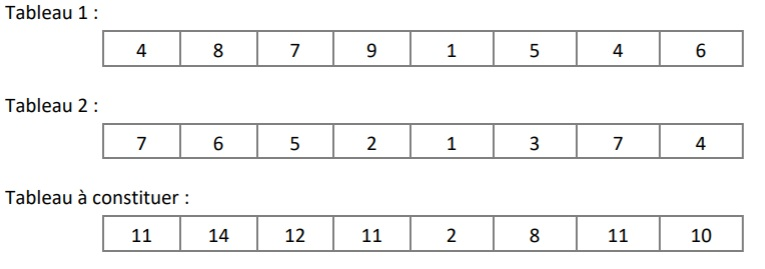
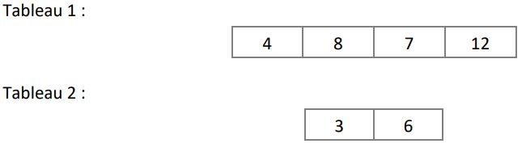

# Partie 4

Cette partie vous permettra de mettre en pratique les notions suivantes : 
- Les notions des parties précédentes
- Les tableaux

## Exercice 4.1 : Créer un tableau d'entiers

Écrire un algorithme qui déclare un tableau d'entiers et le remplit avec 7 valeurs numériques en les mettant toutes à 
zéro.

## Exercice 4.2 : Créer un tableau de chaines de caractères

Écrire un algorithme qui déclare et remplit un tableau contenant les six voyelles de l’alphabet latin.

## Exercice 4.3 : Alimenter un tableau

Écrire un algorithme permettant à l’utilisateur de saisir un nombre quelconque de valeurs, qui devront 
être stockées dans un tableau. 

L’utilisateur doit donc commencer par entrer le nombre de valeurs qu’il compte saisir. Il effectuera ensuite cette saisie. Enfin, une fois la saisie terminée, le programme affichera le nombre de valeurs négatives et le nombre de valeurs positives.

## Exercice 4.4 : Somme des valeurs d'un tableau 

Écrire un algorithme calculant la somme des valeurs d’un tableau (on suppose que le tableau a été 
préalablement saisi avec 10 nombres réels (float)).

## Exercice 4.5 : Somme des valeurs de 2 tableaux

Écrire un algorithme qui respecte la demande suivante :
1. Créer 2 tableaux d'entiers de même longueur.
2. Créer un 3ème tableau dont les valeurs sont la somme des valeurs des 2 tableaux précédents.

Exemple : 

## Exercice 4.6 : Somme des valeurs de 2 tableaux

Toujours à partir de deux tableaux d'entiers précédemment saisis, écrivez un algorithme qui calcule la somme 
des produits des deux tableaux. Pour calculer le résultat, il faut multiplier chaque élément du tableau 1 par chaque élément du tableau 2, et additionner le tout. 

Par exemple si l'on a :

Le résultat sera :

`3 * 4` + `3 * 8` + `3 * 7` + `3 * 12` + `6 * 4` + `6 * 8` + `6 * 7` + `6 * 12` = `279`

## Exercice 4.7 : Modifier un tableau

Écrire un algorithme qui permet la saisie d’un nombre quelconque de valeurs, sur le principe de l’exercice 4.3. 

Toutes les valeurs doivent être ensuite augmentées de 1, et le nouveau tableau sera affiché à l’écran.

## Exercice 4.8 : Recherche dans un tableau

Écrire un algorithme permettant, toujours sur le même principe, à l’utilisateur de saisir un nombre 
déterminé de valeurs. Le programme, une fois la saisie terminée, renvoie la plus grande valeur en précisant 
quelle position elle occupe dans le tableau. On prendra soin d’effectuer la saisie dans un premier temps, et 
la recherche de la plus grande valeur du tableau dans un second temps.

## Exercice 4.9 : Recherche spécifique dans un tableau

Toujours et encore sur le même principe, écrivez un algorithme permettant, à l’utilisateur de saisir les 
notes d'une classe. Le programme, une fois la saisie terminée, renvoie le nombre de ces notes supérieures 
à la moyenne de la classe.

> Validez votre travail avec votre formateur avant de passer à la suite.
