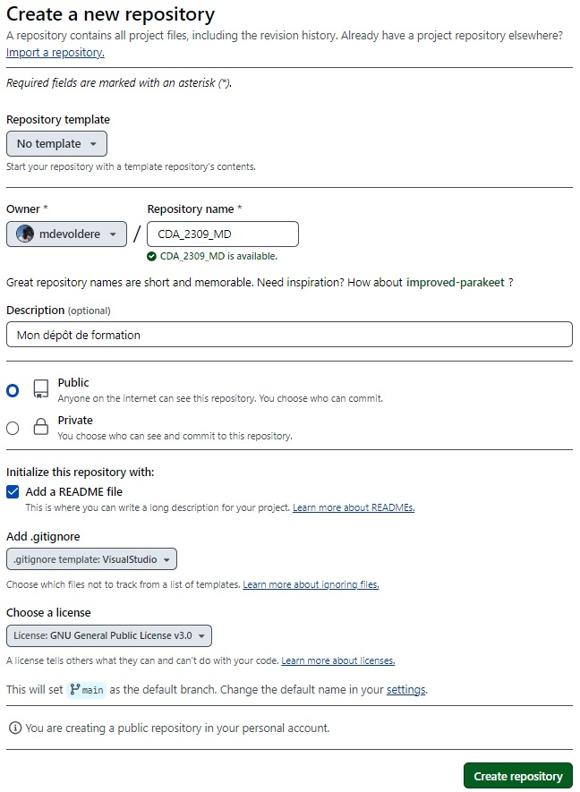

## Pré-requis : 
- Posséder un compte sur [Github](https://github.com)
- Savoir lire et suivre un tutoriel

## Compétences mises en oeuvre : 
- [Créer un dépôt sur github](https://github.com/new)
- Synchroniser un dépôt GIT en ligne de commande ou avec [Github Desktop](https://desktop.github.com)
- Gérer ses fichiers sources avec GIT et Github
- Utiliser l'Anglais dans un contexte professionnel

## Créer mon référentiel de formation

Si ce n'est déjà fait, créer votre compte sur [Github](https://github.com) avec votre adresse email personnelle.

### Contexte 

Vous êtes dans l'une des formations suivantes : 

| CODE_FORMATION | NOM_COMPLET |
| --- | --- |  
| ABCDEV | Accès aux Bases des Compétences en Développement |
| DWWM | Développeur Web et Web Mobile | 
| CDA | Concepteur Développeur d'Application |

Votre 1ère tâche consiste à créer un dépôt GitHub en respectant les règles de nommage suivantes : 

Le nom du dépôt est en MAJUSCULE, le caractère `_` est utilisé pour séparer les mots.

Le nom du dépôt : 

- **Commence** par le `CODE_FORMATION` 
- **Suivi** du caractère `_`
- **Suivi** du code de votre section 
    - Le code de section est composé de
        - l'année d'entrée en formation sur 2 chiffres
        - le mois d'entrée en formation sur 2 chiffres
        - Exemple: Je suis entré en formation en Septembre 2023, mon code de section est `2309`
- **Suivi** du caractère `_`
- **Et se termine** par vos initiales (prenom + nom)

> **Exemple :** 
>
> Mon prénom : *Mickaël*
>
> Mon nom : *Devoldère*
>
> Ma formation : *CDA*
>
> Ma date d'entrée en formation : *12/09/2023*
>
> Mon dépôt sera nommé : ***CDA_2309_MD***
>

Paramètres à appliquer à la création de votre dépôt: 

- Le dépôt doit être `public`
- La case `Add a README file` doit être cochée
- Sélectionner le .gitignore "VisualStudio"
- Sélectionner une licence parmi celles proposées
    -  Consulter le site [choosealicense.com](https://choosealicense.com/) pour comparer les licences 

**[Aide : Créer un dépôt sur GitHub](https://docs.github.com/fr/repositories/creating-and-managing-repositories/creating-a-new-repository)**

Une fois le formulaire complété, cliquer sur le bouton `Create repository`.

## Cloner le dépôt sur votre machine locale

Lorsque votre dépôt et créé et GitHub Desktop installé, clonez votre dépôt sur votre machine local à l'emplacement :
- `C:\Users\VotreNomDutilisateur\GitHub\` 

**[Aide : Cloner un dépôt GitHub ](https://docs.github.com/fr/repositories/creating-and-managing-repositories/cloning-a-repository)**

> Remplacer 'VotreNomDutilisateur' par le nom de votre répertoire personnel

> Éviter de cloner votre dépôt dans le dossier `Documents` si la sauvegarde OneDrive est activée sur votre poste de travail (conflit d'accès aux fichiers)

## Le 1er COMMIT 

Editer le fichier `README.md` et y ajouter :

- L'intitulé de votre formation
- La date de début de votre formation
- La date de fin de votre formation
- Vos dates de début et fin de stage

Lorsque vous avez terminé l'édition du fichier, effectuer un COMMIT avec le message "README mis à jour" puis pousser (PUSH) vos modifications vers GitHub.

## Passer à la suite...

**Si vous suivez la formation ABCDEV** : [C'est par ici...](./02-repository-abcdev) pour la suite du TP.

**Si vous suivez la formation DWWM ou CDA** : [C'est par là...](./03-repository-dwwm-cda) pour la suite du TP.
