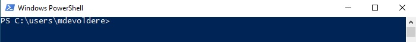
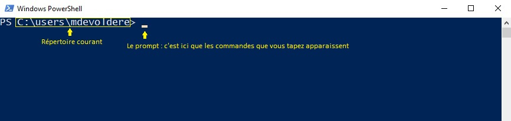
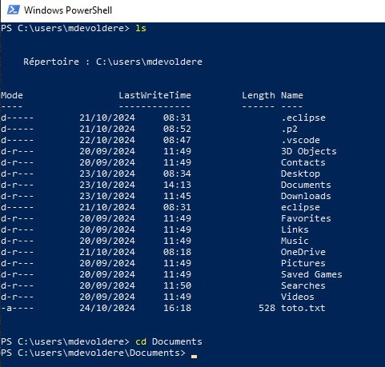

# Le terminal : Introduction aux lignes de commandes

L'invite de commande de Windows est le terminal historique qui existe depuis les 1ères versions de Windows. Cet outil ne sera pas utilisé dans le cadre de votre formation.

Nous préfèrerons utiliser : 

- **PowerShell**: Ce shell (ou interpréteur en ligne de commande) offre une syntaxe similaire à celle des shells Unix comme Bash. Si vous êtes familier avec GNU/Linux et ses commandes comme `ls`, `cd` ou `mkdir`, vous vous sentirez rapidement à l'aise avec PowerShell.
- **Le Terminal Windows**: De son vrai nom `Windows Terminal` et disponible depuis Windows 11, ce shell offre une intégration plus fluide avec les outils en ligne de commande, notamment **PowerShell** et les distributions GNU/Linux via le Sous-système Windows pour Linux (WSL).

> Ce document concerne `Powershell`. Toutefois, les procédures et commandes présentées ici sont utilisables avec le `Windows Terminal`. Le terme `terminal` utilisé ci-après dans ce document désigne à la fois *PowerShell* et *Windows Terminal*.

## Ouvrir le terminal 

**PowerShell** se présente sous la forme d’une application exécutable, que l’on peut donc lancer de la même façon que tout autre programme installé sur un ordinateur.

Pour ouvrir Powershell, vous pouvez utiliser la barre de recherche de Windows en tapant "Powershell".

Pensez à le mettre en raccourci sur votre bureau ou dans la barre des tâches pour y accéder plus facilement par la suite.

Par défaut, le terminal s'ouvre dans votre répertoire utilisateur situé à l'emplacement `C:\Users\VotreNomDutilisateur`

> Dans ce document le nom d'utilisateur visible dans les captures d'écran est `mdevoldere`.

Dans la capture précédente : 

- `PS` : Indique que c'est le terminal PowerShell qui est ouvert
- `C:\users\mdevoldere` : Le répertoire courant 

Chaque commande entrée dans un terminal s'exécute dans le répertoire courant. Le répertoire courant est toujours visible dans la fenêtre PowerShell : 

Par exemple, si je souhaite créer un nouveau dossier, il sera créé dans le répertoire courant affiché dans PowerShell (dans la capture précédente, le dossier serait créé dans `C:\users\mdevoldere`).

## Naviguer dans le système de fichiers

### La commande PWD

`pwd`: Afficher le chemin du répertoire courant.

### La commande LS

`ls` : Lister le contenu d'un répertoire.

La commande `ls` permet de lister le contenu du répertoire courant

Dans la capture ci-dessus, si vous observez la 1ère colonne **Mode**, vous pourrez vous rendre compte que certains éléments possèdent un marqueur `d-----`. La présence du `d` indique qu'il s'agit d'un répertoire (dans lequel on pourra naviguer). Les tirets suivants précisent les droits d'accès à l'élément dans les systèmes UNIX. Les droits d'accès ne nous concernent pas pour le moment.

Si vous observez maintenant le dernier élément (**toto.txt**), vous remarquerez en 1ère colonne que le marqueur ne commence par par un `d` mais par un tiret `-`. Ceci indique qu'il s'agit d'un fichier. Vous pouvez d'ailleurs observer dans la colonne **Length** une valeur qui correspond à la taille du fichier exprimée en octets (ce qui n'est pas le cas pour les répertoires). Dans la capture précédente, le fichier **toto.txt** a une taille de **528 octets**.

### La commande CD

`cd`: Changer de répertoire.

La commande `cd` permet de changer de répertoire courant.

Pour l'utiliser, on entre la commande `cd` suivie du répertoire ou chemin vers lequel on souhaite naviguer comme dans l'exemple ci-dessous.

Vous pouvez observer que le répertoire courant a changé suite à la commande `cd Documents`.

### La commande MKDIR

`mkdir` : Créer un nouveau répertoire.

La commande `mkdir` permet de créer des répertoires.

Pour l'utiliser, on entre la commande `mkdir` suivie du nom du dossier que l'on souhaite créer.

Dans la capture précédente, un répertoire `monSuperDossier` a été créé dans le dossier courant `C:\users\mdevoldere\Documents`.

--- 

## Conclusion 

PowerShell offre une interface en ligne de commande familière pour les utilisateurs Unix/Linux, facilitant la transition entre les systèmes d'exploitation. En maîtrisant ces commandes de base, vous pourrez rapidement naviguer dans votre système, créer des fichiers et des dossiers, et automatiser de nombreuses tâches.

Lorsque vous commencerez à utiliser un éditeur de code (Visual Studio, Eclipse...), vous pourrez ouvrir le terminal PowerShell directement dans le logiciel d'édition de code comme le montre la capture suivante (Visual Studio Code) :

Dans la capture ci-dessus, vous pouvez observer vers le haut **la zone d'édition** et en bas de la fenêtre, **le terminal PowerShell** intégré. Ceci est très pratique lors des phases de développement de pouvoir accéder aux code et au terminal dans la même fenêtre.

> Note: PowerShell propose de nombreuses autres fonctionnalités avancées, comme la manipulation de texte, la gestion de processus, et l'interaction avec des objets .NET.
