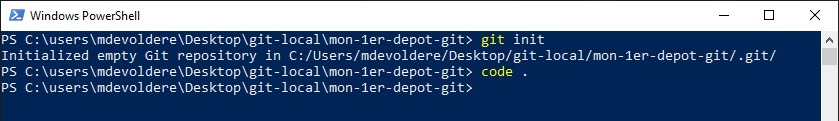

## Pré-requis : 
- Savoir utiliser le terminal
    - Savoir se déplacer dans le système de fichiers
    - Savoir lister les fichiers d'un répertoire
    - Savoir créer un répertoire
- Savoir lire et suivre un tutoriel
- Avoir terminé [l'introduction au terminal Windows](./01-powershell-intro)

## Compétences mises en oeuvre : 
- [Utiliser le terminal du système d'exploitation](./01-powershell-intro)
- [Créer un dépôt GIT sur une machine locale](https://www.atlassian.com/fr/git/tutorials/setting-up-a-repository)
- Valider des modifications avec GIT
- Annuler des modifications avec GIT
- Gérer l'historique de ses fichiers sources avec GIT
- Utiliser l'Anglais dans un contexte professionnel

---

Dans cette 1ère partie dédiée à **GIT**, vous allez apprendre à créer des dépôts sur votre machine locale. L'objectif ici, est de bien comprendre le fonctionnement de GIT et du versionning.

# Créer un nouveau dépôt 

Ouvrir PowerShell puis naviguer jusqu'au répertoire `mon-1er-depot-git` créé dans la [partie précédente](./01-powershell-intro).

Pour créer un nouveau dépôt **GIT**, taper la commande `git init`.

Un message confirme la création d'un nouveau dépôt vide.

Lorsque le dépôt est créé, ouvrir le répertoire courant dans **Visual Studio Code** en tapant la commande `code .` 

> /!\ Le point `.` fait partie de la commande et signifie : "répertoire courant".
>
> Nous pourrions traduire la commande précédente (`code .`) par : 
> - Ouvrir Visual Studio Code (`code`)
> - dans le répertoire courant (`.`)

