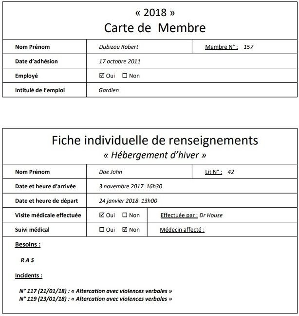
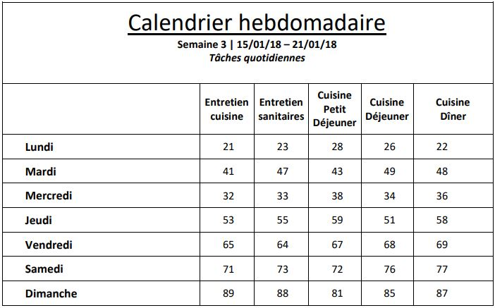
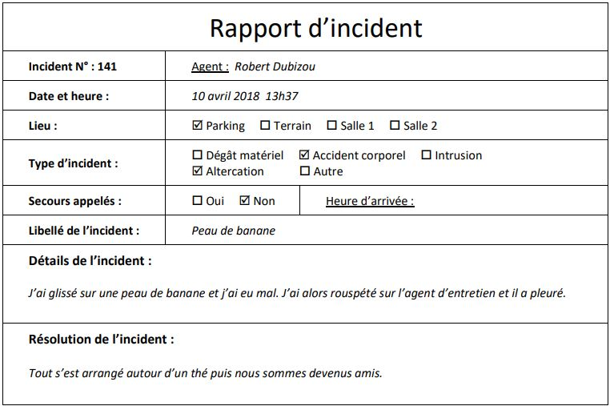

## Exercice de modélisation de base de données

- Niveau : Difficile

1. Concevez le Modèle Conceptuel des Données
2. Réalisez le Modèle Logique des Données
3. Implémentez les scripts SQL de création de la base de données

## L’association « Les Z’amis »

Une association organise des animations culturelles à l’année et des festivals ponctuels. L’association est propriétaire de 2 salles de respectivement 300 et 700 places assises séparées par un terrain municipal de 3 hectares clôturé et légèrement arboré. 2 restaurants et un parking de 1000 places sont accessibles à quelques dizaines de mètres. L’hiver, la salle N°2 (la plus grande) est convertie en centre d’hébergement pouvant accueillir au maximum 100 personnes.

Le parking est divisé en 2 parties séparées par les 2 restaurants, la partie la plus proche des salles est clôturée et sécurisée. Sa capacité est de 250 places et seules les personnes possédant un billet d’entrée à un évènement peuvent y accéder. A l’entrée, le conducteur scanne son billet d’entrée et paye 3€ (tarif unique). La seconde partie du parking n’est pas surveillée et son utilisation est gratuite.

La surveillance est assurée 24h/24 par 1 gardien la journée et 2 gardiens la nuit. Durant son service, chaque gardien doit effectuer plusieurs rondes et passer par 4 points de contrôle (parking, salle 1, salle 2, terrain extérieur) où il scannera son badge pour prouver son passage. En cas d’incident, un rapport est rédigé sur une main courante, le rapport indiquera si les secours ont dû être appelés. Le poste de sécurité est situé dans la salle N°2.

Les 2 salles sont en mesure d’accueillir divers évènements tels que des conférences, le théâtre, le cinéma, la musique… La petite salle peut accueillir 3 représentations par jour au maximum (le matin à 10h, l’après-midi à 15h et le soir à 20h) du lundi au samedi. La grande salle propose des représentations à 15h et 20h.

Chaque spectacle peut être proposé le même jour à des heures différentes dans l’une ou l’autre salle selon le nombre de spectateurs attendus. 2 spectacles différents peuvent être proposés en même temps (chacun dans une salle différente). Un même spectacle ne peut pas être joué simultanément dans les 2 salles. Une représentation d’un spectacle est donc individualisée par sa date, l’heure de la séance, le numéro de la salle et le code de spectacle.

Un spectacle dispose de sa propre tarification. Les billets d’entrée pour une représentation peuvent être achetés en ligne ou dans les bureaux de l’association jusqu’à 90 jours à l’avance. La prévente de billets est clôturée lorsque le taux de remplissage de la salle atteint 90% pour laisser quelques billets disponibles au guichet le jour de la représentation. 

En cas de prévente, une réduction de 10% est appliquée pour les particuliers. Un tarif préférentiel correspondant à 75% du tarif initial est proposé aux entreprises, associations et collectivités (les tickets doivent dans ce cas être achetés par lots de 10). Le jour de la représentation, les billets sont vendus au guichet au plein tarif. Les membres de l’association disposent d’un « passe-droit » et achètent les billets au tarif préférentiel dans tous les cas. Pour chaque billet acheté, la date et heure d’achat est enregistrée. Les billets ne sont pas nominatifs. 

Pour certains spectacles exceptionnels, les billets ne peuvent être achetés qu’en prévente sans réduction (sauf pour les membres de l’association).

--- 

Du 1er mai au 30 septembre, des festivals d’une durée de 3 à 6 jours sont organisés dans les 2 salles avec possibilité d’animations extérieures, le tout associé à un thème unique. Chaque festival propose 2 programmes type pour chacune des journées. Il est possible d’acquérir un « pass journée » donnant accès à toutes les représentations prévus par un programme et dont le prix est l’addition du prix des billets d’entrée réduite de 10% (réduction cumulable avec les réductions standard des billets d’entrée). En période de festival, un spectacle ne peut être joué qu’une fois par jour mais pas forcément tous les jours.

---

Du 31 octobre au 31 mars, aucun festival ne peut être organisé mais la petite salle peut continuer d’accueillir des spectacles et conférences. Le terrain est, quant à lui, utilisé par les services municipaux. 

---

Durant cette période hivernale, la grande salle est convertie en centre d’hébergement et peut accueillir 100 personnes au maximum. Une  fiche individuelle est établie à l’arrivée de toute personne souhaitant être hébergée qui contiendra son identité, ses besoins sanitaires et médicaux ainsi que sa date d’arrivée. On y notera plus tard sa date de départ. A l’issue de la visite médicale, un numéro de lit est attribué à la personne entrante. Une zone médicalisée de 15 lits est prévue pour les personnes nécessitant une surveillance rapprochée. Les visites et suivis médicaux sont assurés par un cabinet médical situé à proximité. Chaque hiver le taux de remplissage est de plus de 95%.

La journée, chaque personne hébergée participe à tour de rôle aux tâches quotidiennes (ménage, cuisine, entretien). Ces tâches sont organisées sur un tableau hebdomadaire édité chaque dimanche pour la semaine suivante. Pour chaque tâche, le numéro du lit est reportée. Les personnes hébergées participent aux tâches quotidienne à partir de la semaine suivant leur arrivée (ex: arrivée vendredi = participation à partir du lundi suivant). 

Au moment de leur départ, chaque personne hébergée reçoit:
-	Une carte de membre de l'association à son nom
-	Une rétribution financière proportionnelle à sa participation aux tâches quotidiennes
Consignes

## L’ association souhaite informatiser sa gestion : 

-	Gestion des membres et des employés (un employé est forcément membre de l‘association).
-	Gestion de l’historique d’utilisation parking, des rondes des gardiens et des incidents.
-	Gestion des salles, évènements et festivals.
-	Gestion de l’hébergement d’hiver, des fiches individuelles associées et des tâches quotidiennes effectuées.

## La démarche à suivre est la suivante : 

A l’aide des documents annexes disponibles plus bas ; 

-	Réalisez une analyse séparée de chaque élément listé ci-dessus. Chaque élément doit être autonome.
-	Une fois les 4 analyses effectuées, proposez une solution globale (fusion des 4 systèmes en 1 système complexe).

A chaque étape de réalisation ;

-	Comparez votre travail avec celui de vos collègues et mettez-vous d’accord sur les points ambigus. 
-	Réalisez l’implémentation du modèle physique en tenant compte de vos discussions. 
-	Proposez un jeu de données complet et différentes requêtes de test (ajout, mise à jour, suppression). 

Lorsque l’analyse globale est terminée : 

-	Discutez en collectif du SGBD (SQLServer, MySQL) et de la solution logicielle (application lourde, application web) les plus adaptés à la situation. Vous formaliserez alors collectivement un document justifiant vos choix.

## Annexes

