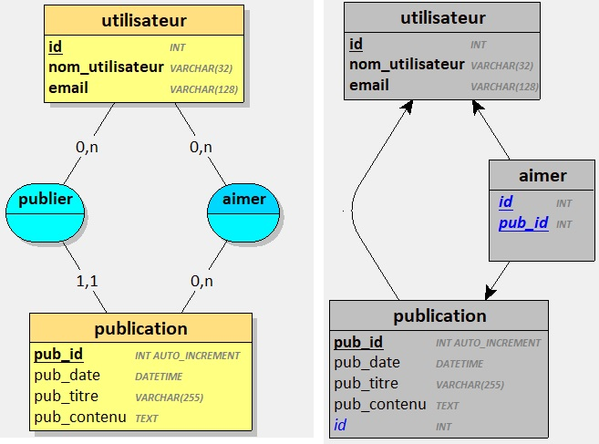

Vous êtes en charge de l'implémentation d'une petite base de données pour un petit réseau social.

L'ingénieur du projet s'est chargé de l'analyse du besoin et vous fournit le résultat de son travail.

> Un utilisateur est caractérisé par un identifiant, un nom d'utilisateur et une adresse email.
>
> Un utilisateur peut publier du contenu.
>
> Une publication est caractérisée par un identifiant, une date de publication, un titre et un contenu et on doit connaitre l'auteur de la publication.
>
> Les utilisateurs peuvent "aimer" des publications.

Votre tâche consiste à créer la base de données correspondante.

## La base de données 

**Nom de la base de données à créer**: *rezo_social*.

## Préparez-vous !

- Créer un répertoire pour le projet (pour stocker vos fichiers SQL).
- Lancer votre serveur SQL depuis Laragon
- Connectez vous au serveur de base de données avec MySQL Workbench ou équivalent

## Travail à réaliser 

1. Créer un 1er script SQL qui contiendra :
    - l'instruction pour supprimer la base de données si elle existe
    - l'instruction pour créer la base de données
    - les instructions pour créer les différentes tables
2. Créer un 2ème script SQL qui contiendra les intructions pour insérer le jeu d'essai fourni
3. Créer un 3ème script SQL qui contiendra les requêtes à implémenter

## Jeu d'essai

**Utilisateurs**

| id | nom_utilisateur | email |
| --- | --- | --- |
| 1 | Zorro | zorb@example.com |
| 2 | Patchouli | patchouli@example.fr |
| 3 | Eva | eva.stt@example.com |

**Publications**

| pub_id | pub_date | pub_titre | pub_contenu | id |
| --- | --- | --- | --- | --- |
| 1 | 2024-11-23 14:30 | Il fait beau | Quel beau soleil aujourd'hui ! | 3 | 
| 2 | 2024-11-23 09:15 | Les bonbons | Les bonbons, c'est bon | 2 | 
| 3 | 2024-11-27 08:17 | Super resto | J'ai découvert un super restaurant hier soir. | 1 | 
| 4 | 2024-12-05 17:52 | Album disponible | Nouvel album de mon groupe préféré ! | 2 | 
| 5 | 2024-12-15 10:05 | Aidez-moi | Je cherche une recette de gâteau au chocolat. | 3 | 

## Requêtes SQL à implémenter

1. Sélectionner tous les utilisateurs (nom d'utilisateur + email).

2. Sélectionner toutes les publications (titre, date, contenu, id utilisateur) triées par date de la plus récente à la plus ancienne.

3. Sélectionner les publications (pub_id, date, titre) de l'utilisateur N°2.

4. Sélectionner les publications (pub_id, titre, contenu) dont le titre contient la lettre "a". Le résultat est trié par le titre et par ordre décroissant.

5. Sélectionner les utilisateurs (id, nom, email) dont l'adresse email se termine par "com".

6. Sélectionner les publications triées par titre (ordre alphabétique) avec le nom d'utilisateur de l'auteur (*nécessite une jointure*).
