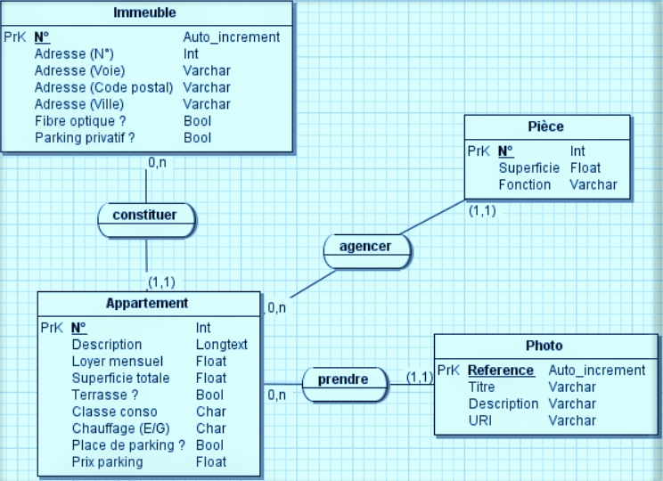

Soit le modèle de données suivant :



### Modèle logique : 

```
Immeuble(id, adrNum, adrVoie, adrCodePostal, adrVille, fibreOptique, parkingPrivatif)
Clef primaire : id

Appartement(#immeuble, num, description, loyer, superficie, terrasse, classeConso, chauffage, 
placeParking, prixParking)
Clef primaire : immeuble, num
Clef étrangère : immeuble en référence à Immeuble(id)

Piece(#(immeuble, appartement), num, superficie, fonction)
Clef primaire : immeuble, appartement, num
Clefs étrangères : (immeuble, appartement) en référence à Appartement(immeuble, num)

Photo(num, titre, description, uri, #(immeuble, appartement))
Clef primaire : num
Clef étrangère : (immeuble, appartement) en référence à Appartement(immeuble, num)
```

### SCRIPT SQL 

```sql
CREATE TABLE Immeuble(
 Id INT(11) NOT NULL AUTO_INCREMENT PRIMARY KEY, 
 adrNum VARCHAR(7) NOT NULL, 
 adrVoie VARCHAR(100) NOT NULL, 
 adrCodePostal VARCHAR(5) NOT NULL, 
 adrVille VARCHAR(30) NOT NULL, 
 fibreOptique TINYINT NOT NULL, 
 parkingPrivatif TINYINT NOT NULL
);

CREATE TABLE Appartement(
 immeuble INT(11), num INT(3) NOT NULL, 
 description LONGTEXT, 
 loyer DECIMAL(8,2) NOT NULL, 
 superficie DECIMAL(8,2) NOT NULL, 
 terrasse TINYINT(1) NOT NULL, 
 classeConso CHAR(1) NOT NULL, 
 chauffage CHAR(1) NOT NULL,
 placeParking TINYINT(1) NOT NULL, 
 prixParking DECIMAL(8,2),
 CONSTRAINT pk_appartement PRIMARY KEY (immeuble, num),
 CONSTRAINT fk_immeuble FOREIGN KEY (immeuble) REFERENCES Immeuble(id)
);

CREATE TABLE Photo(
 immeuble INT(11), 
 appartement INT(3), 
 reference INT(11) NOT NULL,
 titre VARCHAR(75), 
 description VARCHAR(255), 
 uri VARCHAR(120) NOT NULL,
 CONSTRAINT pk_photo PRIMARY KEY (immeuble, appartement, reference),
 CONSTRAINT fk_appartement_photo
 FOREIGN KEY (immeuble, appartement) REFERENCES Appartement(immeuble, num) 
);

CREATE TABLE Piece(
 immeuble INT(11), 
 appartement INT(3), 
 num INT(2) NOT NULL, 
 superficie DECIMAL(8,2) , 
 fonction VARCHAR(30),
 CONSTRAINT pk_piece PRIMARY KEY (immeuble, appartement, num),
 CONSTRAINT fk_appartement_piece 
 FOREIGN KEY (immeuble, appartement) REFERENCES Appartement(immeuble, num)
);
```

## Consignes 

Créer ses tables dans une base de données et y insérer 2 immeubles.

### Question 1

Rédiger le trigger permettant de vérifier la contrainte suivante : 

- Le prix de la place de parking d’un appartement peut et doit être NULL si l’appartement ne possède pas de place de parking. 


### Question 2

On souhaite que la contrainte suivante soit vérifiée : 

- La superficie totale d’un appartement doit être égale à la somme de la superficie de chacune de ses pièces. Pour ce faire, créer le trigger qui permet de mettre à jour la superficie d’un appartement à l’insertion d’une pièce.


### Question 3

Adaptez le trigger de la question 1 afin :

- de vérifier la contrainte suivante : un appartement ne peut avoir de place de parking si l’immeuble n’a pas de parking privatif ;
- d’initialiser la superficie de l’appartement à 0 à l’insertion d’un appartement ;
- d’empêcher la modification de la superficie d’un appartement en cas de mise à jour d’un appartement.


### Question 4

En vous inspirant du trigger de la question 2, créez un trigger qui permet de mettre à jour la superficie 
d’un appartement lors de la mise à jour d’une pièce. 

### Question 5 

Créez le trigger qui met à jour la superficie d’un appartement à la suppression d’une pièce.

---

> Note : si NEW permet de manipuler en lecture/écriture la ligne nouvellement insérée ou modifiée, OLD permet de manipuler la ligne avant modification ou suppression.
