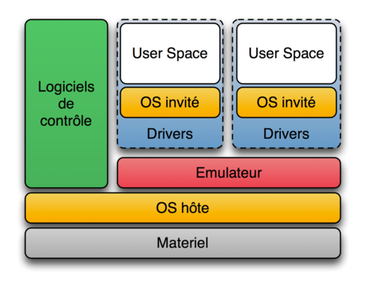
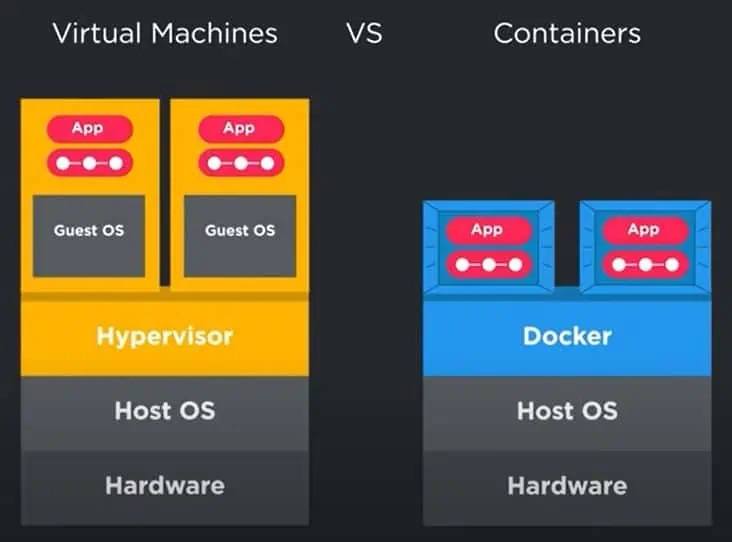
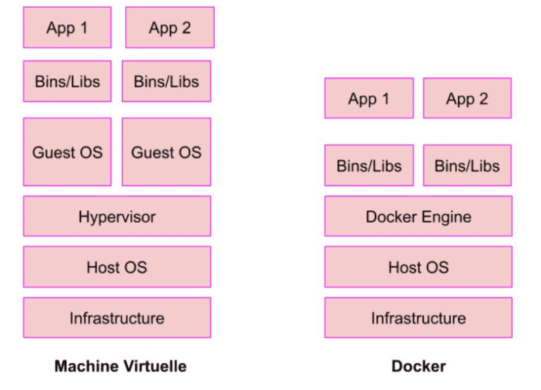
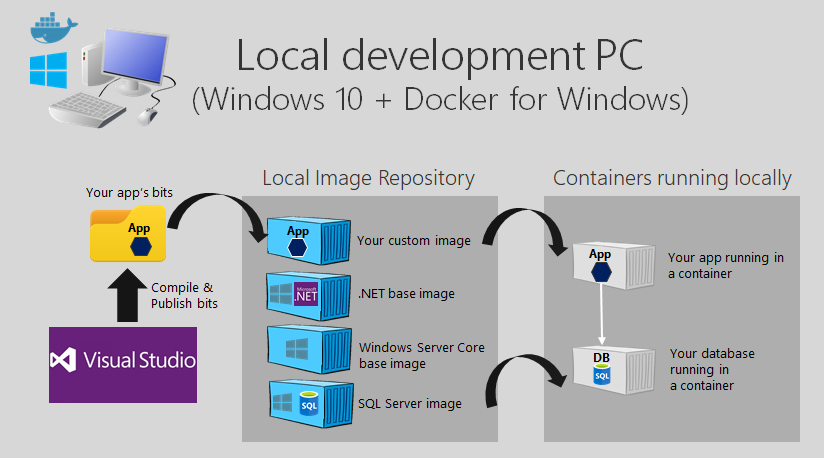
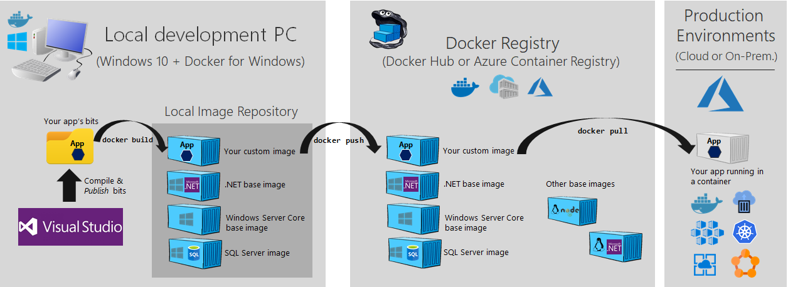
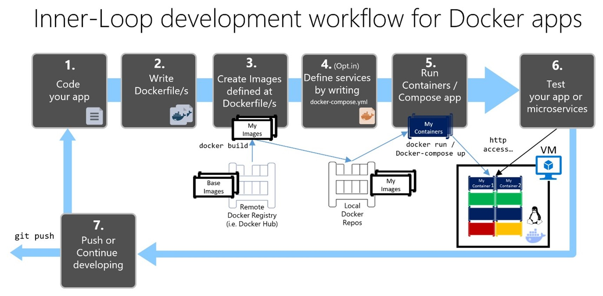
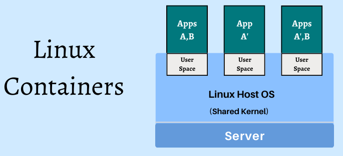

## Qu'est qu'un "Conteneur" ?

La mise en conteneur est une approche de développement de logiciels qui consiste à empaqueter une application ou un service, ses dépendances et sa configuration (extraits sous forme de fichiers manifeste de déploiement) sous forme d’image.

De la même manière que les conteneurs de transport permettent de transporter des marchandises par bateau, par train ou par camion indépendamment de la nature de la cargaison, les conteneurs logiciels agissent comme une unité de déploiement logiciel standard qui peut contenir du code et des dépendances différents. Cette façon de mettre les logiciels en conteneur permet aux développeurs et aux informaticiens de les déployer dans les environnements avec peu ou pas de modifications.

Les conteneurs isolent les applications les unes des autres sur un système d'exploitation partagé. Les applications en conteneur s’exécutent sur un hôte de conteneurs qui à son tour s’exécute sur le système d'exploitation (Linux ou Windows). Par conséquent, les conteneurs ont un encombrement bien moindre que les images de machine virtuelle.

Chaque conteneur peut exécuter une application web ou un service dans son intégralité.

- [Lire la suite sur Microsoft Learn](https://learn.microsoft.com/fr-fr/dotnet/architecture/microservices/container-docker-introduction/)

## Rappels: Principe de la virtualisation 

La **virtualisation** permet de mutualiser plusieurs ordinateurs virtuels sur un ordinateur physique grâce à un logiciel nommé **hyperviseur**. L’hyperviseur permet d’émuler intégralement les ressources matérielles d'un ordinateur physique (l'unité centrale, le CPU, la RAM, le stockage, le réseau etc...), et permet à des machines virtuelles de les partager.

Ainsi ces **machines virtuelles** ou **VM** pour *Virtual Machine* bénéficieront de ressources matérielles selon leurs besoins. Le principal avantage est qu'il est possible de modifier les ressources physiques de ces VMs en quelques clics. Chaque VM possède son propre système d’exploitation ainsi que ses propres applications.

## La conteneurisation vs virtualisation

Dans le cas de la **virtualisation** l’isolation des VMs se fait au niveau matériel (CPU/RAM/Stockage) avec un accès virtuel aux ressources de l'hôte via un hyperviseur. Généralement les ordinateurs virtuels fournissent un environnement avec plus de ressources que les applications n'en ont besoin.

La **conteneurisation** est une forme de virtualisation du système d'exploitation dans laquelle vous exécutez des applications dans des espaces utilisateurs isolés appelés **conteneurs** qui utilisent le même système d'exploitation partagé. 

Les **conteneurs** encapsulent une application en tant que progiciel exécutable qui regroupe le code de l'application et tous les fichiers de configuration, dépendances et bibliothèques nécessaires à son exécution. Les applications conteneurisées sont isolées du système d'exploitation. Le développeur installe un moteur d'exécution (par exemple, Docker) sur le système d'exploitation de l'hôte qui devient l'intermédiaire permettant aux conteneurs de partager un système d'exploitation virtuel avec d'autres conteneurs d'applications sur le système informatique.

La conteneurisation permet aux développeurs de logiciels de créer et de déployer des applications de façon rapide et sécurisée. 

Avec les méthodes traditionnelles, vous codez dans un environnement informatique spécifique, ce qui peut entraîner des erreurs et des bogues lorsque vous transférez ce code dans un nouvel emplacement. Par exemple, lorsque vous transférez du code de votre ordinateur de bureau vers une machine virtuelle, ou d'un système d'exploitation Windows vers GNU/Linux.

La conteneurisation élimine ce problème en vous permettant de regrouper le code du logiciel,  les fichiers de configuration, les dépendances et les bibliothèques nécessaires. Vous pouvez ensuite isoler ce package de logiciels unique appelé **conteneur** du système d'exploitation hôte, ce qui lui permet d'être autonome et de devenir portable, c'est-à-dire de s'exécuter sur n'importe quel ordinateur exécutant Docker.

## Avantages de la conteneurisation

- Les conteneurs sont beaucoup moins gourmand en ressources que les machines virtuelles.
- Les conteneurs exploitent et partagent le système hôte.
- Les applications les plus complexes peuvent être conteneurisées.
- Déploiement des mises à jour à la volée.
- Portabilité: vous pouvez créer localement, déployer sur le cloud et exécuter votre application n'importe où.

Le déploiement doit être pris en compte dans le processus de développement. On peut déplacer les conteneurs d’un environnement à l’autre très rapidement avec Docker car il suffit juste de partager des fichiers de configuration (Dockerfile, docker-compose) qui sont en général très légers. 

On peut bien sur faire la même chose avec des machines virtuelles en les déplaçant entièrement de serveurs en serveurs mais le déploiement et le temps d'exécution seront beaucoup plus lent.

## Les conteneurs 

Pour rappel, le noyau GNU/Linux offre des fonctionnalités telles que :

- Les **namespaces**: ce qu'un processus peut voir
- Les **cgroups**: ce qu'un processus peut utiliser en terme de ressources

Ces fonctionnalités vont permettre à Docker (et autres outils équivalents) d’isoler les processus les uns des autres. Un processus isolé est appelé **conteneur**.

Par exemple, si on souhaite créer un conteneur contenant la distribution *Ubuntu* ; ces fonctionnalités d'isolation proposées par le noyau GNU/Linux vont permettre d'avoir quelque chose qui *ressemble* à une machine virtuelle avec l'OS Ubuntu. En réalité, ce n'est pas du tout une machine virtuelle mais un processus isolé s'exécutant dans le même noyau GNU/Linux.

 

### Les namespaces

Les **namespaces** (ou **espaces de noms** en français) isolent les ressources partagées. Ils donnent à chaque processus sa propre vue unique du système, limitant ainsi leur accès aux ressources système sans que le processus en cours ne soit au courant des limitations.

### Les cgroups 

Que faire si nous souhaitons limiter la quantité de mémoire ou de CPU utilisée par l'un de nos processus ? 

Les **groupes de contrôle**  ou **cgroups** permettent la gestion des ressources utilisées par les processus.

## En vidéo

<iframe width="800" height="450" src="https://www.youtube.com/embed/kJrL9e5cfkE?si=qm0_OXP6A_NyNtws" title="YouTube video player" frameborder="0" allow="accelerometer; autoplay; clipboard-write; encrypted-media; gyroscope; picture-in-picture; web-share" referrerpolicy="strict-origin-when-cross-origin" allowfullscreen></iframe>
