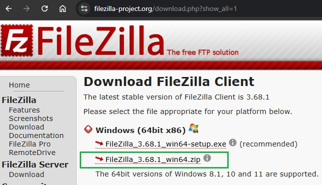
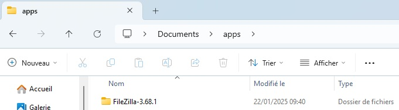
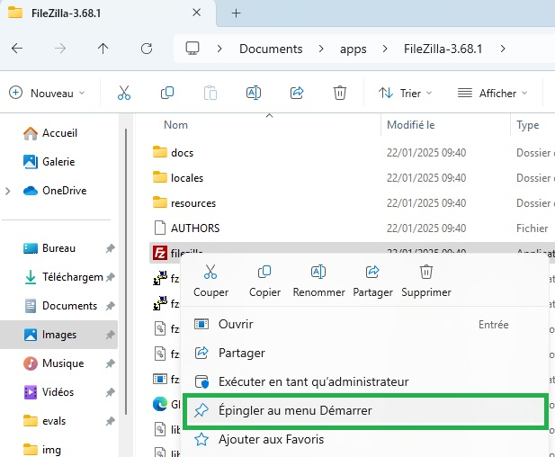
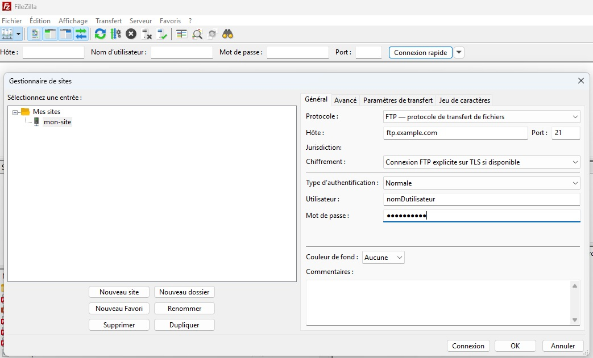

---
title: "Déploiement manuel"
serie: "manuel"
index: 2
--- 

Dans cet article, vous apprendrez à publier du contenu sur un serveur distant en utilisant le protocole FTP et/ou SFTP et le logiciel FileZilla.

## Téléchargez et installez FileZilla

Si FileZilla n'est pas déjà installé sur votre machine: 

1. Téléchargez FileZilla depuis le site officiel : [filezilla-project.org](https://filezilla-project.org/download.php?show_all=1).
    - Sélectionnez la version "ZIP"

2. Décompressez l'archive ZIP dans le répertoire `Documents/apps/`

3. Ouvrez le répertoire puis épinglez l'exécutable dans votre menu démarrer
    - Si vous le souhaitez vous pouvez aussi créer un raccourci sur votre bureau

## Obtenez vos informations de connexion FTP

Vous aurez besoin des informations suivantes pour vous connecter à votre serveur FTP :

- **Hôte**: L'adresse du serveur FTP (par exemple, ftp.example.com).
- **Nom d'utilisateur**: Votre nom d'utilisateur FTP.
- **Mot de passe**: Votre mot de passe FTP.
- **Port**: Le numéro de port FTP ou SFTP
    - Généralement **21** pour le protcole FTP
    - Généralement **22** pour le protocole SFTP

Ces informations vous ont été fournies par votre formateur ou votre hébergeur web lors de la création de votre compte.

## Connectez-vous à votre serveur FTP

1. Ouvrez FileZilla et cliquez sur le bouton "gestionnaire de sites" en haut à gauche.
2. Cliquez sur le bouton "Nouveau site"
3. Choisiseez un nom pour cette connexion (celui que vous voulez)
4. Entrez les informations de connexion dans le champs correspondants
5. Sauvegarder en cliquant sur le bouton "OK"

Une fois configuré, cliquez sur la petite flèche à coté du bouton "Gestionnaire de sites" et cliquez le nom que vous avez choisi pour établir la connexion.

## Naviguez dans les répertoires

Une fois connecté, vous verrez deux panneaux :

- **Panneau de gauche**: Affiche les fichiers et dossiers de *votre ordinateur*.
- **Panneau de droite**: Affiche les fichiers et dossiers du *serveur distant*.

Utilisez ces panneaux pour naviguer vers le répertoire où vous souhaitez publier votre contenu sur le serveur.

## Transférez vos fichiers

Sélectionnez les fichiers ou dossiers que vous souhaitez publier dans le panneau de gauche, puis faites-les glisser vers le panneau de droite pour les transférer sur le serveur. Vous pouvez également utiliser le menu contextuel (clic droit) pour choisir l'option "Envoyer".

## Attendez la fin du transfert

FileZilla affichera la progression du transfert dans la partie inférieure de la fenêtre. Une fois le transfert terminé, vos fichiers seront publiés sur le serveur.

# Exercice 

1. Créer un compte sur le site [https://alwaysdata.com](https://alwaysdata.com)
2. Regardez cette vidéo pour savoir comment publier votre 1er site web :

