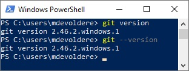
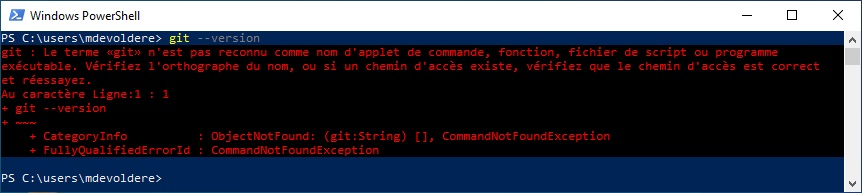

## Pré-requis : 
- Savoir utiliser le terminal
- Savoir lire et suivre un tutoriel
- Avoir terminé [l'introduction au terminal Windows](./01-powershell-intro)

## Compétences mises en oeuvre : 
- [Utiliser le terminal du système d'exploitation](./01-powershell-intro)
- Préparer son environnement de développement
- Configurer le logiciel GIT

---

# Documentation officielle GIT

La documentation complète de GIT est disponible sur le site officiel : [https://git-scm.com/doc](https://git-scm.com/doc)

# Les commandes GIT 

Les commandes GIT commencent toujours par le terme `git` suivi de la commande à exécuter.

Par exemple, 
- `git init` permet de créer un nouveau dépôt vide
- `git log` permet d'affichier l'historique d'un dépôt git
- etc...

# Installation de GIT

> **GIT** est probablement déjà installé de vos postes de travail en formation.

Pour vérifier que **GIT** est bien installé et pour contrôler la version installée sur votre poste, vous pouvez passer par la ligne de commande.

1. Ouvrir PowerShell.
2. Taper la commande `git version` ou `git --version`.

Si **GIT** est bien installé, vous devriez observer un résultat similaire à la capture ci-dessous.

Ci-dessus, vous observez que "**GIT** version 2.46.2" est installé (La version installée sur votre poste de travail peut différer).

Dans le cas où **GIT** n'est pas installé, vous devriez avoir un message similaire à la capture suivante.

Dans ce cas, vous pouvez le télécharger et l'installer à partir du site officiel : [https://git-scm.com](https://git-scm.com/downloads).

# Configurer GIT

Pour fonctionner, **GIT** a besoin de 2 informations :

- Un nom d'utilisateur
- Une adresse email

Pour renseigner ces informations, suivez les étapes suivantes : 

1. Ouvrir PowerShell
2. Entrez les commandes suivantes : 
    - `git config --global user.name "mdevoldere"`
    - `git config --global user.email "mdevoldere@example.com"`

> Remplacez *mdevoldere* par *votre pseudonyme* et *mdevoldere@example.com* par *votre adresse email*.

## Pourquoi GIT a besoin de ces informations ? 

Imaginez **GIT** comme un journal de bord pour vos projets. Chaque modification que vous apportez à vos fichiers est enregistrée comme une entrée dans ce journal. 

Pour garder une trace claire de qui a fait quoi, **GIT** demande de renseigner 2 informations :

- **user.name**: C'est votre nom, ou un pseudo, qui sera associé à chaque modification que vous faites. C'est comme signer votre travail !
- **user.email**: C'est votre adresse email qui sert à vous identifier de manière plus précise et peut être utilisée pour vous contacter en cas de besoin, par exemple si une erreur se glisse dans votre code.

### Pourquoi ces informations sont-elles obligatoires ?

**Traçabilité**: En associant un nom et une adresse email à chaque modification, vous créez un historique clair et complet de votre projet. Cela facilite la collaboration avec d'autres personnes et permet de retrouver facilement l'origine d'un problème.

**Attribution**: Si plusieurs personnes travaillent sur un même projet, **GIT** permet de savoir qui a apporté quelle modification. Cela évite les conflits et facilite la résolution de problèmes.

**Communication**: En cas de besoin, l'adresse email associée à une modification permet de contacter directement la personne responsable.

En résumé, **user.name** et **user.email** sont essentiels pour assurer la transparence, la collaboration et la gestion efficace de vos projets **GIT**. C'est comme signer vos travaux, mais dans le monde du développement !

## Bravo !

Votre GIT est installé et configuré, vous pouvez passer à l'étape suivante : [Initialiser un dépôt GIT local](./03-git-init.md).
