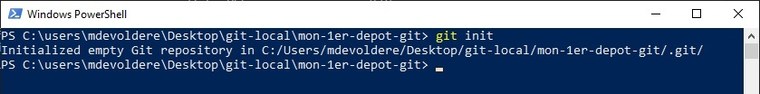
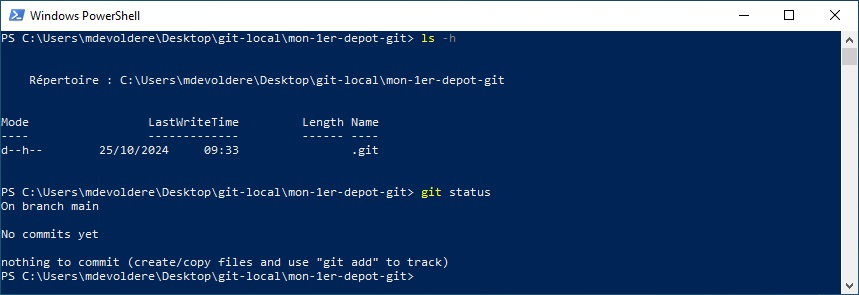
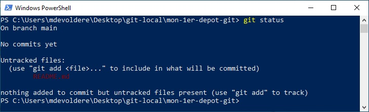
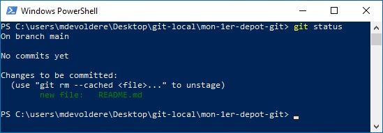
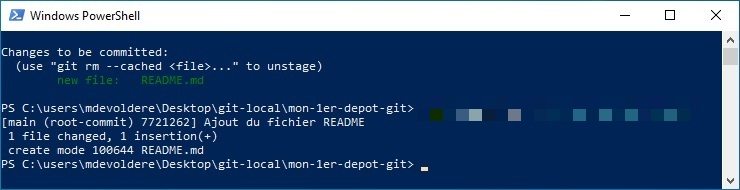

## Pré-requis : 
- Savoir utiliser le terminal
    - Savoir se déplacer dans le système de fichiers
    - Savoir lister les fichiers d'un répertoire
    - Savoir créer un répertoire
- Savoir lire et suivre un tutoriel
- Avoir terminé [l'introduction au terminal Windows](./01-powershell-intro)

## Compétences mises en oeuvre : 
- [Utiliser le terminal du système d'exploitation](./01-powershell-intro)
- [Créer un dépôt GIT sur une machine locale](https://www.atlassian.com/fr/git/tutorials/setting-up-a-repository)
- Valider des modifications avec GIT
- Annuler des modifications avec GIT
- Gérer l'historique de ses fichiers sources avec GIT
- Utiliser l'Anglais dans un contexte professionnel


---

Dans cette 1ère partie dédiée à **GIT**, vous allez apprendre à créer des dépôts sur votre machine locale. L'objectif ici, est de bien comprendre le fonctionnement de GIT et du versionning.

Avant de commencer, suivez ces quelques étapes pour configurer votre environnement GIT

# Créer un nouveau dépôt 

## git init

La commande `git init` crée un nouveau dépôt GIT dans le répertoire courant.

Ouvrir PowerShell puis naviguer jusqu'au répertoire `mon-1er-depot-git` créé dans la [1ère partie](./01-powershell-intro).

Pour créer un nouveau dépôt **GIT**, taper la commande `git init`.

Un message confirme la création d'un nouveau dépôt vide.



Vous pouvez vérifier le contenu du répertoire en tapant la commande  `ls -h`. Vous devriez voir apparaitre un répertoire `.git` ce qui confirme que le répertoire courant héberge un dépôt GIT.

> Le répertoire `.git` contient toutes les informations de votre dépôt et ne doit pas être supprimé. 

> /!\ Attention, un répertoire ne peut contenir qu'un seul dépôt GIT. Vous ne devez JAMAIS créer un dépôt GIT dans un sous-répertoire d'un dépôt GIT existant. 

> Les commandes GIT doivent être saisies dans le répertoire du depôt.

## git status

La commande `git status` affiche l'état actuel de votre dépôt.



> Pour le moment, cette commande afiche peu d'informations. Cette commande sera, plus tard, votre meilleure amie. les détails sur *git status* vous seront communiqués au fur et à mesure de votre avancement dans ce module.

Vous pouvez toutefois observer : 
- `On branch main` : indique la branche de travail actuelle (les branches seront abordées plus tard).
    - Par défaut, à la création d'un dépôt, la branche principale s'appelle `main`.
    - Dans les versions plus anciennes de GIT, la branche principale s'appelait `master`.
- `No commits yet` : Aucune sauvegarde locale n'a été effectuée dans ce dépôt.
- `Nothing to commit (create/copy files and use "git add" to track)` : Rien à sauvegarder pour le moment.

## Exercices

**Exécutez les commandes PowerShell correspondant aux tâches demandées ci-dessous.**

Tâches à réaliser en ligne de commande avec PowerShell. Pour chaque tâche, vous indiquerez dans un document texte la méthode/commande que vous avez utilisé et le résultat obtenu.

1. Ouvrir PowerShell et naviguer jusqu'au répertoire `mon-1er-depot-git` créé dans la [partie précédente](./01-powershell-intro).
2. Dans ce répertoire, créer un nouveau fichier nommé `README.md` (/!\ Respectez la casse).
3. Dans le fichier `README.md`, ajouter le contenu "Mon 1er fichier créé avec PowerShell" 
    - Pour savoir comment réaliser cette tâche, Rechercher `powershell set-content` sur le Web.
4. Afficher le contenu du fichier `README.md`.
    - Pour savoir comment réaliser cette tâche, Rechercher `powershell get-content` sur le Web.
5. Taper la commande `git status`. Vous devriez observer un résultat similaire à la capture ci-dessous.
    - Faire une capture d'écran du résultat et la sauvegarder dans le fichier `C:\users\VotreNomDutilisateur\Pictures\git-status-avant-1er-commit.jpg`



---

# Référencer les fichiers à ajouter au prochain commit

Comme vous avez pu le constater à l'étape 5 de l'exercice précédent, le fichier **README.md** que vous avez créé est noté comme "non traqué". Cela signifie que ce fichier ne sera pas intégré à la prochaine sauvegarde (commit).

Avant d'effectuer un **commit**, vous devez référencer les fichiers qui y seront ajoutés.

## GIT add

La commande `git add` permet d'ajouter des fichiers au prochain `commit`.

> Uniquement les fichiers ajoutés, modifiés ou supprimés depuis le dernier `commit` peuvent être référencés. Il est en effet inutile de référencer un fichier qui n'a pas été modifié !

La commande `git add` peut être utilisée :
- Pour référencer toutes les modifications depuis le dernier commit.
- Pour référencer des fichiers spécifiques.

**Exemples**

`git add *` : ajoute TOUTES les modifications au prochain commit.

`git add ./monDossier` : ajoute toutes les modifications du répertoire **./monDossier** au prochain commit.

`git add monFichier.txt` : ajoute le fichier **monFichier.txt** au prochain commit.

`git add ./monDossier/unFichier.txt` : ajoute le fichier **./monDossier/unFichier.txt** au prochain commit.

Notez que: 
- **GIT** n'ajoute que les fichiers modifiés depuis le dernier commit. Si vous tentez d'ajouter un fichier qui n'a pas été modifié, GIT l'ignorera.
- **GIT** gère les modifications sur les *fichiers*. Les *répertoires vides* ne sont pas synchronisés.


# Mon 1er commit

La commande `git commit` enregistre l'état actuel de votre dépôt.

> Uniquement les fichiers référencés avec la commande `git add` seront sauvegardés dans le prochain commit.

La commande `git commit` est utilisée lorsque : 
- J'ai terminé un travail et je souhaite le sauvegarder.
- Je dois quitter mon poste de travail pour éventuellement reprendre le code sur un autre ordinateur.
- Je vais manger ou j'ai terminé ma journée et je souhaite sauvegarder mon travail.
- Je passe le relais à un autre développeur qui va reprendre mon travail.

La commande `git commit` doit obligatoirement être accompagnée d'un message de commit (message de validation). Elle s'utilise de cette manière :

```ps
git commit -m "Message du commit"
```

Le message doit être explicite et indiquer quelles modifications ont été apportées depuis le commit précédent.

Exemples de messages explicites permettant de rapidement comprendre le travail effectué par le développeur :
- "Ajout de la fonction calculer() dans le composant Calculateur"  
- "Correction du bug lors de l'enregistrement d'un nouvel utilisateur dans la fonction saveUser()"

Exemples de messages que vous ne devriez pas utiliser car ils ne sont pas suffisemment explicites :

- "12 octobre 2024"
- "Mise à jour"
- "sauvegarde"


# Exercice 

1. Ouvrir PowerShell et naviguer jusqu'au répertoire **mon-1er-depot-git**.
2. Entrer la commande `git status`
    - Vous devriez obtenir le même résultat que précédemment


3. Ajouter le fichier **README.md** créé précédemment à la liste des fichiers à sauvegarder au prochain commit.
    - Utilisez la commande `git add`.
4. Une fois le fichier **README.md** ajouté, tapez la commande `git status`
    - Vous devriez obtenir un résultat similaire à la capture suivante qui indique que le fichier README.md est bien "tracké" pour le prochain commit.



5. Effectuer le 1er commit à l'aide de la commande `git commit"`. Le message de commit doit être "Ajout du fichier README".
    - Vous devriez obtenir un résultat similaire à la capture suivante



6. Entrer la commande `git status`
    - Qu'observez-vous ?


# Ouvrir le dépôt dans un éditeur de code

Si ce n'est déjà fait, [installer Visual Studio Code](https://code.visualstudio.com/Download) (choisissez le `User Installer` qui ne nécessite pas de privilèges élevés pour être installé).


Lorsque le dépôt est créé et Visual Studio code installé :

1. Ouvrir PowerShell et naviguer jusqu'au répertoire contenant votre dépôt GIT.
2. Ouvrir le répertoire dans **Visual Studio Code** en tapant la commande `code .` 


> /!\ Le point `.` fait partie de la commande et signifie : "répertoire courant".
>
> Nous pourrions traduire la commande précédente (`code .`) par : 
> - Ouvrir Visual Studio Code (`code`)
> - dans le répertoire courant (`.`)


Votre application `Visual Studio Code` s'ouvre dans le répertoire courant.


- **Sur la gauche**, le répertoire ouvert avec les fichiers qu'il contient (notez que le répertoire .git n'apparait pas, c'est normal).
- **Sur la droite**, la partie éditeur
- **En bas à gauche**, vous observez que Vscode a bien identifié qu'il s'agit d'un dépôt GIT et affiche le nom de la branche courante (main).
