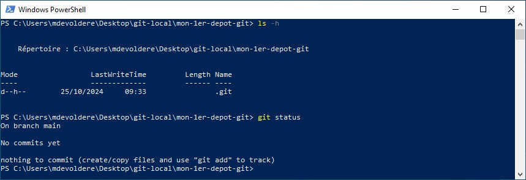

## Pré-requis : 
- Avoir terminé [l'introduction au terminal Windows](./01-powershell-intro)
- Avoir terminé [l'installation et la configuration de votre environnement GIT](./02-git-config)

## Compétences mises en oeuvre : 
- [Utiliser le terminal du système d'exploitation](./01-powershell-intro)
- [Créer un dépôt GIT sur une machine locale](https://git-scm.com/docs/git-init/fr)
- Utiliser l'Anglais dans un contexte professionnel

---

Dans cette partie dédiée à **GIT**, vous allez apprendre à créer des dépôts sur votre machine locale. 

# Créer un nouveau dépôt 

## git init

La commande `git init` crée un nouveau dépôt GIT dans le répertoire courant.

Ouvrir PowerShell puis naviguer jusqu'au répertoire `mon-1er-depot-git` créé dans la [1ère partie](./01-powershell-intro).

Pour créer un nouveau dépôt **GIT**, taper la commande `git init`.

Un message confirme la création d'un nouveau dépôt vide.

Vous pouvez vérifier le contenu du répertoire en tapant la commande  `ls -h`. Vous devriez voir apparaitre un répertoire `.git` ce qui confirme que le répertoire courant héberge un dépôt GIT.

> Le répertoire `.git` contient toutes les informations de votre dépôt et ne doit pas être supprimé. 

> /!\ Attention, un répertoire ne peut contenir qu'un seul dépôt GIT. Vous ne devez JAMAIS créer un dépôt GIT dans un sous-répertoire d'un dépôt GIT existant. 

> Les commandes GIT doivent être saisies dans le répertoire du depôt.

## git status

La commande `git status` affiche l'état actuel de votre dépôt.

> Pour le moment, cette commande afiche peu d'informations. Cette commande sera, plus tard, votre meilleure amie. les détails sur *git status* vous seront communiqués au fur et à mesure de votre avancement dans ce module.

Vous pouvez toutefois observer : 
- `On branch main` : indique la branche de travail actuelle (les branches seront abordées plus tard).
    - Par défaut, à la création d'un dépôt, la branche principale s'appelle `main`.
    - Dans les versions plus anciennes de GIT, la branche principale s'appelait `master`.
- `No commits yet` : Aucune sauvegarde locale n'a été effectuée dans ce dépôt.
- `Nothing to commit (create/copy files and use "git add" to track)` : Rien à sauvegarder pour le moment.

Pour aller plus loin : [La commande git status (documentation officielle)](https://git-scm.com/docs/git-status)

## Exercice

**Exécutez les commandes PowerShell correspondant aux tâches demandées ci-dessous.**

Tâches à réaliser en ligne de commande avec PowerShell. Pour chaque tâche, vous indiquerez dans un document texte la méthode/commande que vous avez utilisé et le résultat obtenu.

1. Ouvrir PowerShell et naviguer jusqu'au répertoire `mon-1er-depot-git` créé dans la [partie précédente](./01-powershell-intro).
2. Dans ce répertoire, créer un nouveau fichier nommé `README.md` (/!\ Respectez la casse).
3. Dans le fichier `README.md`, ajouter le contenu "Mon 1er fichier créé avec PowerShell" 
    - Pour savoir comment réaliser cette tâche, Rechercher `powershell set-content` sur le Web.
4. Afficher le contenu du fichier `README.md`.
    - Pour savoir comment réaliser cette tâche, Rechercher `powershell get-content` sur le Web.
5. Taper la commande `git status`. Vous devriez observer un résultat similaire à la capture ci-dessous.
    - Faire une capture d'écran du résultat et la sauvegarder dans le fichier `C:\users\VotreNomDutilisateur\Pictures\git-status-avant-1er-commit.jpg`

> Validez votre travail avec un formateur

Une fois terminé, vous pouvez passer à l'étape suivante : [Valider des modifications dans un dépôt GIT](./04-git-status-add-commit)
