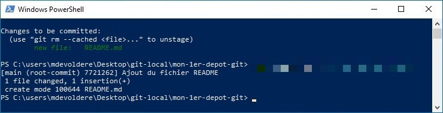

## Pré-requis : 
- Avoir terminé [l'introduction au terminal Windows](./01-powershell-intro)
- Avoir terminé [la configuration de GIT](./02-git-config)
- Avoir terminé [la création de votre 1er dépôt GIT](./03-git-init)

## Compétences mises en oeuvre : 
- [Utiliser le terminal du système d'exploitation](./01-powershell-intro)
- [Créer un dépôt GIT sur une machine locale](https://www.atlassian.com/fr/git/tutorials/setting-up-a-repository)
- Valider des modifications avec GIT
- Annuler des modifications avec GIT
- Gérer l'historique de ses fichiers sources avec GIT
- Utiliser l'Anglais dans un contexte professionnel


---

Dans [le chapitre précédent](./03-git-init.md), vous avez créé un dépôt GIT vide et y avez ajouté un fichier README.md. 

Ce chapitre illustre comment valider des modifications et créer des instantanés de ces modifications dans votre dépôt. Ces opérations sont à réaliser à chaque fois que votre projet atteint un état que vous souhaitez enregistrer.


# Référencer les fichiers à ajouter au prochain commit

Comme vous avez pu le constater à l'étape 5 de l'exercice précédent, le fichier **README.md** que vous avez créé est noté comme "non traqué". Cela signifie que ce fichier ne sera pas intégré à la prochaine sauvegarde (commit).

Avant d'effectuer un **commit**, vous devez référencer les fichiers qui y seront ajoutés.

## GIT add

La commande `git add` permet d'ajouter des fichiers au prochain `commit`.

> Uniquement les fichiers ajoutés, modifiés ou supprimés depuis le dernier `commit` peuvent être référencés. Il est en effet inutile de référencer un fichier qui n'a pas été modifié !

La commande `git add` peut être utilisée :
- Pour référencer toutes les modifications depuis le dernier commit.
- Pour référencer des fichiers spécifiques.

**Exemples**

`git add *` : ajoute TOUTES les modifications au prochain commit.

`git add ./monDossier` : ajoute toutes les modifications du répertoire **./monDossier** au prochain commit.

`git add monFichier.txt` : ajoute le fichier **monFichier.txt** au prochain commit.

`git add ./monDossier/unFichier.txt` : ajoute le fichier **./monDossier/unFichier.txt** au prochain commit.

Notez que: 
- **GIT** n'ajoute que les fichiers modifiés depuis le dernier commit. Si vous tentez d'ajouter un fichier qui n'a pas été modifié, GIT l'ignorera.
- **GIT** gère les modifications sur les *fichiers*. Les *répertoires vides* ne sont pas synchronisés.

## Exercice 

1. Ouvrir PowerShell et naviguer jusqu'au répertoire **mon-1er-depot-git**.

2. Entrer la commande `git status`
    - Vous devriez obtenir le même résultat que précédemment


3. Ajouter le fichier **README.md** créé précédemment à la liste des fichiers à sauvegarder au prochain commit.
    - Utilisez la commande `git add`.
4. Une fois le fichier **README.md** ajouté, tapez la commande `git status`
    - Vous devriez obtenir un résultat similaire à la capture suivante qui indique que le fichier README.md est bien "traqué" pour le prochain commit.


# Mon 1er commit

La commande `git commit` enregistre l'état actuel de votre dépôt.

> Uniquement les fichiers référencés avec la commande `git add` seront sauvegardés dans le prochain commit.

La commande `git commit` est utilisée lorsque : 
- J'ai terminé un travail et je souhaite le sauvegarder.
- Je dois quitter mon poste de travail pour éventuellement reprendre le code sur un autre ordinateur.
- Je vais manger ou j'ai terminé ma journée et je souhaite sauvegarder mon travail.
- Je passe le relais à un autre développeur qui va reprendre mon travail.

La commande `git commit` doit obligatoirement être accompagnée d'un message de commit (message de validation). Elle s'utilise de cette manière :

```ps
git commit -m "Message du commit"
```

Le message doit être explicite et indiquer quelles modifications ont été apportées depuis le commit précédent.

Exemples de messages explicites permettant de rapidement comprendre le travail effectué par le développeur :
- "Ajout de la fonction calculer() dans le composant Calculateur"  
- "Correction du bug lors de l'enregistrement d'un nouvel utilisateur dans la fonction saveUser()"

Exemples de messages que vous ne devriez pas utiliser car ils ne sont pas suffisemment explicites :

- "12 octobre 2024"
- "Mise à jour"
- "sauvegarde"


# Exercice 

1. Ouvrir PowerShell et naviguer jusqu'au répertoire **mon-1er-depot-git**.

2. Effectuer le 1er commit à l'aide de la commande `git commit"`. Le message de commit doit être "Ajout du fichier README".
    - Vous devriez obtenir un résultat similaire à la capture suivante



3. Entrer la commande `git status`
    - Qu'observez-vous ?
    - Faites une capture d'écran du résultat et sauvegardez-la avec les précédentes.

4. Ajouter un fichier **maFormation.md** dans le répertoire ou est situé le fichier **README.md** créé précédemment.

5. Dans ce fichier, ajouter le nom de votre formation suivi de la date de démarrage.
    - Utilisez la commande **Set-Content** de PowerShell

6. Ajouter le fichier **maFormation.md** au prochain commit à l'aide de la commande `git add`.

7. Faire un commit avec le message "ajout du fichier maFormation.md".
    - Faire une capture d'écran du résultat et la sauvegarder avec les précédentes.

8. Modifier le contenu du fichier maFormation.md et y ajouter le texte "PowerShell est mon ami."

9. Ajouter les modifications au prochain commit

10. Effectuer un commit avec le message "modification du fichier maFormation.md"
    - Faire une capture d'écran du résultat et la sauvegarder avec les précédentes.
