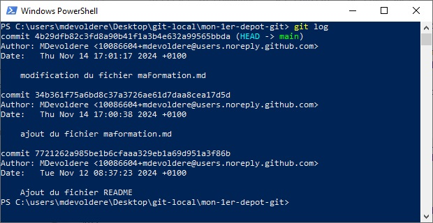

# Voir l'historique des commits

La commande `git log` permet d'afficher l'historique des validations (commits) effectuées dans un dépôt GIT.

Par défaut, git log invoqué sans argument énumère en ordre chronologique inversé les commits réalisés. Cela signifie que les commits les plus récents apparaissent en premier.

Comme vous le remarquez, cette commande indique chaque commit avec le nom et l’e-mail de l’auteur, la date et le message du commit.

enter la commande `` dans le dépôt que vous utilisez dans les exercices de cette page.

vous devriez observer un résultat similaire à la capture suivante : 

