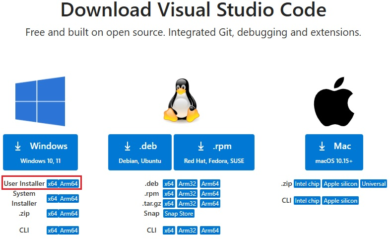
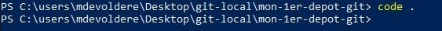
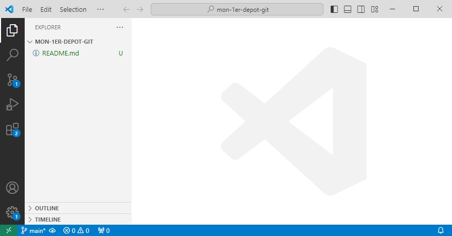
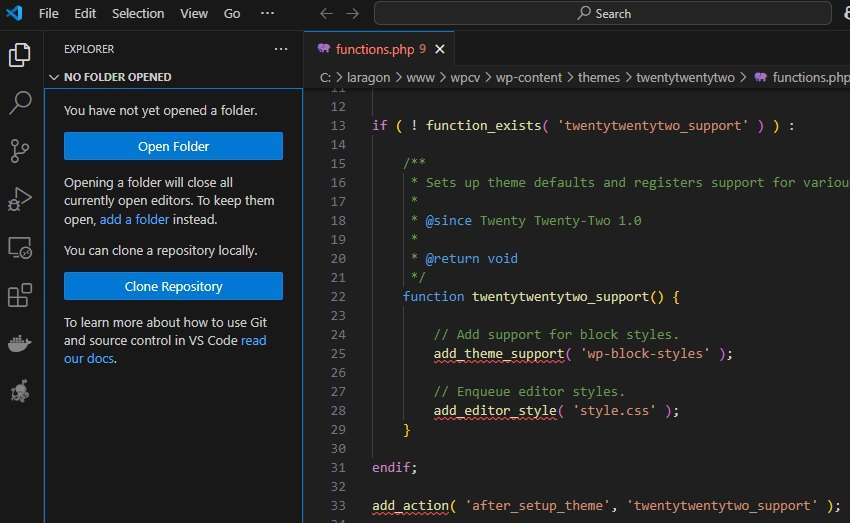
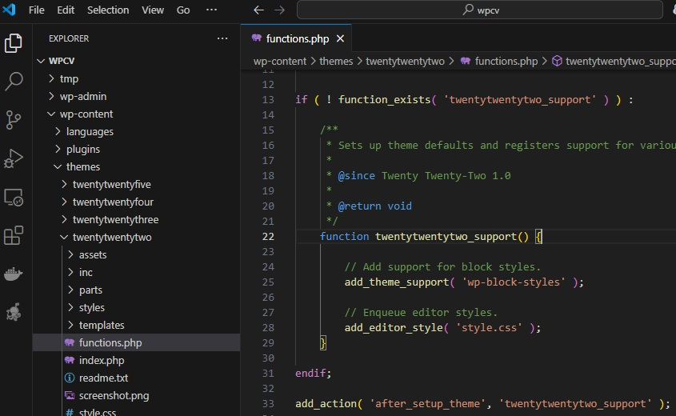

# Installer Visual Studio Code (VsCode)

Si ce n'est déjà fait, [installer Visual Studio Code](https://code.visualstudio.com/Download) (choisissez le `User Installer` qui ne nécessite pas de privilèges élevés pour être installé).

> Après installation, il est possible d'ajouter un extension permettant d'avoir Visual Studio Code en Français.
> 
> Toutefois, nous vous recommandons de laisser Visual Studio Code en Anglais.
>
> Sur arfp.github.io, toutes les captures et procédures liées à Visual Studio Code se basent sur la version en Anglais.

# Méthode 1 : Ouvrir un dépôt GIT avec PowerShell

1. Ouvrir PowerShell et naviguer jusqu'au répertoire contenant votre dépôt GIT.
2. Ouvrir le répertoire dans **Visual Studio Code** en tapant la commande `code .` 

> /!\ Le point `.` fait partie de la commande et signifie : "répertoire courant".
>
> Nous pourrions traduire la commande précédente (`code .`) par : 
> - Ouvrir Visual Studio Code (`code`)
> - dans le répertoire courant (`.`)

Votre application `Visual Studio Code` s'ouvre dans le répertoire courant.

- **Sur la gauche**, le répertoire ouvert avec les fichiers qu'il contient (notez que le répertoire .git n'apparait pas, c'est normal).
- **Sur la droite**, la partie éditeur
- **En bas à gauche**, vous observez que Vscode a bien identifié qu'il s'agit d'un dépôt GIT et affiche le nom de la branche courante (main).

# Méthode 2 : Ouvrir le dépôt depuis VsCode

1. Ouvrir Visual Studio Code
2. Dans le menu supérieur : 
    1. Cliquer sur "File"
    2. Cliquer sur "Open Folder"
    3. Sélectionner le répertoire qui contient le dépôt
    4. Votre depôt est ouvert dans Vscode (résultat identique aux captures précédentes)

# A éviter

Voici quelques recommandations sur les choses que *vous ne devriez pas faire avec VsCode* : 

**Ouvrir un fichier à la place d'un répertoire**

Si vous ouvrez un fichier contenant du code directement sans d'abord ouvrir le répertoire du projet concerné fonctionne mais Vscode ne comprendra pas le contexte dans lequel le fichier se trouve.

Par exemple, je souhaite corriger un bug dans un fichier PHP d'un thème Worpdress.

Si j'ouvre directement le fichier sans ouvrir le répertoire contenant l'installation de Wordpress concernée, VsCode ne comprendra pas que le fichier ouvert est un composant d'un site Wordpress. De ce fait, les fonctions Worpdress utilisées dans le fichier ne seront pas reconnues et aparaitront en erreur.

Si vous ouvrez le réeprtorie Wordpress, puis, à partir de là vous ouvrez le fichier à éditer, vsCode comprendra le contexte et reconnaîtra les "fonctions Wordpress".

Et parce-que une image vaut Mille mots...

Le fichier ouvert directement, sans contexte : 

Le même fichier ouvert après avoir chargé le répertoire du projet dans VsCode : 

Non seulement les fonctions sont reconnues, mais vous bénéficiez en plus de l'aide à la saisie de l'éditeur...
