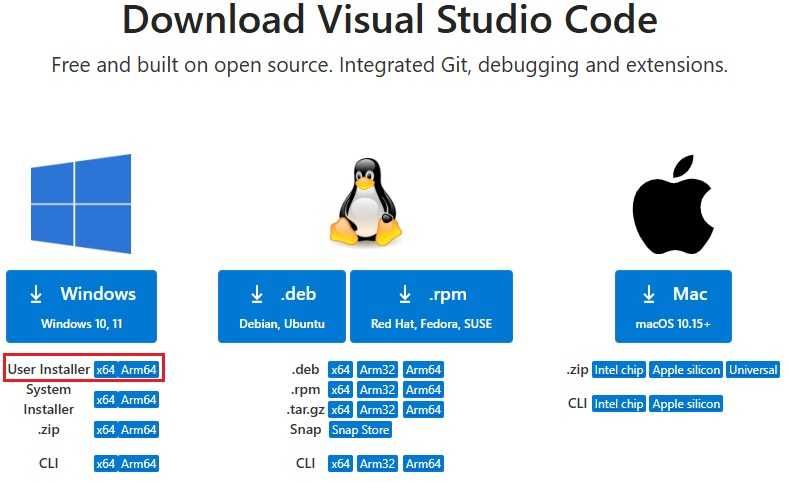
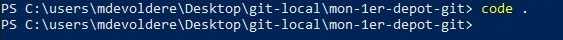
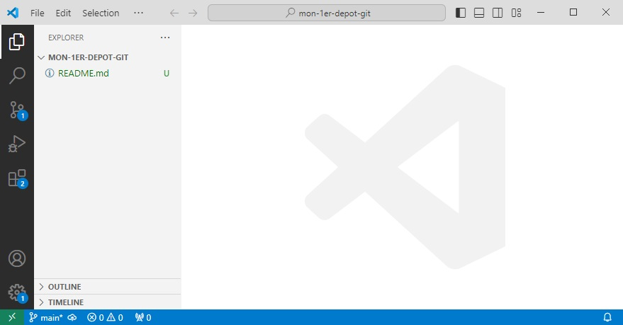

# Ouvrir le dépôt dans un éditeur de code

Si ce n'est déjà fait, [installer Visual Studio Code](https://code.visualstudio.com/Download) (choisissez le `User Installer` qui ne nécessite pas de privilèges élevés pour être installé).

1. Ouvrir PowerShell et naviguer jusqu'au répertoire contenant votre dépôt GIT.
2. Ouvrir le répertoire dans **Visual Studio Code** en tapant la commande `code .` 

> /!\ Le point `.` fait partie de la commande et signifie : "répertoire courant".
>
> Nous pourrions traduire la commande précédente (`code .`) par : 
> - Ouvrir Visual Studio Code (`code`)
> - dans le répertoire courant (`.`)

Votre application `Visual Studio Code` s'ouvre dans le répertoire courant.

- **Sur la gauche**, le répertoire ouvert avec les fichiers qu'il contient (notez que le répertoire .git n'apparait pas, c'est normal).
- **Sur la droite**, la partie éditeur
- **En bas à gauche**, vous observez que Vscode a bien identifié qu'il s'agit d'un dépôt GIT et affiche le nom de la branche courante (main).

