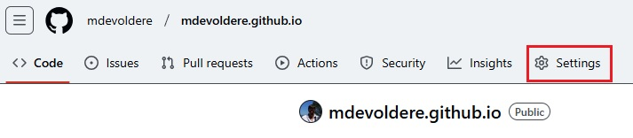
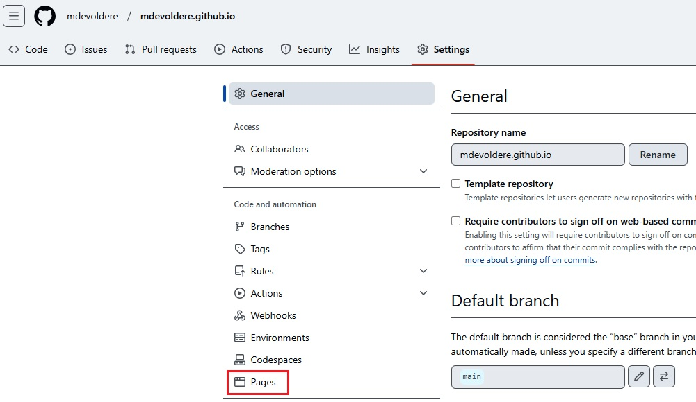
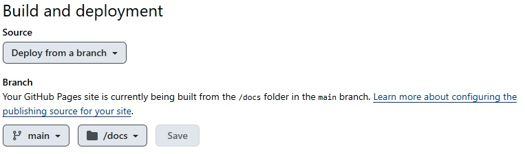

Dans ce document, vous allez apprendre à publier un site sur Github.

## Pré-requis : 
- Bases HTML
- Bases CSS
- Posséder un compte sur [Github](https://github.com)
- Savoir créer un dépôt sur github
- Savoir synchroniser un dépôt GIT avec [Github Desktop](https://desktop.github.com)
- Savoir fusionner des branches avec l'outil "Pull request" de Github
- Savoir lire et suivre un tutoriel en Anglais

## Compétences mises en oeuvre : 
- Créer un document HTML
- Mettre en forme un document HTML avec CSS
- Gérer ses fichiers sources avec GIT et Github
- Publier un site statique sur Github avec Github Pages
- Utiliser l'Anglais dans un contexte professionnel

## Publication d'un site web statique sur Github

Les développeurs ont généralement un compte sur une plateforme de gestion de version comme [Github](https://github.com) ou [Gitlab](https://gitlab.com). Cela leur permet de gérer leurs projets et de partager leur savoir-faire. Ces plateformes proposent des fonctionnalités similaires aux réseaux sociaux mais adaptés aux développeurs. Sur de telles plateformes, on publie du code plutôt que des photos de vacances.

Ces grandes plateformes proposent une fonctionnalité intéressante : **publier automatiquement un site web à partir d'un dépôt GIT grâce à l'intégration continue**. Le site est alors accessible via un sous domaine de la plateforme.

> Note: La fonctionnalité "pages" de Github et Gitlab ne fonctionne qu'avec des sites statiques. PHP, Java et tout autre langage exécuté coté serveur ne sont pas pris en charge !

# Publier son site statique sur Github

Pour publier un site statique sur Github, vous devez suivre la procédure décrite ci-dessous.

1. S'identifier sur github
2. Créer un nouveau dépôt respectant les règles suivantes :
    - Le nom du dépôt doit être *username.github.io*
        - Ex: mon nom d'utilisateur est *mdevoldere*, je crée un dépôt nommé "*mdevoldere.github.io*"
    - Le dépôt doit être public
3. Une fois le dépôt créé, rendez-vous dans les **paramètres** du dépôt

4. Dans le menu latéral, cliquer sur la section "**pages**"

5. Appliquez la configuration comme sur la capture suivante : 

6. Cloner le dépôt sur votre mahcine locale
    - Pour vous aider : [Cloner un dépôt Github](https://docs.github.com/fr/repositories/creating-and-managing-repositories/cloning-a-repository)

7. Une fois votre dépôt cloné en local, l'ouvrir dans Visual Studio Code

8. A la racine du dépôt, créer un répertoire "**docs**"

9. Dans ce répertoire "**docs**", créer un fichier "**index.html**"

10. Dans ce fichier, ajouter une structure HTML de base et un titre de niveau 1

11. Une fois les modifications terminées, créer un commit et pousser le sur Github

12. Retourner sur github.com et afficher votre dépôt

13. Avec votre navigateur web, accéder à l'adresse correspondant au nom du dépôt.
    - Mon dépôt est "mdevoldere.github.io"
    - l'adresse du site correspondant est https://mdevoldere.github.io

14. Vous devriez voir aparaitre votre page web !

# Exercez vous

[Publier votre CV en ligne sur Github Pages](./21-cv-github)
