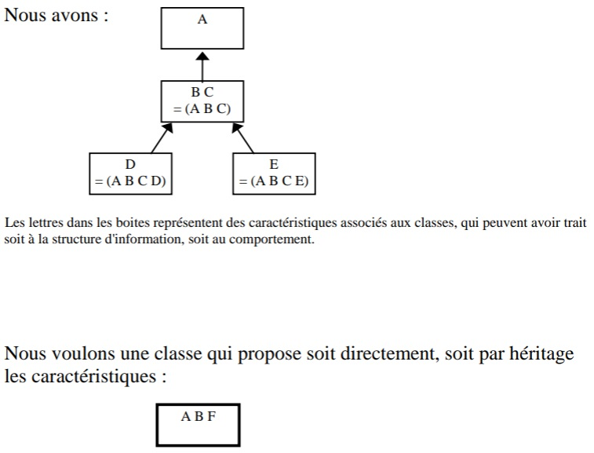

# L'héritage

Cette partie vous permettra de mettre en pratique les notions suivantes : 
- L'abstraction
- La représentation de concepts en objet 
- La notation UML
- L'héritage

# Structuration d'héritage

Une structuration de classes s'effectue avec l'aide de l'héritage. 

Comment devons-nous donc utiliser l'héritage pour obtenir une hiérarchie de classes bonne et robuste ?

Prenons cet exemple :

Que se passe-t-il si nous voulons décrire des hommes vieux, ayant quelques caractéristiques différentes de celles de leurs jeunes collègues ?

Par exemple il ne peuvent pas danser de la même manière qu'un homme jeune.

Proposer une solution résolvant cette problématique.

# Restructuration d'héritage

Il est parfois nécessaire de restructurer une hiérarchie d'héritage de manière à obtenir une classe qui soit adaptée à l'héritage nécessaire. Cette restructuration demande souvent beaucoup de travail parce qu'il faut assumer les conséquences de la modification sur la hiérarchie existante.

**Exercice :**

