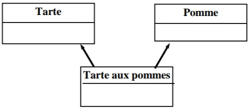

# Les associations

Cette partie vous permettra de mettre en pratique les notions suivantes : 
- L'abstraction
- La représentation de concepts en objet 
- La notation UML
- Les relations entre objets

# Améliorer un modèle

Améliorer le modèle suivant : 

# Identifier la bonne relation

Dans les assertions suivantes, préciser s'il s'agit d'une association, d'une 
agrégation ou d'une généralisation.

1. Une pièce de théâtre classique comporte des actes et des scènes.
2. Chez les artistes de music-hall, il y a des compositeurs, des interprètes et 
des paroliers.
3. Un coureur automobile participe à des courses pour une écurie
4. Un programmeur écrit des programmes. 
5. Un programme COBOL est composé de divisions, de sections et de 
paragraphes.
6. Les modems, les écrans, les souris et les claviers sont des organes d'entrée/sortie. 
7. Un ordinateur comprend une caisse, une alimentation, des composants 
électroniques, un SSD, des organes d'entrée-sortie (claviers, souris, enceintes...).

# Modéliser un concept

Proposer une modélisation qui représente la métamorphose du **papillon** qui passe 
successivement par les stades **chenille**, **chrysalide** et **lépidoptère** ?

Lorsque vous avez terminé votre diagramme, coder la solution dans le langage indiqué par vos formateurs.
