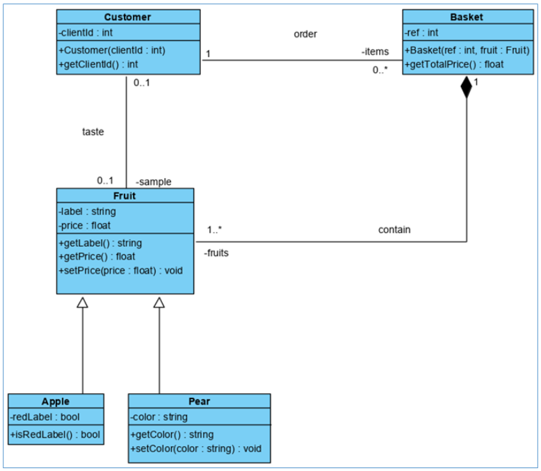

Codez le diagramme de classes suivant dans le langage indiqué par votre formateur. 

>/!\ Respectez la typo. 
>
>/!\ Le corps des méthodes n'a pas besoin d'être implémenté (uniquement les signatures). 
---

---