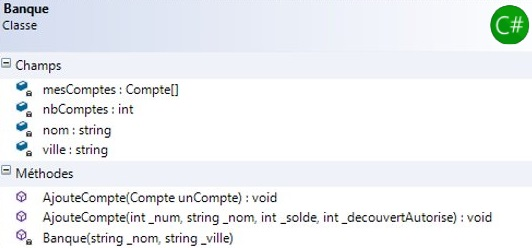

# Modéliser et coder

**Prerequis :** Avoir terminé l'exercice [Compte bancaire](./01-compte-bancaire)

Cette partie vous permettra de mettre en pratique les notions suivantes : 
- Notions de conteneurs

# Contexte

Pour cette exercice, nous allons réutiliser la classe `Compte`.​

Une classe `Banque` va permettre de regrouper les différents comptes.



## Travail à réaliser

1. Compléter le diagramme de classe que vous avez réalisé pour le Compte bancaire. 

> Valider votre diagramme avec votre formateur.

- Implémentez le constructeur et les deux méthodes `AjouterCompte`. Attention une des méthodes est privée !​

- Écrire la méthode `ToString` de la classe **Banque** qui réutilisera la méthode `ToString` de la classe **Compte​**

- Écrire une méthode publique `CompteSup` de la classe **Banque** qui retourne le compte ayant solde maximum. Vous afficherez ce compte supérieur dans la console.​

- Écrire une méthode `RendCompte` de la classe **Banque** qui retourne un compte en fonction de son numéro. La fonction retourne `null` si le compte n'est pas trouvé. Pour cela vous devrez ajouter éventuellement dans la classe **Compte** un accesseur public sur le numéro de compte. 

- É​​crire une méthode qui va transférer une somme d'un compte vers un autre compte.

```csharp
Banque b = new Banque("Crédit Mutuel", "Mulhouse");
b.Ajoutercompte(1245, "Robert", 2000, 300);
b.Ajoutercompte(2568, "Denis", 1000, 400);

if(b.Transferer(1245, 2568, 1000)) {
    Console.WriteLine("Transfert Réussi"); // Doit afficher ce résultat
}
else {
    Console.WriteLine("Transfert impossible");
}

bool resultat = b.Transferer(1245, 2568, 5000); // retourne "faux", le transfert sera impossible.
```

> Tester votre code puis valider votre travail avec votre formateur.
