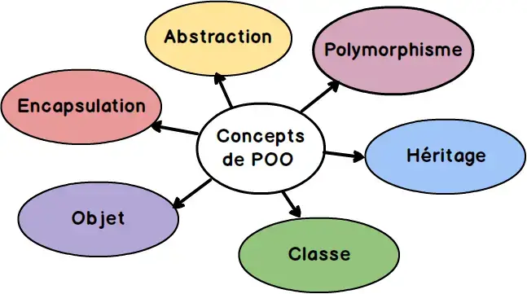
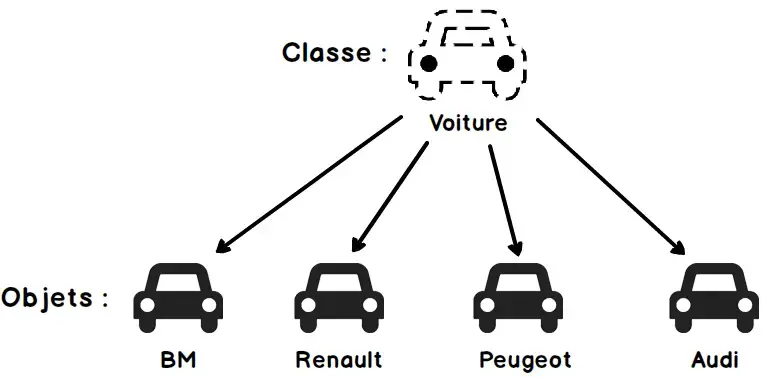
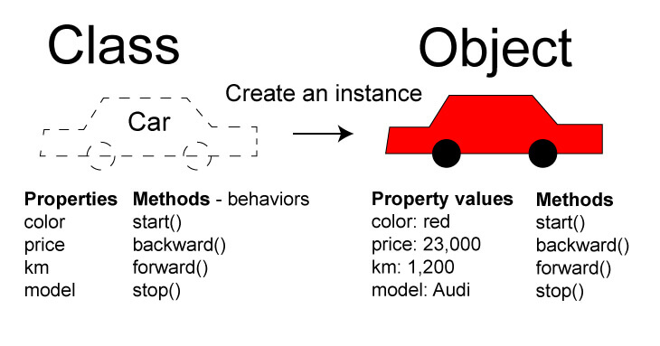

Programmation Orientée Objet (POO), Vous en avez peut-être déjà entendu parler. En quoi cela consiste-t-il ?

## Qu'est ce qu'un objet ?

Un **objet** en programmation n’est pas si différent de ce qu’on considère comme objet dans la vie de tous les jours. Si je vous dis "*Donnez-moi un objet*", vous pourriez m’apporter un *stylo*, un *écran de télévision*, ou encore un *livre*.

**Prenons l’exemple du stylo:**

Si je vous dis "*décrivez-moi ce qu’est un stylo*", vous pourriez répondre:
    - "*Un stylo est un objet, qui a de l’encre, et qui permet d’écrire*".
Si je vous dis "*décrivez-moi ce qu’est un stylo précisément*", vous pourriez répondre:
    - "*Un stylo est un objet, avec un niveau d’encre compris entre 0% et 100%, et qui a une fonctionnalité : écrire*".
Si je vous dis "*décrivez-moi ce qu’est un stylo comme un développeur*", vous me répondrez alors: 
    - "*Un stylo est un objet, qui a une variable de type "Integer" appelé "niveauEncre", et qui a une fonction écrire*".

Et voilà, vous avez compris ce qu’est un objet 🙂.

En informatique, un objet est un conteneur symbolique et autonome qui contient des informations et des mécanismes concernant un concept qui peut-être réél (un stylo, une voiture...) ou virtuel (et/ou imaginaire) (un compte bancaire, un personnage dans un jeu vidéo...).

Un objet en programmation est donc la représentation d’une structure de données ayant un comportement bien défini. Un objet possède ses propres variables et ses propres fonctions.

## Qu’est-ce qu’une classe ?

En programmation orientée objet, les classes sont des modèles permettant de créer des objets.

- Si je vous dis "faites un gâteau", vous allez vous reporter à une recette (au chocolat ? aux fruits ?).
- Si je vous dis "fabriquez une voiture", vous allez vous reporter à un modèle (peugeot 206 ? Clio ?).
- Si je vous dis "modélisez un chien", vous allez vous reporter à une race (labrador ? berger allemand ?).

Vous avez compris, dans la vie réelle, pour fabriquer quelque chose, vous avez besoin de sa définition. Comment fabriquer un stylo si l’on ne sait pas ce que c’est.

Une **classe** est une définition, un modèle, une recette pour fabriquer quelque chose : les fameux **objets** !

**Partons sur un autre exemple : Une voiture**

A partir d'un concept générique (la classe **voiture**), nous pouvons construire des voitures différentes (les objets). Toutes les voitures possèderont des caractéristiques en commun (les attributs). 

Chaque voiture créée à partir du modèle possèdera des valeurs différentes pour chacune des caractéristiques.

Pour résumer, à partir d'une classe, on instancie des objets : 

## Ressources 

Poursuivre la lecture : 

- [Introduction aux concepts Objet](https://devoldere.net/ressources/objet/1.Cours%20Concepts_objet.pdf)
- [Cours UML sur Developpez.com](https://laurent-audibert.developpez.com/Cours-UML/?page=diagramme-classes)
