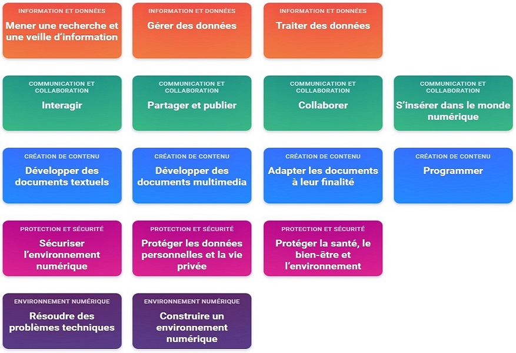

Maîtriser l’informatique représente un prérequis dans le monde professionnel que vous souhaitez intégrer. Ce secteur est omniprésent avec la multiplication des tablettes, des Smartphones et ordinateurs, aussi bien dans le monde professionnel que dans les foyers. Pour apprendre l’informatique, vous devez maîtriser certaines bases en lien avec le numérique. 

Vous devez connaître les bases de l’informatique avant de vous former sur la programmation. 

Voici une liste non exhaustive de compétences à maîtriser :

- Démarrer et éteindre un ordinateur 
- Connaître les éléments basiques d’un système informatique
- Savoir naviguer dans les dossiers et les fichiers
- Créer et ouvrir un fichier sur traitement de texte ou tableur 
- Savoir installer un logiciel
- Faire une maintenance informatique de base 
- Naviguer sur le web 
- Brancher un disque externe et stocker ses données 
- Savoir utiliser une solution de stockage dans le Cloud

--- 

Pour démarrer, vous pouvez vous inscrire et suivre les modules de la plateforme PIX en cliquant sur le lien suivant : 

[Développez des compétences numériques fondamentales pour votre vie personnelle, professionnelle et citoyenne](https://pix.fr)

  
