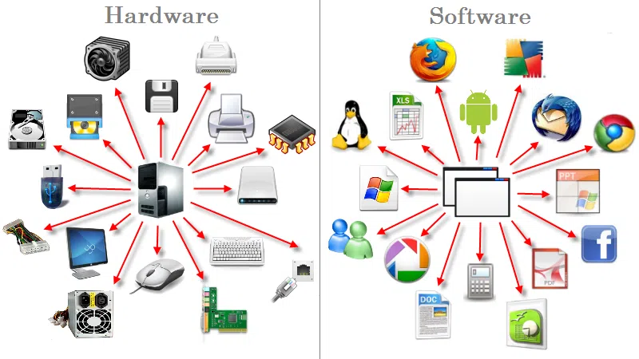
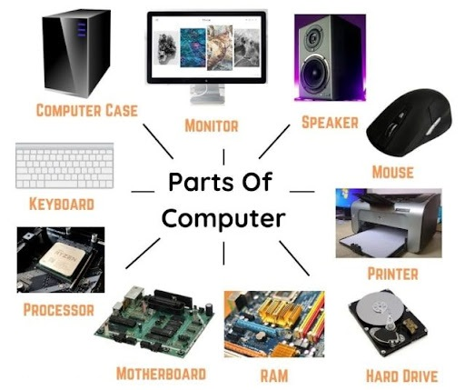

Le terme "**hardware**" désigne tous les composants matériels d’un ordinateur ou d’un appareil électronique. Contrairement au "**[software](./22-software-kesako.md)**" (logiciel) qui est immatériel et correspond aux programmes et aux applications, le hardware constitue l’ensemble physique des composants, des circuits, et des accessoires d’un appareil. 

# Qu’est-ce que le Hardware ?
Le **hardware** regroupe tout ce qui est tangible dans un ordinateur ou un système électronique : les puces, les cartes, les périphériques et les boîtiers. En somme, tout ce qui est matériel dans un dispositif informatique est considéré comme du **hardware**. Cela inclut le processeur, la mémoire vive (RAM), le disque dur (HDD ou SSD), la carte graphique (GPU), les périphériques comme la souris, le clavier, etc...

## Le rôle essentiel du hardware
Le hardware joue un rôle central car il permet aux logiciels de fonctionner. Sans un support matériel, les logiciels seraient inutiles. C’est grâce au hardware que les applications, systèmes d’exploitation, jeux et autres programmes peuvent fonctionner. Par exemple, le processeur exécute les instructions des logiciels, la mémoire vive stocke temporairement les données pour les traiter rapidement, et les disques durs ou SSD stockent les informations sur le long terme.

# Les Composants Clés du Hardware
Le hardware d’un ordinateur comprend une variété de composants, chacun ayant une fonction précise et essentielle au bon fonctionnement de l’appareil.

### Le Micro Processeur (CPU)
Le processeur ou CPU (**C**entral **P**rocessing **U**nit) est souvent considéré comme le "*cerveau*" de l’ordinateur. C’est lui qui exécute les instructions des programmes en effectuant des calculs logiques et arithmétiques. Plus un processeur est rapide, plus l’ordinateur peut effectuer de tâches rapidement. Les processeurs sont aujourd'hui dotés de multiples cœurs, permettant de gérer plusieurs tâches en parallèle (c'est le concept du *multitache*).

### La Mémoire Vive (RAM)
La RAM stocke temporairement les données en cours de traitement. Elle a l'avantage de traiter des informations très rapidement et de faire fonctionner les programmes sans délai. Plus un ordinateur dispose de RAM, plus il peut gérer des applications et des processus simultanément sans ralentissement. Lorsque l'ordinateur est mis hors tension, le contenu stocké dans la RAM est effacé.

### Le Disque de Stockage (HDD/SSD)
Le disque dur (HDD) ou le disque SSD (Solid State Drive) sont les unités de stockage permanent. Lorsque l'ordinateur est mis hors tension, le contenu stocké dans un HDD ou SSD est préservé.

### La Carte Graphique (GPU)
La carte graphique est responsable de l’affichage des images à l’écran. Elle est particulièrement importante pour les applications graphiques intensives comme les jeux vidéo, la modélisation 3D et le rendu vidéo. Une carte graphique dispose d'un micro-processeur appelé GPU (**G**raphics **P**rocessing **U**nit). Les GPU modernes sont également utilisés pour des calculs complexes en intelligence artificielle car ils ont la particularité de pouvoir gérer de nombreux calculs en parallèle, bien plus efficacement q'un CPU.

### Les Périphériques d’Entrée et de Sortie
Les périphériques d’entrée (comme le clavier et la souris) permettent à l’utilisateur de transmettre des instructions à l’ordinateur. Les périphériques de sortie, tels que l’écran et l’imprimante, montrent les résultats des traitements effectués.

# L’Évolution du Hardware
Le hardware a connu une évolution impressionnante depuis l’apparition des premiers ordinateurs. Dans les années 1960, les ordinateurs étaient de vastes machines occupant des salles entières. Aujourd’hui, nous avons des ordinateurs portables et des smartphones plus puissants que ces ordinateurs de première génération.

### Les Premiers Ordinateurs
Les premiers ordinateurs étaient composés de tubes à vide, remplacés ensuite par les transistors, ce qui a permis de réduire leur taille et d’améliorer leur efficacité.

### L’Ère des Microprocesseurs
Dans les années 1970, l’invention du microprocesseur a transformé le monde de l’informatique en permettant la fabrication de micro-ordinateurs, accessibles à un plus large public.

### La Révolution des Années 2000 : L’Apparition des Smartphones et des Tablettes
La miniaturisation du hardware et l’amélioration de la performance ont permis le développement des smartphones et des tablettes, qui offrent des capacités proches de celles des ordinateurs de bureau.

# Les Innovations Récentes dans le Hardware
Les progrès dans le domaine du hardware continuent d’être réalisés, avec des innovations comme l’intelligence artificielle, les systèmes de refroidissement avancés, les technologies de stockage et la connectivité sans fil ultra-rapide.

### Les Processeurs Multi-cœurs et le Processeur Quantique
Les processeurs multi-cœurs, omniprésents dans les ordinateurs modernes, permettent de réaliser des opérations simultanément. Par ailleurs, le calcul quantique, bien qu’encore en développement, promet des puissances de calcul incomparables pour des tâches spécifiques. Un processeur quantique et à minima 1000 fois plus rapide que le plus puissant des CPUs actuels (11/2024).

### Les GPU pour l’IA et le Deep Learning
Les GPU ont vu leur utilisation détournée. Les cartes graphiques modernes permettent d'effectuer les tâches de deep learning et de machine learning, car elles peuvent traiter un grand nombre de calculs en parallèle, ce qui est nécessaire pour l’entraînement des modèles d’IA. 

### Les NPU pour l’IA
**NPU** pour **N**eural **P**rocessing **U**nit, ou Unité de traitement neuronal. 

Il s’agit d’un type de processeur spécialisé conçu pour accélérer les calculs liés aux réseaux de neurones artificiels. Ces derniers sont utilisés dans une large gamme d'applications d'intelligence artificielle (IA), telles que la reconnaissance d'image, le traitement du langage naturel, les filtres vidéo en temps réel et la prise de décision automatique. Le NPU est donc un processeur spécial chargé de gérer les tâches liées à l’IA et à l’apprentissage automatique.

### Les Stockages SSD et les NVMe
Le SSD est devenu la norme pour les ordinateurs modernes. Les interfaces NVMe (Non-Volatile Memory Express) augmentent considérablement la vitesse de transfert des données par rapport aux anciens disques durs. Le plus lent des SSD est environ 10 fois plus rapide qu'un disque dur classique.

# Le Futur du Hardware
Le futur du hardware est prometteur et porteur de changements importants. On peut s’attendre à des avancées dans les domaines suivants :

### Les Processeurs Neuromorphiques
Inspirés du cerveau humain, les processeurs neuromorphiques sont conçus pour améliorer l’efficacité énergétique des systèmes d’IA, ouvrant la voie à des applications d’intelligence artificielle plus rapides et moins énergivores.

### L’Ordinateur Quantique Grand Public
Bien que les ordinateurs quantiques soient encore loin d’être accessibles à tous, les recherches dans ce domaine progressent rapidement, et ils pourraient révolutionner des secteurs comme la cryptographie, la finance et la science des matériaux.

### Les Interfaces Homme-Machine
Avec le développement de dispositifs comme les lunettes de réalité augmentée et les implants neuronaux, le hardware pourrait bientôt permettre de nouvelles formes d’interaction entre l’homme et la machine.

## Conclusion
Le hardware reste un pilier essentiel du monde informatique et continue d’évoluer à un rythme rapide, poussant les limites de la technologie et redéfinissant ce qui est possible. Avec des innovations constantes et des progrès dans des domaines variés, le hardware influence et transforme la société moderne. Les nouvelles technologies à venir, comme l’ordinateur quantique et les processeurs neuromorphiques, promettent des possibilités encore plus fascinantes pour les décennies à venir. En définitive, la compréhension et l’amélioration du hardware seront essentielles pour répondre aux défis technologiques futurs et pour exploiter pleinement le potentiel de l’informatique.
