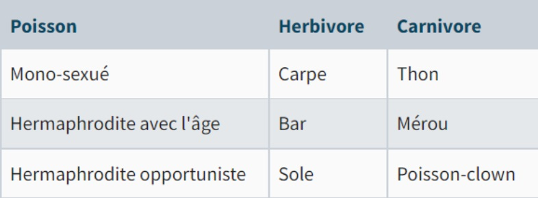

## INTRODUCTION 

Cet exercice vous permettra de mettre en œuvre vos compétences en développement orienté objet. 

Cet exercice peut être réalisé avec n’importe quel langage orienté objet (Java, C#, JS…). 

Nous vous recommandons de faire cet exercice en mode « console » pour bien vous concentrer sur les interactions entre les objets. 

Lorsque vous avez terminé le projet en mode « console », vous pouvez envisager de développer une interface graphique pour rendre vos aquarium « vivants » 😊. 
 

## CONTEXTE  

Monsieur Poiskaï, aquariophile accompli, vous demande de réaliser un programme de simulation pour son prochain aquarium : il compte y mettre un certain nombre d'espèces de poissons rares et chères et ne souhaite pas voir son précieux investissement se transformer en désert au bout de deux mois… 
 

Votre mission (et vous l'acceptez) : lui concevoir un programme qui fera la chose suivante : 


> Je devrai pouvoir mettre des poissons et des plantes dans mon aquarium virtuel, et faire passer le temps pour savoir si tout se passe bien. 


Traduit en langage technique, cela signifie qu'il faudra un programme en deux phases : 

1. L'initialisation : au démarrage, les poissons et les algues sont ajoutés dans l'aquarium. 
2. Le temps qui passe : on résout les actions d’un tour, et on fait un rapport de la situation. 
 

## PARTIE 1 : PEUPLER L’AQUARIUM 

Dans cette 1ère partie, vous vous concentrerez sur le remplissage de votre aquarium. 

### EXERCICE 1.1 : REMPLISSAGE DE L’AQUARIUM 

Il s'agit de la base du programme : avoir un aquarium rempli.  

L'aquarium contient des poissons et des algues, un nombre quelconque de chaque. 

- L'algue ne fait rien : c'est une algue, elle se contente d'exister ou non. 
- Le poisson, lui, a un nom et un sexe (mâle ou femelle). 

L'aquarium permet les opérations suivantes :

- Ajouter un poisson (avec son nom et son sexe).
- Ajouter une algue.
- Passer le temps : à chaque nouveau tour, on fait toutes les actions (ce qui n'est pas très passionnant pour l'instant puisqu'il n'y en a aucune) et on affiche sur la console : 
    - Le nombre d'algues présentes.
    - La liste des poissons avec leur nom et leur sexe. 


### EXERCICE 1.2 : UN PEU DE DIVERSITÉ 

Des poissons tous identiques, ce n'est pas très passionnant.  

Dans le magasin où se fournit le client, on trouve des poissons carnivores et d'autres herbivores.  

Il y a six races de poissons :  

- Poissons carnivores : Mérou, Thon, Poisson-clown.  
- Poissons herbivores : Sole, Bar, Carpe.  

Chaque poisson peut donc manger (via une méthode) :  

- S'il est herbivore, il mange une algue (paramètre : une algue). 
- S’il est carnivore, il mange un autre poisson (paramètre : un poisson quel qu'il soit). 

 
## PARTIE 2 : MANGE, TU NE SAIS PAS QUI TE MANGERA 

Dans cette 2ème partie, vous vous concentrerez sur le cycle de vie de vos algues et poissons. 

### EXERCICE 2.1 : MIAM MIAM MIAM ! 

Nos poissons sont des goinfres. 

A chaque tour, tous les poissons mangent, et ils mangent tout ce qu'ils ont commencé. En clair, ça veut dire que ce qui est mangé disparaît purement et simplement.  

Attention : un poisson ne peut pas se manger lui-même, et un poisson mangé ne peut rien faire.  

L'algue ou le poisson mangé est choisi au hasard. 


### EXERCICE 2.2 : UN PEU DE DOUCEUR DANS CE MONDE DE BRUTES 

Tout ça est beaucoup trop brutal, introduisons la notion de points de vie (PV). 

Les poissons et les algues sont des êtres vivants. Tous les êtres vivants commencent avec 10 PV. Un être vivant qui arrive à 0 PV meurt et disparaît. 

Chaque algue grandit à chaque tour : elle gagne 1 PV. Une algue mangée par un poisson perd 2 PV. 

A chaque tour qui passe, le poisson a de plus en plus faim : il perd 1 PV. 

Un poisson qui a suffisamment faim (5 PV ou moins) cherche à manger. 

Les herbivores n'ont pas trop de problème, mais les algues ne sont pas très nourrissantes : +3 PV. 

Les carnivores mangent de la bonne viande de poisson, qui fait gagner +5 PV. 

Un carnivore attaque chaque tour un poisson au hasard : il n'a qu'une seule chance. 

Hélas pour lui, il ne peut ni se manger lui-même, ni manger un poisson de son espèce. 

Se faire mordre fait très mal et fait perdre 4 PV. 
 

## PARTIE 3 : REPRODUCTION 

Dans cette 3ème partie, vous vous concentrerez sur la reproduction des locataires de l’aquarium. 
 

### EXERCICE 3.1 : LE DÉSASTRE DU VIEILLISSEMENT 

Tous les êtres vivants naissent à l'âge de 0 tour. 

Les êtres vivants qui ont plus de 20 tours meurent de vieillesse. 

On peut acheter des poissons et des algues à un âge quelconque. 

### EXERCICE 3.2 : LE MIRACLE DE LA JEUNESSE 

Notre aquarium précédent est condamné à être désert au bout de ~20 tours, ou alors il faut remettre sans arrêt des algues et des poissons. 

Pas très intéressant, non ? Nous avons des poissons mâles et femelles ? Faisons-les se reproduire ! 

Un poisson qui n'a pas faim va aller voir un autre poisson (au hasard). 

Si ce poisson est de même race et de sexe opposé, les deux poissons se reproduisent et donnent naissance à un troisième poisson, de même race et de sexe aléatoire. 

Il n'a qu'un seul essai par tour. 

Concernant les algues, c'est plus simple : Une algue qui possède 10 PV ou plus se sépare en deux pour donner naissance à une algue deux fois plus petite, donc avec deux fois moins de PV. 

Évidemment l'algue parente perds la moitié de ses PV dans le processus, mais garde son âge. 
 

### EXERCICE 3.3 : MAIS… LA REPRODUCTION DES POISSONS EST HORRIBLEMENT COMPLIQUÉE ! 

Eh bien oui, la sexualité des poissons est horriblement compliquée. Pourquoi ? Parce qu'ils ne sont pas simplement "mâle" ou "femelle" !  

On distingue :  

- Le poisson mono-sexué : Comme vous et moi, ces poissons naissent mâle ou femelle et n'en changent plus.  
- Le poisson hermaphrodite avec l'âge : Ce poisson passe les 10 premiers tours de sa vie en tant que mâle et les 10 suivants en tant que femelle.  
- Le poisson hermaphrodite opportuniste : Ce poisson va rencontrer un membre de son espèce. Si ce membre est de même sexe que lui, notre poisson change de sexe pour pouvoir se reproduire. 

 
Je rappelle que nous avons déjà des races herbivores et carnivores, ce qui nous donne le tableau suivant : 



 
## PARTIE 4 : RENDONS NOTRE SIMULATEUR D'AQUARIUM PRATIQUE 

### EXERCICE 4.1 : SAUVEZ WILLY ! 

Le client voudrait pouvoir sauvegarder l'état actuel de la simulation (par exemple au tour 35) dans un fichier (par exemple un fichier avec l’extension « .poisson ») pour pouvoir la reprendre plus tard. 

Cette question est beaucoup plus simple qu'elle n'en a l'air, mais nécessitera sans doute de modifier toutes les classes. 
 

### EXERCICE 4.2 : UN FICHIER POUR LES ENREGISTRER TOUS… 

Le client voudrait que les rapports de ce qui s'est passé dans le tour s'enregistrent dans un fichier en plus d'être affichés sur la console. 

 

### EXERCICE 4.3 : … ET DANS UN FICHIER LES CHARGER 

Le client est aquariophile mais pas programmeur, et n'a pas envie de recompiler le programme à chaque fois qu'il veut changer les poissons et les algues introduits au début. 

De toutes façons, il ne sait pas ce qu'est "recompiler". 

Il veut bien lancer le programme en ligne de commande, mais il veut pouvoir écrire les poissons et les algues dans un fichier texte dont il passerait le nom au programme. 

Il fournit un exemple de fichier (les lignes qui commencent par // sont des commentaires et n'apparaitront jamais dans le fichier). 

```js
// 1- ALGUES 
// Format : [Nombre d'algues] algues [âge] ans (= tours) 
1 algues 10 ans 
10 algues 4 ans 

// 2- POISSONS 
// Format : [nom], [race], [âge] ans (= tours) 
Lin, Morue, 10 ans 
Anaclet, Poisson-clown, 1 ans 
Évariste, Thon, 3 ans 
```

### EXERCICE 4.4 : TOURNE, LA ROUE TOURNE… 

Le client voudrait pouvoir ajouter des poissons et des algues à n'importe quel tour. 

Le tour d'insertion serait indiqué par des séparateurs comme celui-ci : 

===== tour 5 ==== 

Tout ce qu'il y a après (et avant le séparateur suivant) suit le format de l'exercice précédent. 

Exemple d'un fichier .poissons : 

```js
1 algues 10 ans 
10 algues 4 ans 
Lin, Morue, 10 ans 
Anaclet, Poisson-clown, 1 ans 
Évariste, Thon, 3 ans 
===== tour 3 ==== 
1 algues 4 ans 
Toto, Morue, 2 ans 
===== tour 8 ==== 
3 algues 2 ans 
1 algues 4 ans 
Titi, Thon, 5 ans 
```

Attention, cette question n'est pas si simple qu'elle en a l'air… 
 

### EXERCICE 4.5 : LE PETIT NEVEU 

Le client voudrait donner le simulateur à son petit-neveu. 

Sauf que celui-ci n'est pas précautionneux : il ne faudrait pas qu'il puisse planter son PC avec le logiciel. 

Si vous avez programmé en suivant les bonnes pratiques, vous avez déjà réalisé cet exercice. 


> Valider votre travail avec vos formateurs avant d'envisager une version avec interface graphique.
