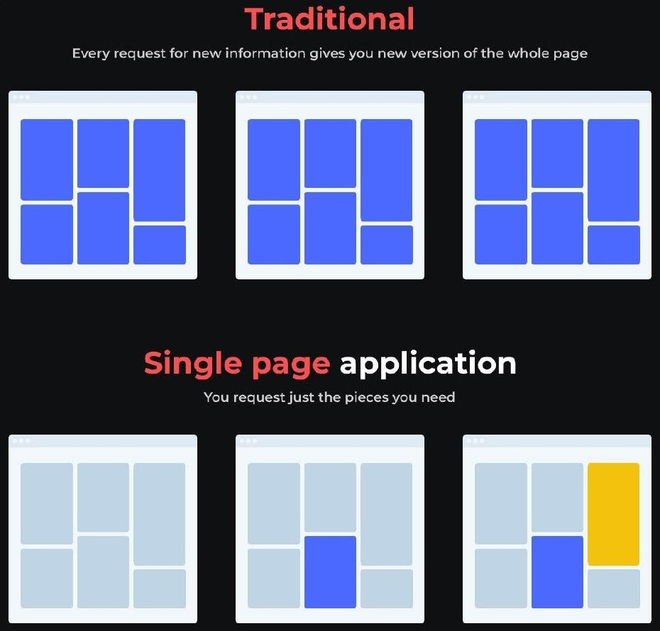

> Projets à réaliser en individuel.

# Application monopage (SPA)

Une application monopage ou SPA (**Single-page application** en anglais) est une implémentation d'application web qui ne charge qu'un seul document web, puis met à jour le contenu du corps de ce document via des **API JavaScript** telles que `XMLHttpRequest` et `Fetch` lorsqu'un contenu différent doit être affiché.

Cela permet donc aux utilisateurs d'utiliser des sites web sans charger de nouvelles pages entières à partir du serveur, ce qui peut entraîner des gains de performances et une expérience plus dynamique, avec certains inconvénients tels que le référencement (SEO), plus d'efforts nécessaires pour maintenir l'état, mettre en œuvre la navigation et mesurer les performances.

---

