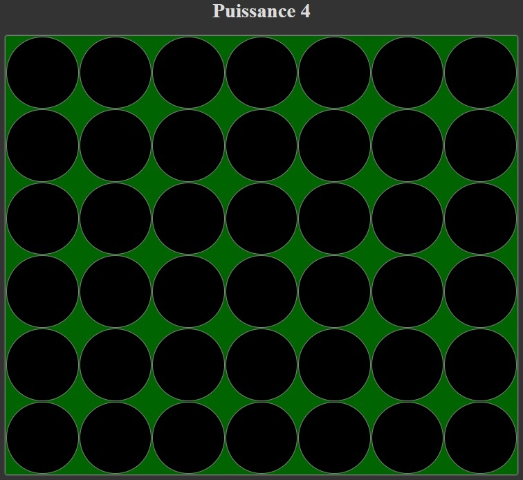
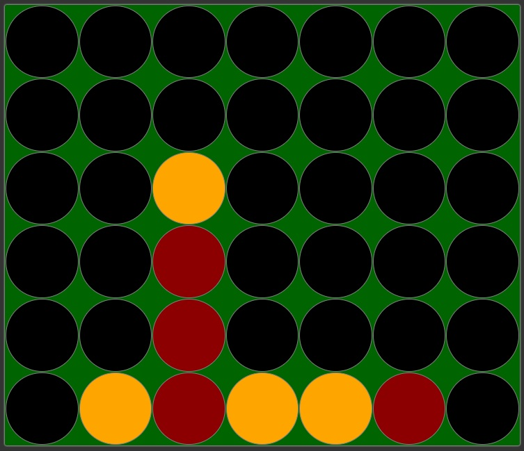
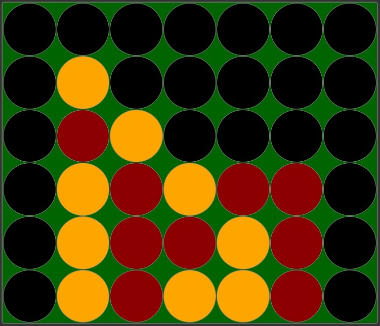

# Le Puissance 4

Dans cet exercice, vous allez développer une version web du célèbre jeu **Puissance 4**. 

## Description du jeu 

Classique et culte, le **Puissance 4** est l'un des jeux de société, de stratégie et de combinaison incontournable. 

Le principe est simple : insérer un pion chacun son tour dans la grille verticale. Le gagnant est le premier à avoir aligné 4 pions de la même couleur, horizontalement, verticalement, ou en diagonale. 

Tout l'enjeu de la partie réside dans la stratégie adoptée pour mettre l'adversaire en échec. Puissance 4 est un jeu qui a traversé plusieurs générations. La simplicité de ses règles en fait un jeu qui vous permettra de passer des heures réflexives et ludiques. 

**Puissance 4** se joue exclusivement en duel.

## Travail à réaliser

A partir des règles exprimées ci-dessus et les maquettes ci-dessous, votre tâche consiste à développer une version Web de ce célèbre jeu.

**Puissance 4** se joue en duel sur le même écran.

**Plateau de jeu vide**

**Partie en cours**

**Les jaunes ont gagné**

