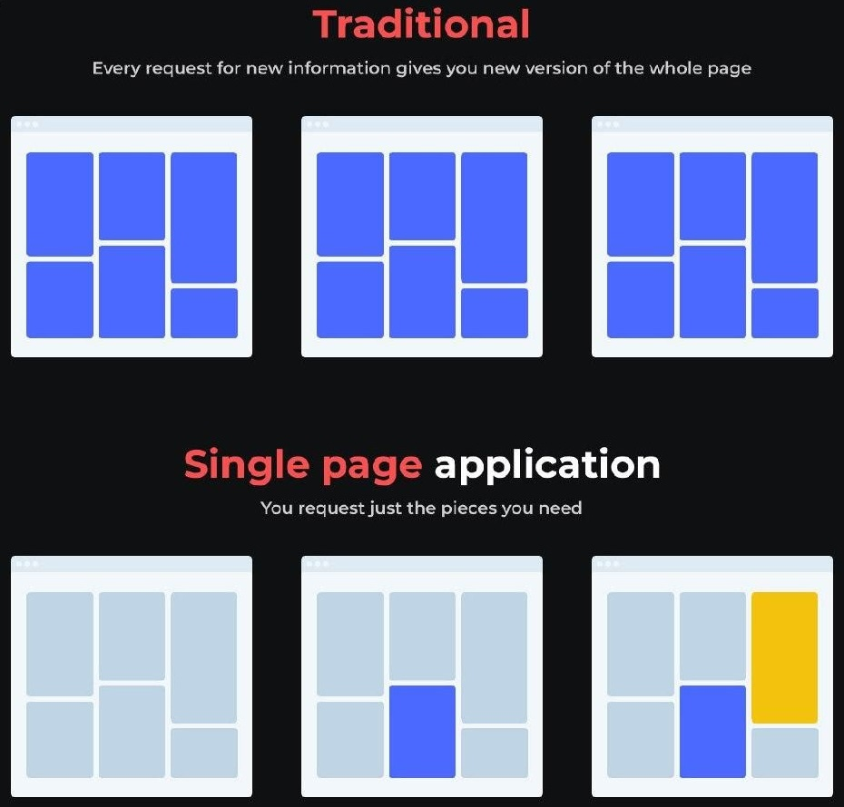
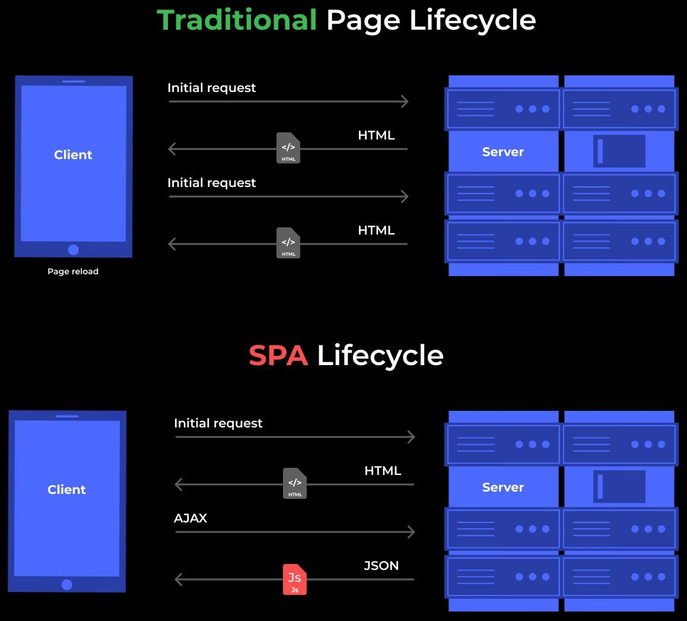

> Projets Web à réaliser en individuel ou en petite équipe !

Une application Web de plusieurs pages ou MPA (**Multi-page application** en anglais) est ce que nous considérons comme un site Web traditionnel.

Lorsque vous passez d'une page à une autre, le site se recharge complètement. Avec ce genre de site Web, le chargement peut parfois être gênant, surtout si votre vitesse de connexion est lente et que vous devez visiter plusieurs pages avec des médias.

On pourrait presque dire que les MPA sont une relique du passé et seront bientôt presque éteintes au profit des [Single Page Applications](./200-projets-spa.md). Certes, un chargement de page plus rapide est toujours intéressant pour l'utilisateur. Cependant, ce n'est pas si simple, et il y a des cas où une MPA reste encore aujourd'hui le meilleur choix.

