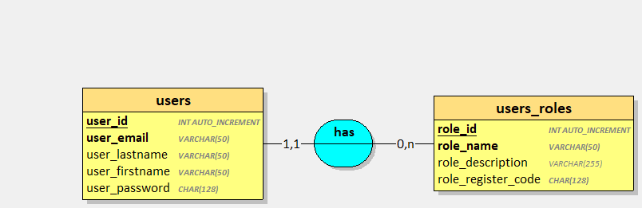
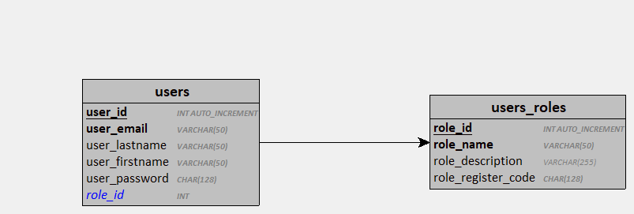
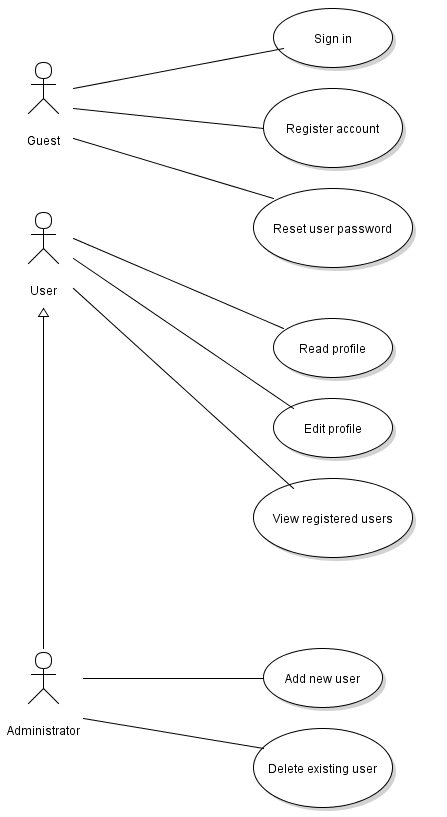

## Développer une application de gestion d'utilisateur

- Application de gestion d'utilisateurs
- L'application est utilisable via une interface HTML/CSS/JS
- La base de données sera une base SQLite 3
- L'application est utilisable uniquement par les utilisateurs enregistrés et authentifiés
- Les utilisateurs non identifiés sont des "invités"
- Un utilisateur est caractérisé par un nom, un prénom, une adresse email, un mot de passe chiffré et une
description
- Un utilisateur enregistré possède 1 rôle parmi la liste suivante :
    - Usager
    - Encadrant
    - Administrateur
- Un rôle est caractérisé par un nom, une description et un code d'inscription chiffré.

### Dictionnaire des données 

| Mnémonique | Signification | Type | Longueur | Remarques |
| --- | --- | --- | --- | ---|
| user_id | Identifiant de l'utilisateur | INT | 11 | Identifiant, A.I |
| user_email | Email de l'utilisateur | VARCHAR | 50 | Obligatoire, unique |
| user_lastname | Nom de l'utilisateur | VARCHAR | 50 | Obligatoire |
| user_firstname | Prénom de l'utilisateur | VARCHAR | 50 | Facultatif |
| user_password | Mot de passe chiffré de l'utilisateur | CHAR | 128 | Obligatoire, chiffré avec Argon2 |
| role_id | Identifiant du rôle | INT | 11 | Identifiant, A.I  |
| role_name | Nom du rôle | VARCHAR | 50 | Obligatoire, unique |
| role_description | Description du rôle | VARCHAR | 255 | Facultatif |
| role_register_code | code d'inscription du rôle | CHAR | 128 | Obligatoire, chiffré avec Argon2 |

### MCD & MLD

### SQL

[Script d'installation SQLite3](./img/users.sqlite.sql) 

[Script d'installation MySQL/MariaDB](./img/users.mysql.sql)

## FONCTIONNALITES

1. **Invité**
    1. Un invité peut s'identifier
        - Après identification, il est redirigé vers la page de son profil
    2. Un invité peut créer un compte s'il dispose du code d'inscription
        - Après la création, il est redirigé vers le formulaire d'identification
    3. Un invité peut demander à réinitialiser son mot de passe
2. **Usager**
    1. Un usager peut consulter son profil
    2. Un usager peut modifier les informations de son propre profil sauf son rôle
    3. Un usager peut parcourir la liste des utilisateurs enregistrés
        - La liste des utilisateurs affiche : `Nom`, `Prénom`, `Intitulé du rôle`
        - *Un usager ne peut pas consulter les fiches individuelles des autres utilisateurs*
    4. Un usager peut se déconnecter de l'application
3. **Encadrant**
    1. Un encadrant **est un usager** avec privilèges accrus
    2. Un encadrant peut consulter les profils individuels des *usagers* et *encadrants*
    3. Un encadrant peut modifier les informations des **usagers** sauf leur rôle et leur mot de passe
4. **Administrateur**
    1. Un administrateur **est un encadrant** avec privilèges accrus
    2. Un administrateur peut consulter le profil individuel de n'importe quel utilisateur
    3. Un administrateur peut modifier toutes les informations d'un utilisateur enregistré
    4. Un administrateur peut ajouter un utilisateur sans code d'inscription
    5. Un administrateur peut supprimer un utilisateur

Si nécessaire, ajoutez les cas d'utilisation supplémentaires que vous jugerez pertinents. Toutefois, gardez en mémoire que dans un projet client, chaque fonctionnalité ajoutée coûte du temps et doit être justifiée auprès des décideurs.

## TRAVAIL A REALISER

- Réaliser l'analyse (cas d'utilisation, développer les scénarios)
- Concevoir et implémenter la couche d'accès aux données
- Développer les composants d'accès aux données
- Développer l'interface utilisateur

> Assurez vous que votre application fonctionne correctement avant de passer à la suite

# Fonctionnalités complémentaires 

Ce système de gestion d'utilisateur doit pouvoir permettre à d'autres applications de l'utiliser à distance via des requêtes AJAX.

## TRAVAIL A REALISER 

Développer une API Rest permettant :

- De s'identifier (Requête POST)
    - Après identification réussie, l'API retourne un `JWT` valide pendant 10 minutes
- De récupérer les informations de son profil une fois identifié (Requête GET)

**Pour vous aider**

[Comprendre le JSON Web Token](https://www.ionos.fr/digitalguide/sites-internet/developpement-web/json-web-token-jwt/)

Cette API sera éventuellement consommée par d'autres projets que vous serez amenés à développer tout au long de votre formation.
