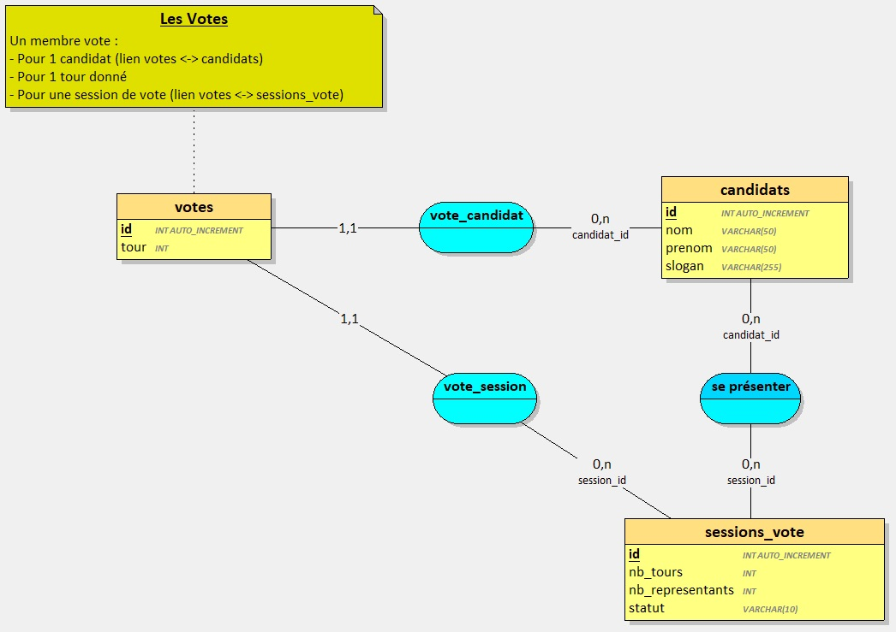
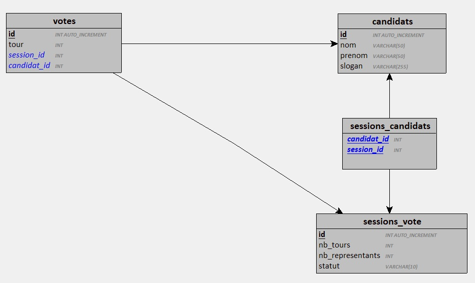
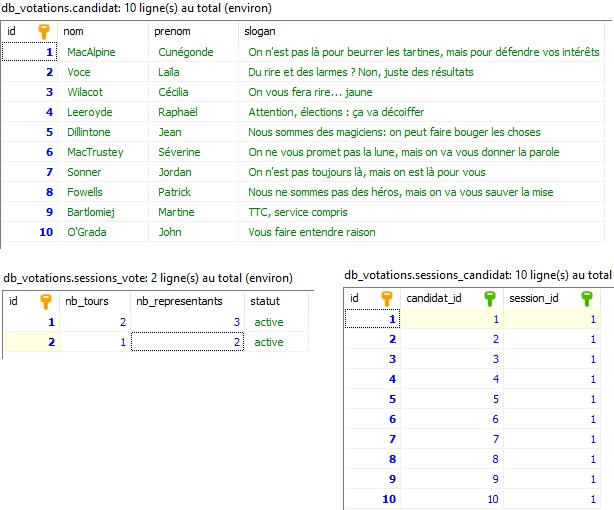
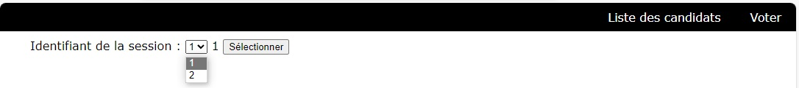
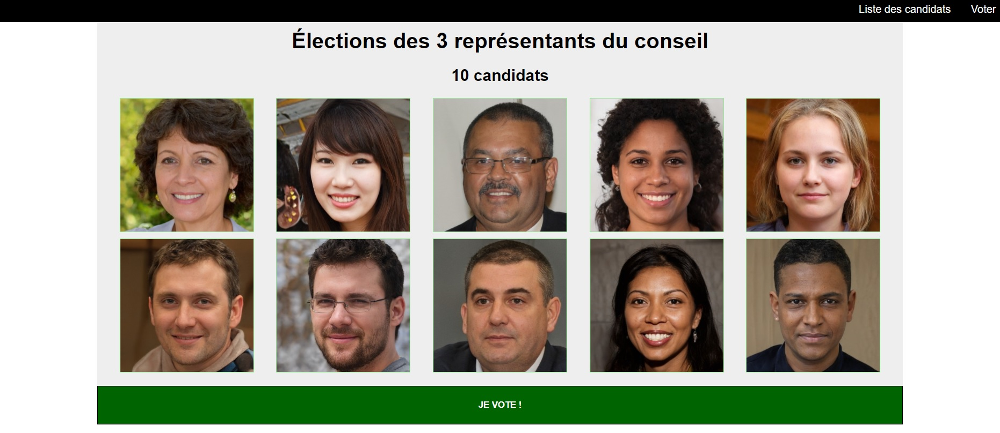
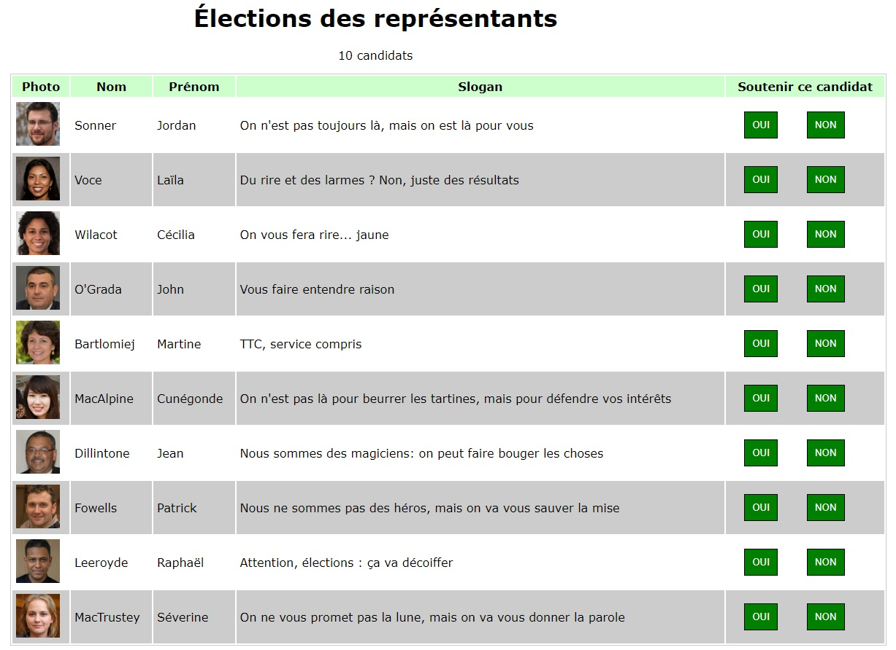

Votre mission consiste à concevoir une machine à voter ! 

Analyser la demande ci-dessous puis, dans cet ordre :

1. Modéliser et créer la base de données relationnelle répondant au besoin
2. Développer le logiciel d'administration permettant la gestion des sessions de votes 
    - Le logiciel d'administration respecte l'architecture MVC
3. Développer le logiciel client : la machine à voter
    - Le logiciel client est une SPA et se connecte à la base de données via une API Rest

--- 

## Contexte 

L'élection est un modèle largement utilisé pour sélectionner les représentants d'une institution.

Cette méthode de sélection fonctionne sur un principe simple :

1. Une institution a besoin de représentants.
2. Des candidats se font connaître et font campagne.
3. Tous les membres de l'instituion votent.
4. Selon le cas, un ou plusieurs candidats sont élus en 1 ou 2 tours. 

D’ordinaire, les électeurs et électrices se rendent au bureau de vote, prennent une enveloppe et des bulletins sur lesquels figurent les noms des candidats et candidates, puis se rendent dans un isoloir. Ils font alors leur choix et ensuite glissent l’enveloppe dans une urne prévue à cet effet. Le tout, sous la supervision des membres du bureau de vote.

Dans le cas d’une machine à voter, c’est presque la même chose sauf qu’il n’y a ni bulletin ni enveloppe. Une machine à voter est placée dans un isoloir (afin que la personne puisse se soustraire aux regards extérieurs) et le vote consiste à suivre les instructions indiquées sur l’écran. Pour voter, ll faut se servir du clavier/souris ou de l'écran s'il est tactile. De plus, la machine à voter sert d’urne et est directement connectée à une base de données où les votes sont enregistrés.


Votre mission, si vous l'acceptez, est de concevoir le logiciel d'une machine à voter.


## Règles de gestion et d'organisation 

Le logiciel centralise un certain nombre d'informations.

Pour chaque session de vote, le système doit enregistrer : 
- Un identifiant numérique 
- Le nombre de tours de vote (1 ou 2).
- Le nombre de représentants à élire.
- l'identité des candidats (id, nom, prénom, slogan). 
- le statut de la session de vote : `à venir`, `active` ou `terminée`

Note : Une session de vote avec le statut `terminée` ne peut être supprimée.


## Référentiel GIT

Créer un dépôt GIT qui hébergera votre projet.

Ce référentiel doit être synchronisé sur GitHub ou GitLab et être accessible en `public`.


## Base de données 

Créer la base de données relationnelle. 

- Le nom de la base de données doit être: `db_votations`
- La base de données utilise le jeu de caractères `UTF8`

```sql
/* Exemple de création d'une base de données MySQL avec le jeu de caractères UTF8 */

CREATE DATABASE IF NOT EXISTS `db_votations` CHARACTER SET utf8mb COLLATE utf8mb4_unicode_ci;

/* Exemple de création d'une base de données PostgreSQL avec le jeu de caractères UTF8 */
CREATE DATABASE db_votations ENCODING 'UTF8';
```

Vous pouvez utiliser le modèle proposé ci-dessous ou la modéliser vous même.

### Proposition de Modèle Conceptuel


### Modèle logique associé



## API 

Une fois la base de données créée (sans les tables), développer l'API qui sera utilisée par le logiciel client.

1. Créer le répertoire du projet et s'y positionner avec un terminal
2. Créer un projet **Symfony** :  `composer create-project symfony/skeleton:"6.4.*" .`
3. Installer **api-platform** : `composer require api`
4. Installer **maker-bundle** : `composer require symfony/maker-bundle --dev`
5. Créer les entités nécessaires 
    - Tous les entités sont exposées dans l'API
    - Les entités `candidats` et `sessions_vote` sont en lecture seule dans l'API (uniquement les opérations `GET` sont accessibles)
    - L'entité `votes` expose les opérations `GET` et `POST` uniquement

## Créer un jeu d'essai

1. Ajouter 2 sessions de votes à 2 tours
    - Session #1 : 2 tours et 3 représentants à élire 
    - Session #2 : 1 tour et 2 représentants à élire
2. Ajouter 10 candidats
    - [Télécharger la liste des candidats et leur photos](./candidats.zip).
    3. Associer les 10 candidats à la session de vote #1

Votre base de données devrait contenir ces données (les slogans sont libres) : 



## Le logiciel client 

C'est la machine à voter. 

**Fonctionnement :**

La page d'accueil affiche la liste des sessions de votes dans un menu déroulant.



L'application affiche la liste des candidats de la session sélectionnée.



Un survol de la souris sur une photo affiche le nom du candidat dans le cadre de la photo : 


L'utilisateur clique sur le bouton "Je vote"

L'application affiche la liste des candidats dans un tableau



Pour chaque candidat, l'utilisateur clique sur `Oui` ou `Non` pour exprimer son soutien ou pas.

Tous les `Oui` sont enregistrés en base de données (les non sont ignorés).

L'application affiche un message de remerciement.

Au bout de 10 secondes, la liste des candidats est ré-affichée.


## Le logiciel d'aministration 

Développer le logiciel permettant l'administration du système :

1. Gestion des candidats
2. Gestion des sessions de votes
3. Export des résultats de vote au format JSON

**Le logiciel doit obligatoirement respecter l'architecture MVC.**

Vous proposerez une interface utilisateur sobre et intuitive.

Fonctionnement au démarrage de l'application : 

1. L'accueil affiche un formulaire d'identification.
2. L'administrateur s'identifie.
    - En cas d'erreur d'identification : 
        - Afficher un message d'erreur
        - Recommencer à l'étape 1
3. La liste des sessions de vote existantes est affichée 
    - Les sessions sont classées en 2 catégories :
        - active ou terminée

Une fois identifié, l'administrateur peut : 
- Ajouter, modifier ou supprimer une session de vote 
- Ajouter, modifier ou supprimer des candidats
- Afficher les résultats des sessions de vote dont le statut est `terminée`.

---

> Valider le fonctionnement de vos 2 applications avec vos formateurs avant de passer à la suite.


## Déployer la V1

Lorsque vos 2 logiciels sont fonctionnels, créez une `release` sur GitHub (ou GitLab) et étiquetez là `1.0.0`.


## La machine à Voter :  Version 2

Vous devez maintenant développer une version améliorée de la machine à voter.

Les nouveaux éléments à prendre en compte sont les suivants :

- Lors de certaines élections, on vote pour une liste plutôt qu'un candidat.
- Un liste est identifiée par un nom.
- Une liste contient 2 à 10 candidats.
- Le 1er nom de la liste est le représentant de la liste.
- Les autres candidats sont classés par ordre d'importance dans la liste.
- Lors d'une élection, toutes les listes inscrites doivent posséder le même nombre de candidats.

--- 

> Valider le fonctionnement de vos 2 applications V2 avec vos formateurs avant de passer au déploiement.


## Déployer la V2

Lorsque vos 2 logiciels V2 sont fonctionnels, créez une `release` sur GitHub (ou GitLab) et étiquetez là `2.0.0`.
