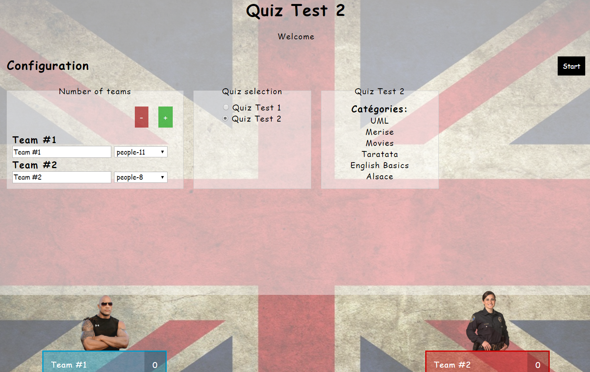
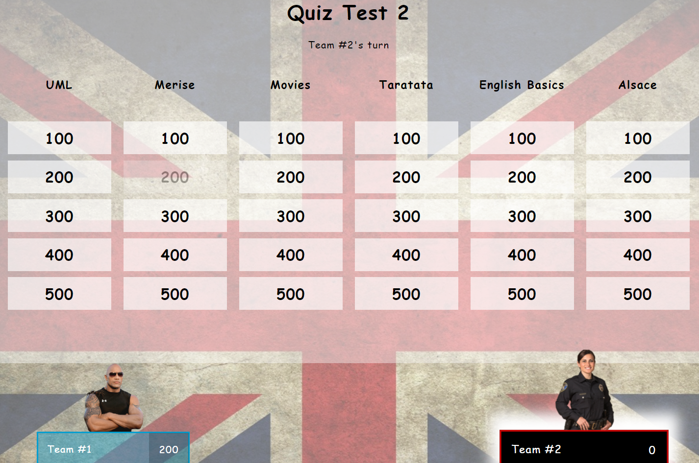
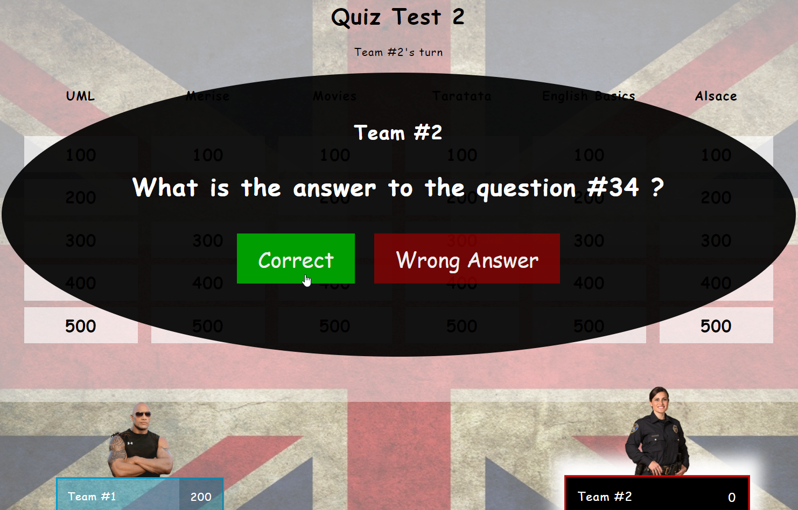

Un FlipQuiz est un jeu de quiz interactif conçu principalement pour animer des quiz en groupe. Il permet aux enseignants, aux animateurs, aux présentateurs ou à toute personne souhaitant organiser un jeu-questionnaire de créer et de personnaliser des tableaux de quiz.

Un FlipQuiz met en concurrence plusieurs équipes qui s’affrontent au tour par tour.

## Contexte de l'application 

L’interface du jeu présente 1 à 6 catégories différentes et chaque catégorie affichée propose 5 questions de niveaux différents (du plus facile au plus compliqué). 

Au début d’une partie de jeu, une équipe est sélectionnée au hasard pour commencer le 1er tour . A chaque tour, l’équipe courante sélectionne une catégorie et un niveau. La question correspondante est alors affichée et un compte à rebours se déclenche. L’équipe peut se concerter et doit proposer une réponse dans un délai maximum de 3 minutes. Si la réponse donnée est correcte, les points correspondant sont attribués à l’équipe. Dans le cas contraire, aucun point n’est attribué. Une équipe ne peut proposer qu’une seule réponse par question.

Le jeu est dirigé par un Maître de jeu qui est responsable de l’interaction avec le logiciel. 

## Contexte d'utilisation

L'application sera utilisée en mode "projection" dans une salle. Elle n'a pas vocation à mettre en concurrence 2 équipes par écrans interposés. Les participants n'interagissent pas directement avec le logiciel. 

Durant une partie de quiz, c'est le maître de jeu qui valide ou invalide une réponse à une question.

L'application sera utilisable au travers d'un navigateur web. 

# Version 1 

## Fonctionnalités 

- Administration des quiz, catégories et questions.
- Lancement d'une partie de quiz paramétrée (choix du quiz, nom des équipes)
- Interface du jeu

## Règles de gestion 

Un Quiz est caractérisé par un titre et une description. Chaque Quiz est relié à 6 catégories au maximum. Une catégorie ne peut être reliée qu’à un seul quiz.

Une question est caractérisée par un contenu (la question), la réponse et un niveau (de 1 à 5). 
Plus le niveau de la question est élevé, plus la question est difficile et rapporte de points.

## Logiciel d'administration

Dans un 1er temps, vous devez développer le logiciel de gestion des quiz.

Ce logiciel sera accessible via un navigateur web après authentification, vous devez donc prévoir la gestion des comptes utilisateurs et l'identification.

### Spécifications du logiciel d'administration 

Le logiciel doit prévoir les cas d'utilisation suivants :

**Quiz**

1.	Ajouter un Quiz
2.	Éditer un quiz
3.	Supprimer un quiz (et toutes les catégories et questions associées) 
4.	Sélectionner tous les Quiz
5.	Sélectionner un Quiz à partir de son identifiant
6.	Un quiz a-t’ il au moins une catégorie associée ?

**Catégories**

1.	Ajouter une catégorie à un Quizz
2.	Éditer une catégorie
3.	Supprimer une catégorie (et toutes les questions associées) 
4.	Sélectionner toutes les catégories
5.	Sélectionner une catégorie par son identifiant en intégrant le nom du quiz
6.	Sélectionner toutes les catégories d’un Quiz à partir de l’identifiant du Quiz
7.	Une catégorie a-t’elle exactement 5 questions associées (une par niveau) ?

**Questions**

1.	Ajouter une question à une catégorie
2.	Éditer une question 
3.	Supprimer une question
4.	Sélectionner toutes les questions
5.	Sélectionner toutes les questions d’une catégorie à partir de l’identifiant de la catégorie
6.	Sélectionner toutes les questions d’un Quiz à partir de l’identifiant d’un Quiz

## Interface Utilisateur 

Pour gérer toutes les données des quiz, le logiciel de gestion proposera les vues suivantess :

-	Identification 
-	Accueil back-office (résumé des données des quiz)
-	Modification du profil de l’utilisateur connecté
-	Édition des Catégories
-	Édition des Questions
-	Édition des Quiz

Prévoyez une interface de gestion sobre et épurée compatible avec les terminaux mobiles.

> Le logiciel d'administration doit être fonctionnel avant de passer à la suite.

## Le Jeu

Le logiciel client embarquera le jeu, sera développé avec VueJS ou ReactJS et proposera 2 vues en Anglais : 

-	Vue Quiz (interface du jeu)
-	Page de Résultat à la fin d’une partie  

### Vues Quiz 

**Démarrage : configuration du jeu**

**Le tableau de questions**

**Affichage d'une question**

>  Publiez la Version 1 avant de travailler sur la Version 2.

# Version 2 

## Fonctionnalités ajoutées

- Gestion d'un historique
- Persistance des équipes avec cumul des points
    - Historique des parties (chaque tour de jeu est enregistré)
- Statistiques et Exportation
    - Statistiques des équipes, parties…
    - Export des statistiques au format Excel

Une équipe est caractérisée par un nom et le nombre de points accumulés lors des différentes parties.

Une partie de quiz connaît les identifiants les 2 équipes et est composé de plusieurs tours de jeu. 

Chaque tour de jeu relie une équipe, un quiz et une question liée à la catégorie sélectionnée par l’équipe. On doit connaître, pour chaque tour, le nombre de points gagnés par l’équipe (0 si mauvaise réponse ou absence de réponse).

---
