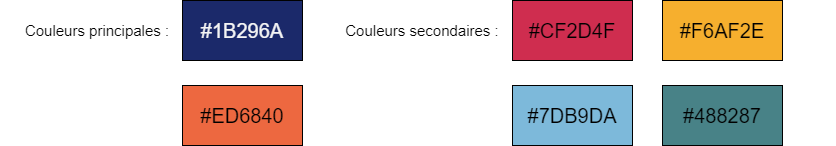
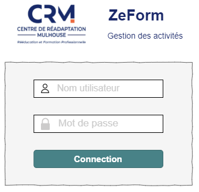
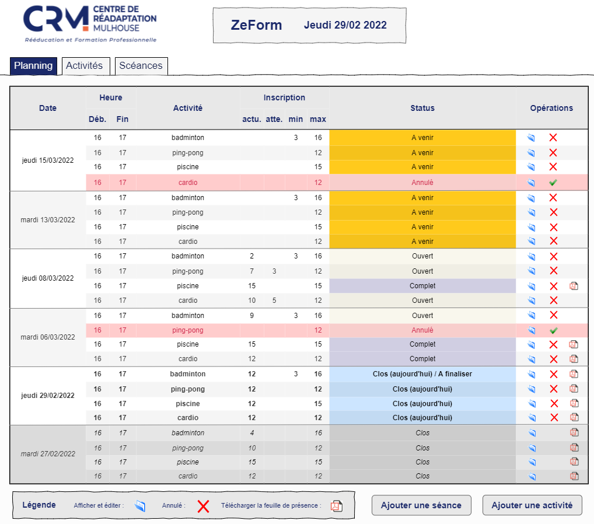
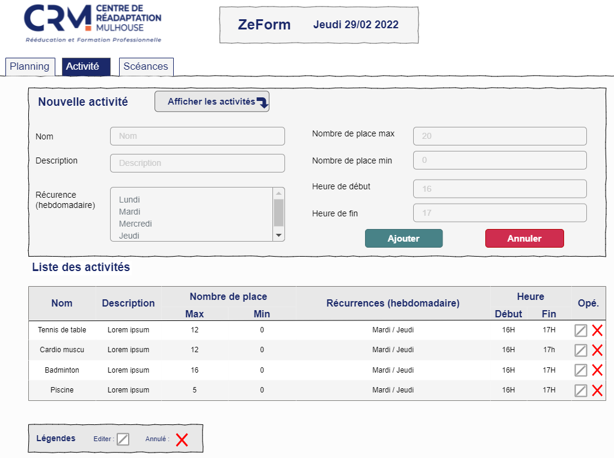
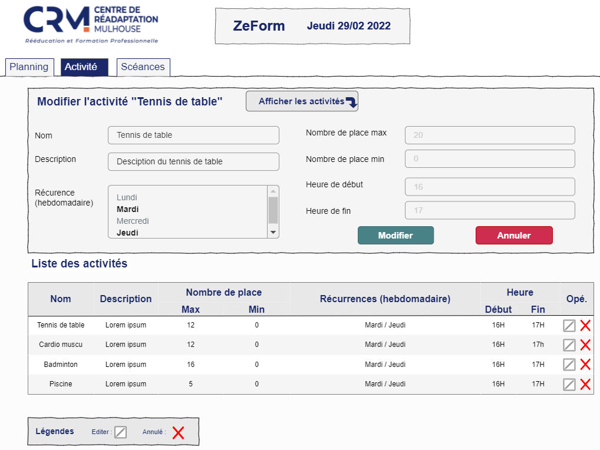
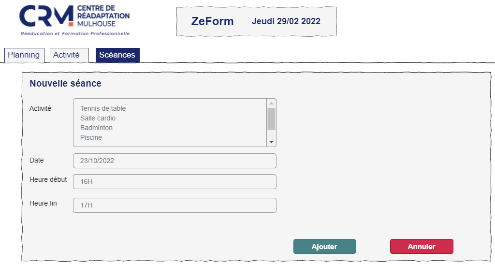
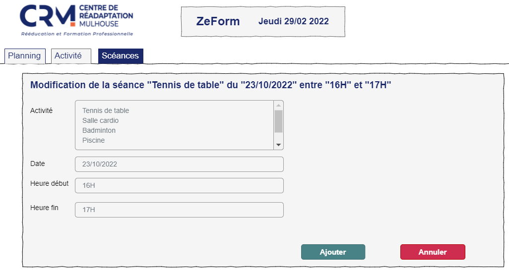

Le CRM utilise un formulaire en ligne pour gérer les inscriptions des stagiaires de la formation professionnelle (OFP) aux différentes activités sportives.

## Contexte 

Actuellement, les inscriptions sont gérées en plusieurs étapes :

1. Les stagiaires s'inscrivent à travers un formulaire accessible depuis une URL (avec Microsoft Form) en remplissant différentes informations.
2. L’administrateur récupère un fichier Excel auto-généré par Microsoft Form, avec l'ensemble des données des stagiaires. Il copie ces données dans un second fichier Excel pour établir la « liste de présence » pour les différentes activités sportives.
3. La liste de présence est ensuite envoyée, au format PDF, aux différents moniteurs sportifs, qui l'impriment.

Cette liste de présence permet aux moniteurs de vérifier la présence des différents stagiaires. Elle permet également aux stagiaires de valider leur présence en émargeant la feuille, à coté de leurs nom et prénom.

Une grosse partie des actions sont réalisées « manuellement », notamment :

- La copie des informations des stagiaires du fichier généré par le formulaire à la feuille de présence.
- La gestion du nombre d'inscrits aux activités sportives.
- La génération du formulaire, réalisé pour chaque date d’inscription.
- La notification des stagiaires en cas de problème d’inscription : trop d'inscrits, moniteur absent, annulation d'activités sportives... La notification est actuellement réalisée à travers un mail envoyé par l’administratrice.
- L'exportation de la feuille de présence au format PDF, ainsi que l’envoi aux moniteurs.

Nous avons également quelques données à prendre en compte :

Il y a actuellement 4 activités sportives avec un certain nombre de places par activités :

- Le tennis de table, 12 places.
- La salle de cardio et de muscu, 12 places.
- Le badminton, 16 places.
- L'accès à la piscine, 15 places.

Les activités sportives se déroulent toutes les semaines, le mardi et le jeudi, de 16h à 17h voire jusque 18h dans certains cas. 

Le formulaire d’inscription des stagiaires enregistre les données suivantes :

- Le nom du stagiaire
- Le prénom du stagiaire
- La section du stagiaire
- L'activité sportive voulue pour la prochaine date

Le client a également 2 contraintes :

- Il ne peut y avoir une section complète inscrite aux activités sportives.
- Il faut prévoir un système de roulement pour les activités "populaires".

## Le logiciel 

Le but de ce projet est d’aider l'administrateur dans la gestion des inscriptions, en automatisant le processus.

Cette automatisation peut être mise en place à plusieurs niveaux :

1. Générer automatiquement la feuille de présence à partir des données du formulaires.
2. Mettre à jour le formulaire en fonction de la date, du nombre d’inscrits ou d’événements souhaités par l'administrateur.
3. Récupérer les informations du stagiaire, comme son nom, son prénom et sa section.
4. Gérer la priorité entre les stagiaires, notamment entre ceux qui ne s’inscrivent que rarement et ceux qui s’inscrivent régulièrement.

**Il faudra proposer 2 interfaces graphiques :**

- Une interface pour les stagiaires, pour gérer leurs inscriptions aux activités.
- Une interface administrateur, pour gérer les inscriptions, notamment :
   - La gestion des dates, des activités sportives.
   - L’affichage des stagiaires inscrits. 

L’authentification se fera grâce au compte du CRM, lié à Microsoft.

**D’autres demandes ont étés formulées par le client :**

- Certaines inscriptions doivent pouvoir être désactivées par l’administrateur (moniteur absent, ou autre événement).
- Pouvoir gérer l’annulation d’événements ayant déjà des inscriptions.
- Pouvoir informer les stagiaires que les inscriptions sont complètes.
- Pouvoir soit laisser à l'administrateur, soit définir dans l’application, l’ouverture des futures sessions d’inscriptions. 

**Système de roulement des stagiaires :**

- A chaque inscription : vérifier si le stagiaire s’est inscrit à la même activité la session précédente
   - si oui => le mettre sur une file d’attente et ne valider l'inscription que s'il reste des places à la fermeture des inscriptions.

A la clôture des inscriptions, possibilité de générer Un PDF pour les moniteurs contenant la liste des inscrits.

## Fonctionnalités 

**Un administrateur peut :**

- Se connecter
- définir la fréquence
- Afficher les types d'évènement
- Ajouter un type d'évènement
- Modifier un type d'évènement
- Supprimer un type d'évènement
- Afficher les évènements
- Afficher un évènement
- Ajouter un évènement
- Modifier un évènement
- Annuler un évènement
- Supprimer un évènement

**Un stagiaire peut :**

- S'identifier
- Afficher les évènements à venir
- Afficher un évènement
- Afficher les évènements auquels il est inscrit(e)
- S'inscrire à un évènement
- Se désinscrire d'un évènement

**L'API Rest permet de :**

- S'identifier
- Afficher les évènements à venir
- Afficher un évènement
- Afficher les évènements auquels je suis inscrit(e)
- S'inscrire à un évènement
- Se désinscrire d'un évènement

## Maquettes 

Inspirez-vous des maquettes ci-dessous pour réaliser les pages de l'application.

### Couleurs

### Login

### Planning

### Ajouter une Activité

### Modifier une Activité

### Ajouter une Scéance

### Modifier une Scéance

> Le cahier des charges a été réalisé avec la participation de Julien Milletre, stagiaire CDA.
>
> Les maquettes ont été conçues par Julien Milletre, stagiaire CDA.
