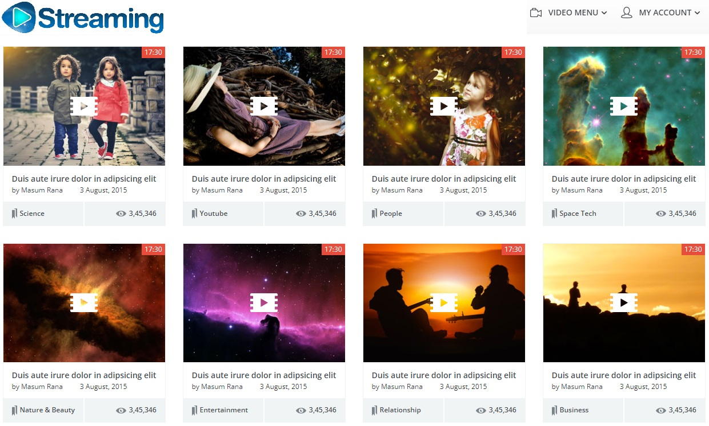
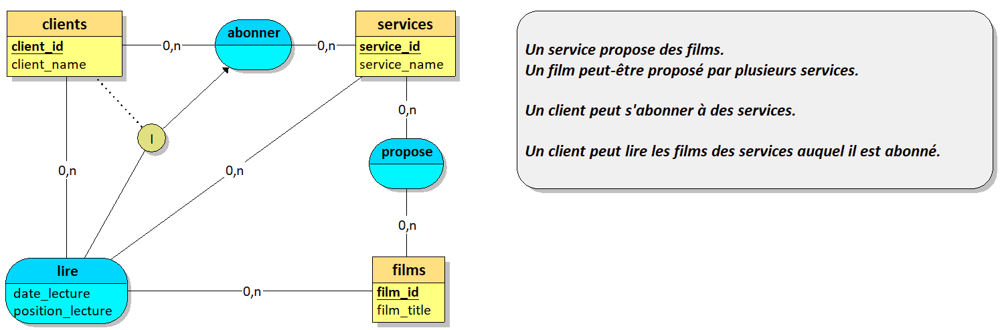
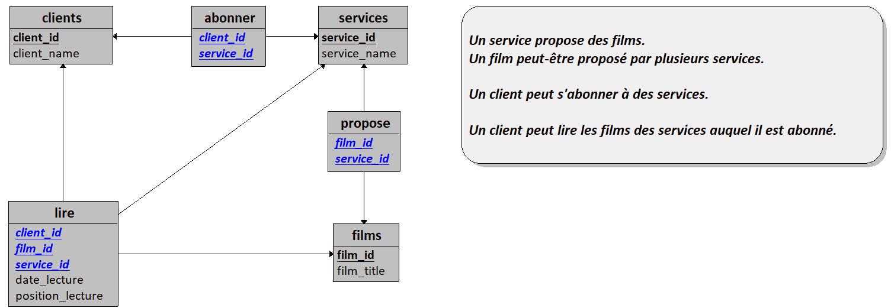

Vous souhaitez lancer votre plateforme de streaming. Votre ambition est grande !

## Contexte 

Pour démarrer et acquérir des fonds, vous décidez de créer une plateforme qui permet de centraliser plusieurs abonnements d'autres plateformes en un compte unique. Plus tard, peut-être, déciderez-vous de lancer votre propre service de streaming ;) 

Vous avez décroché des partenariats avec des services de Streaming populaires. 

Chaque service partenaire vous donne accès à un catalogue de films que vous référencez dans votre base de données.


## Le logiciel client (Front-office)

Vous proposez les catalogues de films de vos partenaires sur un site web.

Un utilisateur non-inscrit peut consulter l'ensemble des catalogues de films et peut accéder à la fiche détaillée de chaque film référencé.

L'utilisateur inscrit à la plateforme peut s'abonner à différents services de streaming vidéo ce qui lui permet de lire les vidéos proposées par les services auquel il est abonné.

Sur la fiche détaillée d'un film : 

- Si l'utilisateur n'est pas abonné au service proposant ce film, un bouton "s'abonner à NOM_DU_SERVICE" permet à l'utilisateur de s'abonner au service.
- Si l'utilisateur est abonné à un service proposant ce film, un bouton de lecture permet de lancer le film.

Lorsqu'un utilisateur lance la lecture d'une vidéo : 

 - Le système contrôle si son abonnement lui permet l'accès à la vidéo.
 - Le système ajoute/édite une entrée dans l'historique de lecture de l'utilisateur (une entrée par utilisateur/film).
    - Si une entrée d'historique existe, la lecture reprend à la progression enregistrée.
 
 Lors de la lecture d'une vidéo : 

 - Le système enregistre la progression actuelle de la vidéo dans l'historique toutes les 2 minutes.


## API 

Les données (catalogues et vidéos) sont accessibles via une API Rest et sont récupérées via des requêtes AJAX.

## Interface utilisateur

L'interface doit être adaptative, mobile-first et utiliser une bibliothéque JS frontend (VueJS ou ReactJS).

Pages à implémenter : 

- Accueil
- Identification
- Profil utilisateur
- Afficher la liste des services (avec tarif et bouton d'abonnement)
- Afficher le catalogue d'un service
   - Les films sont classés par catégorie
- Afficher un film
- Afficher l'historique de l'utilisateur identifié


Logo :


Exemple d'interface que vous pouvez implémenter mais libre à vous de créer l'interface utilisateur de votre choix.

 

---

## Kit de démarrage

Pour démarrer, le modèle suivant doit être utilisé. 





[Cliquez ici pour télécharger le fichier Looping MCD](Streaming_MCD.loo)


Complétez ce modèle avec les informations que vous jugerez nécessaire.

### Script SQL 

```sql
CREATE TABLE clients(
   client_id INT PRIMARY KEY,
   client_name VARCHAR(50) NOT NULL
);

CREATE TABLE films(
   film_id INT PRIMARY KEY,
   film_title VARCHAR(50) NOT NULL
);

CREATE TABLE services(
   service_id INT PRIMARY KEY,
   service_name VARCHAR(50) NOT NULL
);

CREATE TABLE propose(
   film_id INT,
   service_id INT,
   PRIMARY KEY(film_id, service_id),
   FOREIGN KEY(film_id) REFERENCES films(film_id),
   FOREIGN KEY(service_id) REFERENCES services(service_id)
);

CREATE TABLE abonner(
   client_id INT,
   service_id INT,
   PRIMARY KEY(client_id, service_id),
   FOREIGN KEY(client_id) REFERENCES clients(client_id),
   FOREIGN KEY(service_id) REFERENCES services(service_id)
);

CREATE TABLE lire(
   client_id INT,
   film_id INT,
   service_id INT,
   date_lecture VARCHAR(50) NOT NULL,
   position_lecture VARCHAR(50) NOT NULL,
   PRIMARY KEY(client_id, film_id, service_id),
   FOREIGN KEY(client_id) REFERENCES clients(client_id),
   FOREIGN KEY(film_id) REFERENCES films(film_id),
   FOREIGN KEY(service_id) REFERENCES services(service_id)
);

```

> Complétez le modèle, insérez quelques services et quelques films.


## Le back-office

Pour la partie "administration" du site, vous utiliserez un modèle MVC.

Une section privée de votre site vous permet de gérer les données de votre application.

Un administrateur peut ajouter modifier et supprimer des services et des films.
Il a également la possibilité de créer, éditer et désactiver un utilisateur (un utilisateur ne peut-être supprimé).

Par extension, un administrateur connecté est considéré comme un utilisateur abonné à tous les services et a donc accès à l'ensemble des catalogues du logiciel client.
