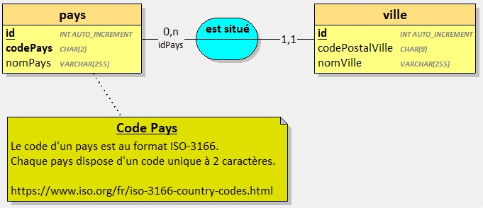
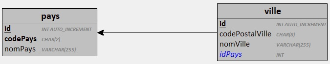
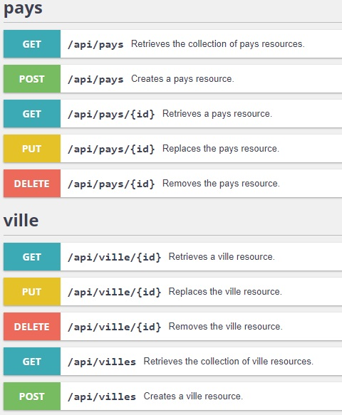
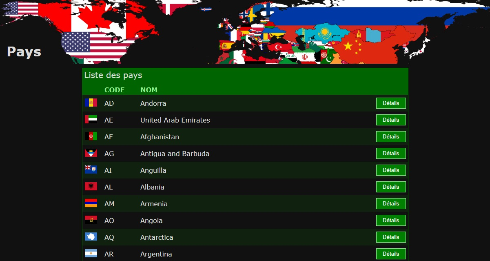
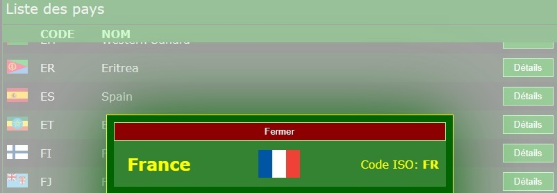
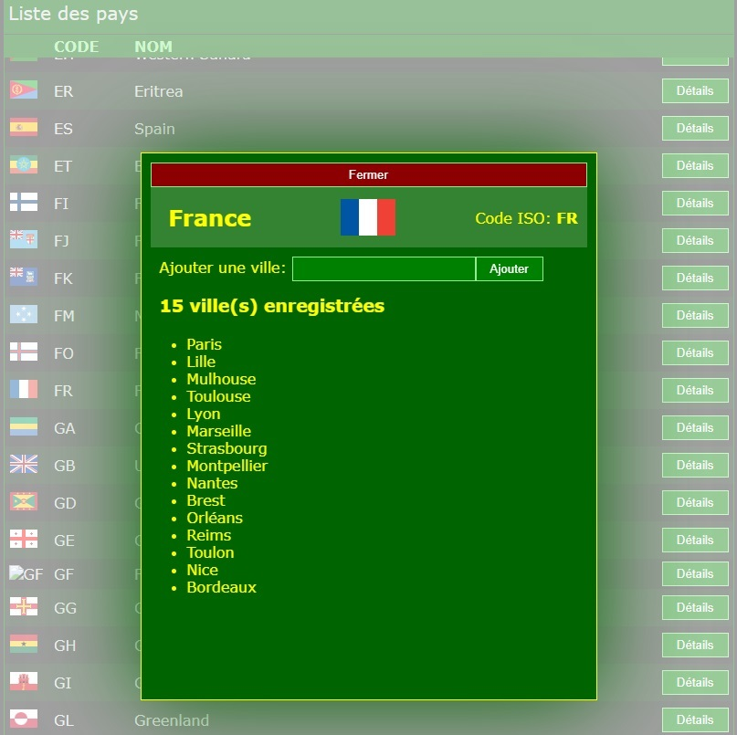

## PreRequis

Avoir terminé et validé l'exercice précédent : [Créer une API de gestion de Pays](../api-countries/)

--- 

Dans cet exercice, vous devez mettre à jour une API REST permettant la gestion de `Pays` et de `Villes`.

L'API existante est celle que vous avez vous-même développé dans [l'exercice précédent](../api-countries/).

> Vous vous aiderez des supports d'apprentissage fournis par vos formateurs.

## Contexte

Dans la majorité des applications, les développeurs sont amenés à manipuler des pays et des villes dans différents contextes comme par exemple : 
- Les profils utilisateurs
- Les adresses de facturation et/ou de livraison

Votre travail consiste à mettre à jour une API existante et d'y ajouter de nouvelles entités.

## Base de données 

La base de données contient déjà une entité `pays` à laquelle vous ajouterez une entité `ville` afin d'obtenir le résultat suivant:

- `1` ville est située dans `1` pays
- `1` pays situe `0 ou plusieurs` villes

**Modèle Conceptutel**


**Modèle Logique**



## Développer l'API

Une fois terminée, Votre API devra correspondre à la capture suivante :



**Jeu d'essai**

Vous utiliserez le jeu d'essai fourni dans le fichier [cities.json](./cities.json).

### Avec Symfony et/ou ASP.NET

1. Ouvrir le projet existant
2. Ajouter l'entité `Ville` et l'association entre `Pays` et `Ville`
3. Effectuer la migration pour mettre à jour la base de données
4. Lancer l'application dans un navigateur
5. Ajouter toutes les villes du [jeu d'essai fourni](./cities.json). *Ajouter les pays correspondants si nécessaire*.

> Validez votre API avec vos formateurs avant de passer à la suite.

## Développer l'interface utilisateur

Lorsque l'API est fonctionnelle, vous pouvez implémenter l'interface utilisateur.

Dans votre projet, ajouter un fichier `pays.html`:
- Sur Symfony : Dans le répertoire `public`
- Sur ASP.NET: Dans le répertoire `wwwroot`


Ajouter VueJS à la page web : 

```html
<script src="https://unpkg.com/vue@3/dist/vue.global.js"></script>
```

Implémenter le code `HTML`, `CSS` et `JS` pour que la page corresponde à la capture suivante :

.

**Notes :**
- La bannière est accessible [en cliquant sur ce lien](./banner.png).
- Vous pouvez utiliser le jeu de couleurs de votre choix tant que la mise en page est respectée.

**La page fonctionne ainsi :**

1. Les données sont chargées à partir de l'API (utilisez `VueJS` et `fetch` de Javascript).
2. Les données sont affichées dans un tableau.
3. Un clic sur le bouton `Détails` affiche une fenêtre modale avec les informations du pays correspondant comme sur la capture suivante.



> Valider ce fonctionnement avec vos formateurs avant de passer à la suite.

**Ajouter la fonctionnalité suivante :**

Un clic sur le bouton `Détails` affiche une fenêtre modale avec les informations du pays correspondant ainsi que la liste des villes associées à ce pays (chargez cette liste à partir de l'API).

Ajouter ensuite un petit formulaire permettant d'ajouter une ville dans le pays concerné. Cette ville devra être enregistrée dans la base de données en créant une requête `POST` vers l'API.



> Valider le fonctionnement de votre application avec vos formateurs.