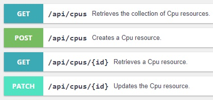
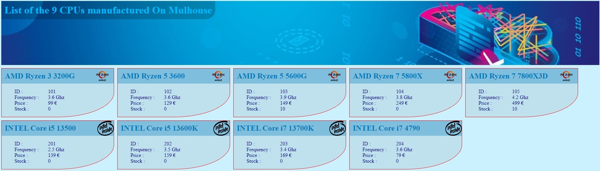
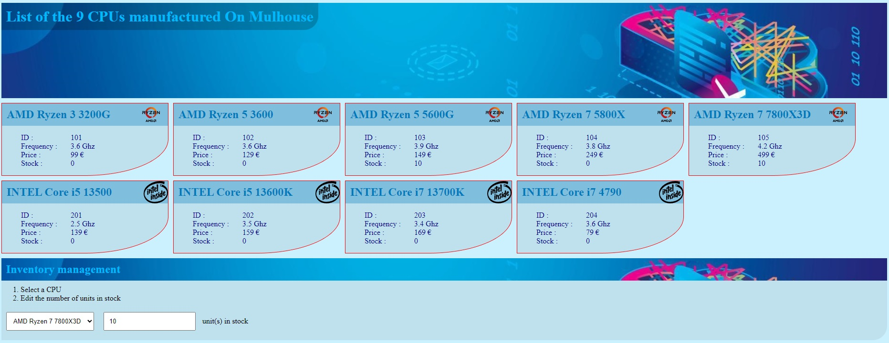
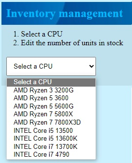
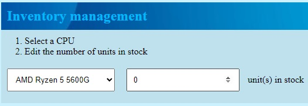
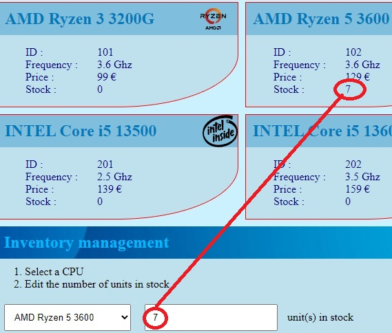

Dans cet exercice, vous devez réaliser une API REST permettant la gestion de `Microprocesseurs`.

Cet exercice peut être réalisé avec :
- PHP + Symfony
- C# + ASP.NET

Dans les 2 cas, l'API sera accessible via une interface de gestion: [Swagger UI](https://swagger.io/)

## Contexte

L'entreprise UNTEL fabrique des micro-processeurs de différentes marques prévus pour les architectures x86 et x64. 

Sa nouvelle usine, implantée à Mulhouse, disposera d’un tout nouveau système d’information et d’une suite logicielle expérimentale permettant la gestion des CPU et des lignes de production associées. 

Dans un 1er temps, votre travail consiste à développer une API réutilisable pour gérer et maintenir cette liste de CPU. 

Chaque micro-processeur est identifié par un entier numérique et possède les caractéristiques suivantes :  

- Marque  
- Nom de la famille 
- Nom de modèle  
- Fréquence de fonctionnement en Ghz (1 décimale) 
- Prix catalogue (0 décimale). 

**L'API permet de :**
- Lister tous les microprocesseurs
- Afficher 1 seul microprocesseur
- Ajouter un microprocesseur
- Modifier un microprocesseur

## Travail à réaliser

1. Créer un dépôt public sur GitHub pour votre projet.
2. Cloner le dépôt en local.
3. Dans le dépôt créer un répertoire `cpu_api` et s'y positionner.
3. Créer la base de données.
    - Nom de la base de données : `db_cpuz`
4. Créer le projet.
5. Installer les dépendances nécessaires.
6. Configurer l'API.
    - L'api retourne des objets `JSON`.
7. Implémenter la ou les entité(s) nécessaire(s).
8. Ajouter les éléments du jeu d'essai fourni.
    - [cpuz.json](./cpuz.json)
9. Lorsque vous avez ajouté tous les CPUs, exporter la base de données créée et alimentée dans un fichier SQL `db_cpuz_export.sql` et enregistrer ce fichier dans un répertoire `_docs` à l'intérieur de votre projet.
10. Sauvegarder votre travail sur Github.
11. Partager le lien vers votre dépôt avec votre formateur

> Valider la 1ère partie avec vos formateurs avant de passer à la suite 

## Développement de l'interface utilisateur

Lorsque votre API est fonctionnelle: 
- Ajouter un fichier `cpuz.html` dans le répertoire `public` de votre projet.
- Importer VueJS ``
- Développer l'interface utilisateur en vous basant sur les maquettes ci-dessous.

**Images à utiliser :**
- [La bannière](./banner.jpg)
- [Le logo INTEL](./intel.svg)
- [Le logo AMD](./amd.svg)

**Couleurs à utiliser :**

-  Bleu clair : #0079bc
-  Bleu clair transparent : #0079bc55
-  Bleu foncé : #00008b
-  Rouge : #FF0000

### Affichage des données de l'API

Au chargement de la page, les données sont récupérées depuis l'API et sont affichées dans des blocs distincts.

### Gestion des stocks 

À la suite des éléments affichés, ajouter un petit formulaire permettant de gérer le stock de chaque CPU. 

Le menu déroulant contient la liste des CPUs. 

Lorsqu'un CPU est sélectionné, un champ s'affiche et permet de modifier le nombre d'unités en stock pour le  CPU concerné. 

Cette information est visible uniquement dans le navigateur et ne doit pas être sauvegardée en base de données. Par contre, pensez à synchroniser cette valeur avec la valeur affichée dans les blocs d'informations des CPUs

> Valider le fonctionnement de l'UI avec vos formateurs.

## Sauvegarder le stock des CPUs 

Modifier votre API afin de pouvoir sauvegarder le stock des CPUs en base de données.

Une fois cette modification effectuée, mettre à jour l'interface utilisateur de manière à ce que le nombre d'unités en stock soient sauvegardé en base de données. 

Pour cela, ajouter un bouton de validation qui déclenchera la sauvegarde en base de données en émettant une requête `PATCH`.

> Valider le fonctionnement de la sauvegarde avec vos formateurs.
