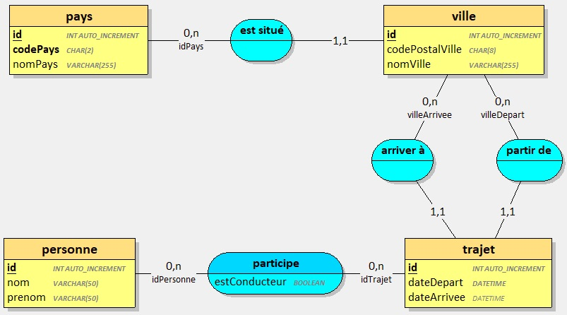
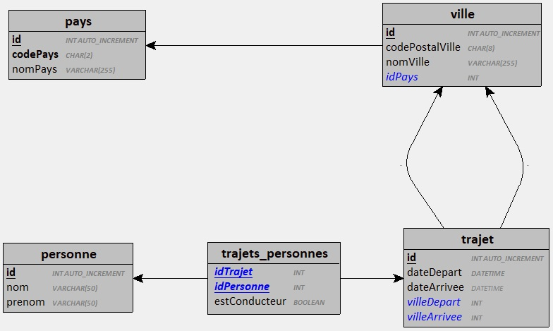

## PreRequis

Avoir terminé et validé les 2 exercices précédents :
- [Créer une API de gestion de Pays](../api-countries/)
- [Ajouter la gestion des Villes à l'API](../api-cities/)

--- 

Dans cet exercice, vous devez mettre à jour une application existante et y ajouter des fonctionnalités de gestion de trajets entre plusieurs villes.

L'application existante est celle que vous avez vous-même développé dans [les 2 exercices précédents](../api-cities/).

## Mettre à jour l'API 

Mettre à jour l'API en prenant en considération les règles suivantes :

1 `trajet` est caractérisé par une `ville de départ` et une `ville d'arrivée`. La ville de départ doit être différente de la ville d'arrivée.

Pour chaque trajet on doit pouvoir connaître :
- La date et heure de départ (obligatoire).
- La date et heure d'arrivée (facultatif) qui doit être ultérieure à la date de départ.

Pour chaque trajet, on doit pouvoir connaître les personnes participantes. Au moins un des participants doit être déclaré conducteur.

1 personne est caractérisée par un nom et un prénom.

Au niveau de l'API, les personnes et trajets ne sont accessibles qu'en lecture.

Le schéma ci-dessous représente les entités attendues :

**MCD**

**MLD**

> Valider votre API mise à jour avec vos formateurs avant de passer à la suite.

## Gestion des personnes 

La gestion des personnes et des trajets est gérée en utilisant le modèle MVC. Vous êtes libre de proposer la mise en page de votre choix.

1. Ajouter un contrôleur `Personnes`
2. Développer les vues et formulaires permettant de :
    - Afficher la liste des personnes.
    - Ajouter une personne.
    - Modifier une personne existante.
    - Supprimer une personnes existante.

> Valider le fonctionnement de votre contrôleur avec vos formateurs avant de passer à la suite.

## Gestion des trajets 

La gestion des des trajets est gérée en utilisant le modèle MVC. Vous êtes libre de proposer la mise en page de votre choix.

1. Ajouter un contrôleur `Trajets`
2. Développer les vues et formulaires permettant de :
    - Afficher la liste des trajets.
    - Afficher les détails d'un trajet (villes, pays, et personnes associées).
    - Ajouter un nouveau trajet.
    - Modifier un trajet existant.
    - Supprimer un trajet existant.

**A noter :**
- Il ne doit pas être possible de renseigner la date d'arrivée d'un trajet si aucun participant n'est associé à ce trajet.
- Un trajet terminé (la date d'arrivée est renseignée) ne peut être ni modifié, ni supprimé.
- Une personne participant à au moins 1 trajet ne peut-être supprimée.

> Valider le fonctionnement de votre application MVC avec vos formateurs.