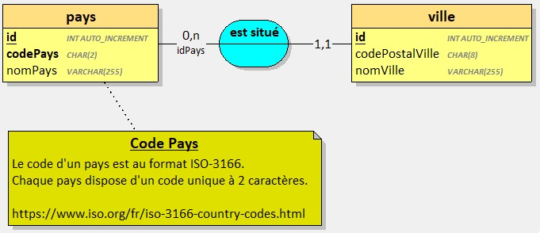

## PreRequis

Avoir terminé et validé l'exercice précédent : [Créer une API de gestion de Pays](../api-countries/)

--- 

Dans cet exercice, vous devez mettre à jour une API REST permettant la gestion de `Pays` et de `Villes`.

L'API existante est celle que vous avez vous-même développé dans [l'exercice précédent](../api-countries/).

> Vous vous aiderez des supports d'apprentissage fournis par vos formateurs.

## Contexte

Dans la majorité des applications, les développeurs sont amenés à manipuler des pays et des villes dans différents contextes comme par exemple : 
- Les profils utilisateurs
- Les adresses de facturation et/ou de livraison

Votre travail consiste à mettre à jour une API existante et d'y ajouter de nouvelles entités.

## Base de données 

La base de données contient déjà une entité `pays` à laquelle vous ajouterez une entité `ville` afin d'obtenir le résultat suivant:

- `1` ville est située dans `1` pays
- `1` pays situe `0 ou plusieurs` villes

**Modèle Conceptutel**

**Modèle Logique**

## Développer l'API

Une fois terminée, Votre API devra correspondre à la capture suivante :

**Jeu d'essai**

Vous utiliserez le jeu d'essai fourni dans le fichier [cities.json](./cities.json).

### Avec Symfony et/ou ASP.NET

1. Ouvrir le projet existant
2. Ajouter l'entité `Ville` et l'association entre `Pays` et `Ville`
3. Effectuer la migration pour mettre à jour la base de données
4. Lancer l'application dans un navigateur
5. Ajouter toutes les villes du [jeu d'essai fourni](./cities.json). *Ajouter les pays correspondant si nécessaire*.

## Partie 2 : Développer les interfaces utilisateur 
