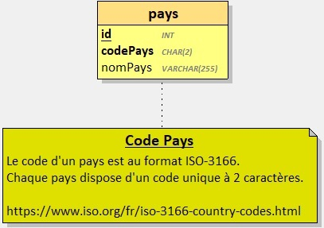
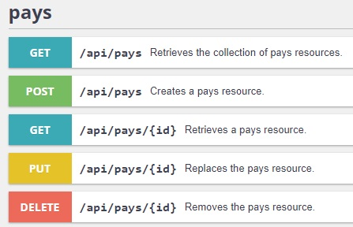
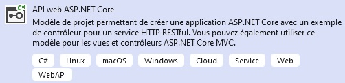
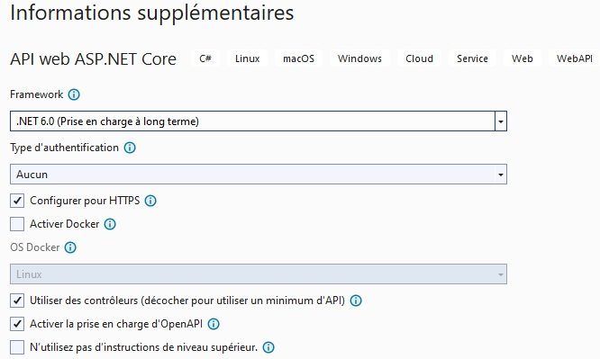

Dans cet exercice d'introduction, vous devez réaliser une API REST permettant la gestion de `Pays`.

Cet exercice peut être réalisé avec :
- PHP + Symfony
- C# + ASP.NET

Dans les 2 cas, l'API sera accessible via une interface de gestion: [Swagger UI](https://swagger.io/)

Lorsque vous créerez un projet `Symfony` ou `ASP.NET API`, vous aurez la possibilité d'ajouter Swagger.

> Vous vous aiderez des supports d'apprentissage fournis par vos formateurs.

## Contexte

Dans la majorité des applications, les développeurs sont amenés à manipuler une liste de pays dans différents contextes comme par exemple : 
- Les profils utilisateurs
- Les adresses de facturation et/ou de livraison

Votre travail consiste à développer une API réutilisable pour gérer et maintenir cette liste de pays.

## Base de données 

La 1ère étape consiste à créer une base de données qui accueillera les données des pays.

- Le nom de la base de données doit être: `db_countries`
- La base de données utilise le jeu de caractères `UTF8`

```sql
/* Exemple de création d'une base de données MySQL avec le jeu de caractères UTF8 */
CREATE DATABASE IF NOT EXISTS `db_countries` CHARACTER SET utf8mb4 COLLATE utf8mb4_unicode_ci;

/* Exemple de création d'une base de données PostgreSQL avec le jeu de caractères UTF8 */
CREATE DATABASE db_countries ENCODING 'UTF8';

/* Exemple de création d'une base de données Microsoft SQL Server */
CREATE DATABASE db_countries;
```
La base de données contiendra une table `pays` :



> Le code d'un pays est au format ISO-3166. Chaque pays dispose d'un code unique à 2 caractères. 
>
> Voir le site [iso.org](https://www.iso.org/fr/iso-3166-country-codes.html) pour plus d'infos.


## Développer l'API

Une fois la base de données créée (sans les tables), développer l'API qui sera consommé par d'autres applications.

Une fois terminée, Votre API devra correspondre à la capture suivante :



**Jeu d'essai**

Vous utiliserez le jeu d'essai fourni dans le fichier [countries.json](./countries.json).

### Avec Symfony 

1. Créer le répertoire du projet et s'y positionner avec un terminal
2. Créer un projet **Symfony** :  `composer create-project symfony/skeleton:"6.4.*" .`
3. Installer **api-platform** : `composer require api`
4. Installer **maker-bundle** : `composer require symfony/maker-bundle --dev`
5. Éditer le fichier `.env` et adapter la chaine de connexion à la base de données
6. Éditer le fichier `config/packages/api_platform.yml` et y ajouter le support du format JSON.
6. Créer l'entité `pays` et l'exposer dans l'API
7. Démarrer l'application et ajouter au moins 10 pays parmi la liste fournie dans le jeu d'essai


## Avec C# ASP.NET 

1. Ouvrir Visual Studio Community
2. Créer un projet `ASP.NET Core Web API`



3. Nommez le projet `ApiPays`
4. Sélectionner la version la plus récente du framework .NET
5. Cocher la case `Use controllers`
6. Cocher la case `Enable OpenAPI support`



7. Ajouter les packages Nuget à votre projet: 
- `Microsoft.EntityFrameworkCore.Tools`
- `Microsoft.EntityFrameworkCore.Design`
- `Microsoft.EntityFrameworkCore.SqlServer`
- `Microsoft.EntityFrameworkCore.SqlServer.Design`

8. Mettre en place les Entités
    - [Tutoriel : Créer des entités](https://www.entityframeworktutorial.net/efcore/create-entities.aspx)
    - [Tutoriel: Créer le contexte de base de données](https://www.entityframeworktutorial.net/efcore/entity-framework-core-dbcontext.aspx)