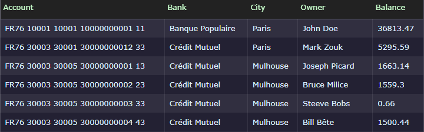
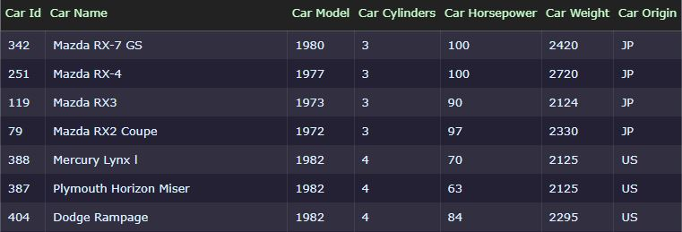

JSON (*Javascript Object Notation*) est un format permettant de structurer et transmettre des informations sur les réseaux informatiques. Il est particulièrement adapté à la transmission d'objets entre programmes via les API (Application Programming Interface).

Lien vers le support de cours : 
- [Introduction au format JSON](https://devoldere.net/ressources/web/01%20-%20Le%20format%20JSON.pdf)

# Exercices

## 1.1 Utilisateurs 

Un utilisateur est caractérisé par :

- Un identifiant numérique (différent pour chaque utilisateur)
- Un nom d'utilisateur
- Un patronyme
- Un prénom
- Une date de naissance

Créer un document **users.json** contenant au moins 5 utilisateurs.

## 1.2 Comptes bancaires 

Créer un document **bank-accounts.json** qui représente les comptes bancaires visibles sur la capture ci-dessous.

## 1.3 Voitures

Créer un document **cars.json** correspondant à la vue ci-dessous :

 
## 2.1 ALLER PLUS LOIN

Créez 1 fichier JSON pour chaque élément de la liste suivante. 

-	**series.json**
    - Les 5 séries les plus populaires d'une plateforme de streaming.

-	**passagers.json**
    - Les 3 passagers inscrits pour un trajet en co-voiturage.

-	**europe.json**
    - Les pays de l'Union Européenne.

-	**vols.json**
    - Les 4 prochains vols de la compagnie *Air France* à l'aéroport d'Orly.

> Validez votre travail avec vos formateurs.
