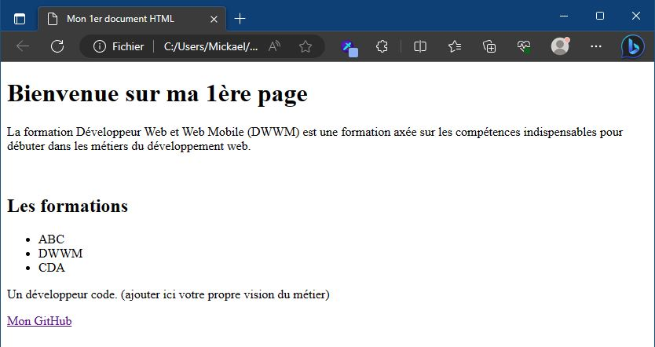
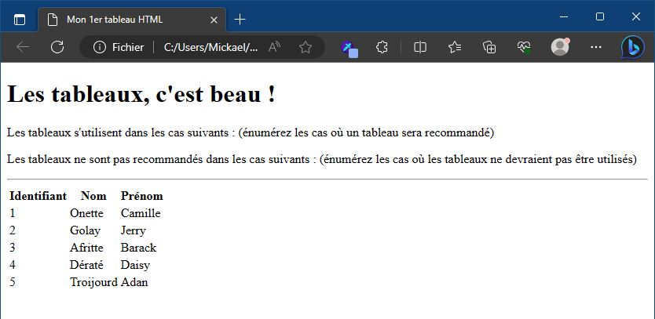
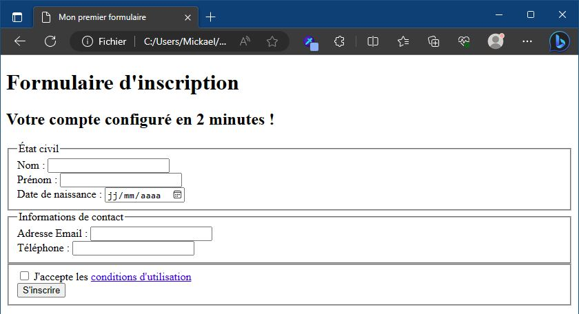
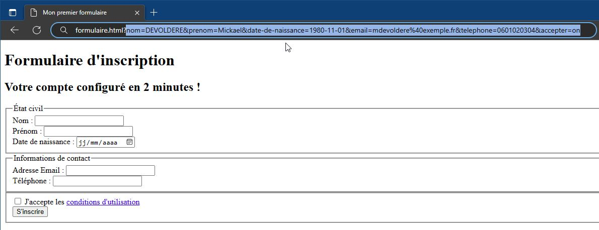

Prenez connaissance de la structure d'un document HTML sur le lien suivant : 

- [Introduction à la structure d'un document HTML sur MDN](https://developer.mozilla.org/fr/docs/Learn/HTML/Introduction_to_HTML/Document_and_website_structure).

Lorsque vous avez terminé, réalisez les exercices ci-dessous. **Implémentez uniquement le code HTML** (*L'utilisation du langage CSS est interdite*).

--- 

## Ma 1ère page web

Créez un document HTML `introduction.html` répondant aux exigences suivantes :

Dans les entêtes de la page (`<head>`) : 
- La langue de la page doit être `fr`
- L'encodage des caractères doit être `UTF-8`
- Le titre de la page est `Mon 1er document HTML`

Dans le corps de la page (`<body>`), implémentez les éléments suivants, dans l'ordre : 

- Un titre de niveau 1 : `Bienvenue sur ma 1ère page`
- Un paragraphe contenant une description de la formation que vous suivez actuellement.
- Une image représentant une personne en train de coder (recherchez cette image sur le web)
- Un titre de niveau 2 : `Les formations`
- Une liste non-ordonnée qui contiendra les éléments suivants :
    - ABC, DWWM, CDA
- Un paragraphe contenant votre vision du métier de développeur web.
- Un lien dont le libellé est `Mon GitHub` et qui mène à votre page GitHub.

--- 

Votre page devrait ressembler à la capture suivante :

## Mon 1er tableau 

Documentez-vous sur les tableaux HTML en suivant ce lien : [Tableaux HTML: Notions de base](https://developer.mozilla.org/fr/docs/Learn/HTML/Tables/Basics)

Créez un document HTML `tableau.html` répondant aux exigences suivantes :

Dans les entêtes de la page (`<head>`) : 
- La langue de la page doit être déclarée en *Français* adapté pour la *Belgique*
- L'encodage des caractères doit être `UTF-8`
- Le titre de la page est `Mon 1er tableau HTML`

Dans le corps de la page (`<body>`), implémentez les éléments suivants, dans l'ordre : 
- Un titre de niveau 1 : `Les tableaux, c'est beau !`
- Un paragraphe expliquant dans quels cas on utilisera un tableau suivi d'un autre paragrpahe qui énumère dans quel(s) cas il sera déconseillé d'en utiliser (faites des recherches sur le web).
- Une barre horizontale
- Un tableau contenant 3 colonnes et 5 lignes (voir la capture suivante pour voir le contenu du tableau).

Votre page doit respecter la mise en page et les données de la capture suivante : 

## Mon 1er formulaire 

Documentez-vous sur les formulaires HTML en suivant ce lien : [Apprendre les formulaires sur MDN](https://developer.mozilla.org/fr/docs/Learn/Forms/Your_first_form).

Ensuite, créez un document HTML `formulaire.html` correspondant à la capture suivante : 

Lorsque le formulaire est soumis (par un clic sur le bouton *S'inscrire*), les informations saisies apparraisent dans la barre d'adresse : 

--- 

> Validez votre travail avec vos formateurs.

Lorsque vous avez terminé, vous pouvez commencer la série d'exercices [Introduction au langage CSS](./04-css.md/)