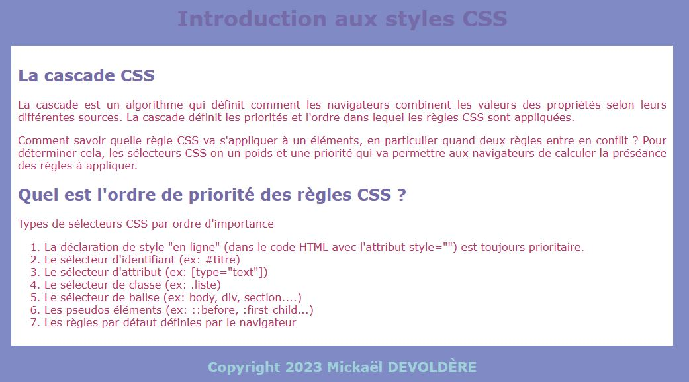
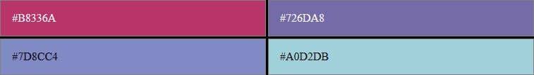

---
title: "Introduction CSS"
serie: "exercices"
order: 4
--- 

CSS (Cascading Style Sheets ou en français "Feuilles de style en cascade") est utilisé pour styliser et mettre en forme des pages Web. CSS permet par exemple de modifier la police, la couleur, la taille et l'espacement du contenu de la page, le scinder en plusieurs sections ou ajouter des animations et autres éléments décoratifs.

Ressources en ligne : 
- [Introduction au langage CSS sur MDN](https://developer.mozilla.org/fr/docs/Learn/CSS/First_steps)

## Exercice d'introduction

Soit le document HTML suivant : 

```html
<!DOCTYPE html>
<html lang="fr-ch">
<head>
    <meta charset="UTF-8">
    <title>Introduction à CSS</title>
</head>
<body>
    <header>
        <h1>Introduction aux styles CSS</h1>
    </header>
    <main>
        <h2>La cascade CSS</h2>
        <p>La cascade est un algorithme qui définit comment les navigateurs combinent les valeurs des propriétés selon leurs différentes sources. La cascade définit les priorités et l'ordre dans lequel les règles CSS sont appliquées.</p>
        <p>Comment savoir quelle règle CSS va s'appliquer à un éléments, en particulier quand deux règles entre en conflit ? Pour déterminer cela, les sélecteurs CSS on un poids et une priorité qui va permettre aux navigateurs de calculer la préséance des règles à appliquer.</p>
        <h2>Quel est l'ordre de priorité des règles CSS ?</h2>
        <p>Types de sélecteurs CSS par ordre d'importance</p>
        <ol>
            <li>La déclaration de style "en ligne" (dans le code HTML avec l'attribut style="") est toujours prioritaire.</li>
            <li>Le sélecteur d'identifiant (ex: #titre)</li>
            <li>Le sélecteur d'attribut (ex: [type="text"])</li>
            <li>Le sélecteur de classe (ex: .liste)</li>
            <li>Le sélecteur de balise (ex: body, div, section....)</li>
            <li>Les pseudos éléments (ex: ::before, :first-child...)</li>
            <li>Les règles par défaut définies par le navigateur</li>
        </ol>
    </main>
    <footer>
        Copyright Année NOM Prénom 
    </footer>
</body>
</html>

```

1. Créez un document `css-introduction.html`
2. Collez-y le code HTML ci-dessus
3. Dans la balse `<footer>`, remplacez `Année NOM Prénom` par l'année en cours, votre nom et votre prénom
3. Créez un fichier `style.css` et liez-le au document HTML (utlisez la balise `<link>`)
4. Appliquez les règles CSS pour que la page respecte la mise en page de la capture ci-dessous
    - Vous pouvez ajouter des identifiants et des classes dans le code HTML



Informations :
- La largeur du cadre blanc est de 1000px
- Le contenu est centré dans la page 
- La police d'écriture utilisée est "Verdana".

**Couleurs :**



> Une fois terminé, validez votre travail avec vos formateurs avant de passer à la suite.

## La suite 
- [Créez une fiche métier au format HTML](./05-fiche-metier)
- [Exercices de positionnement CSS](../positionnement/)

