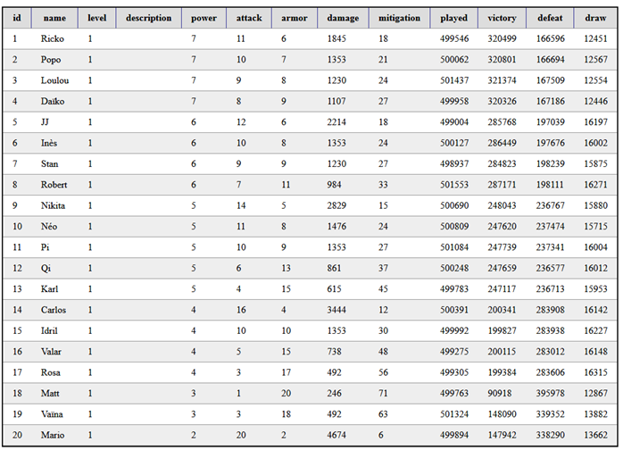

---
title: "Jeu de cartes"
layout: default
module: "web"
serie: "frontend"
order: 20
--- 

L'objectif de cet exercice est d'afficher les inforations des cartes d'un jeu en ligne.

Les informations proviennent d'une API fictive et sont rendues disponibles dans le fichier JSON [cardgame.json](cardgame.json).

Afficher les données reçues dans un tableau HTML. Appliquez les règles CSS nécessaires afin que le tableau ressemble à la capture suivante : 

A la suite de ce tableau, afficher les informations complètes des cartes suivantes :
-	La carte possédant le plus de puissance d’attaque
-	La carte possédant le plus d’armure
-	La carte ayant le plus de parties jouées
-	La carte ayant le plus grand nombre de victoires 
