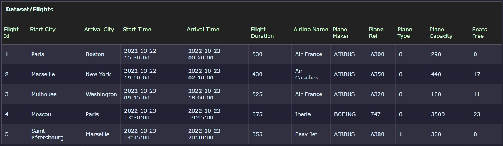

## Afficher une liste de vols

Pour cet exercice, vous devez créer une application web affichant la liste des vols d'une compagnie aérienne 
Les informations proviennent d'une API fictive et sont rendues disponibles dans le fichier JSON [flights.json](flights.json).

Les vols doivent être listés dans un tableau avec toutes les informations de la collection. Chaque colonne peut-être triée en cliquant sur son entête.

Ajouter ensuite 1 colonne qui affichera la `durée` de chaque vol.

L’affichage « en anglais » devrait ressembler à la capture suivante :

> Validez le fonctionnement de votre application avec votre formateur.