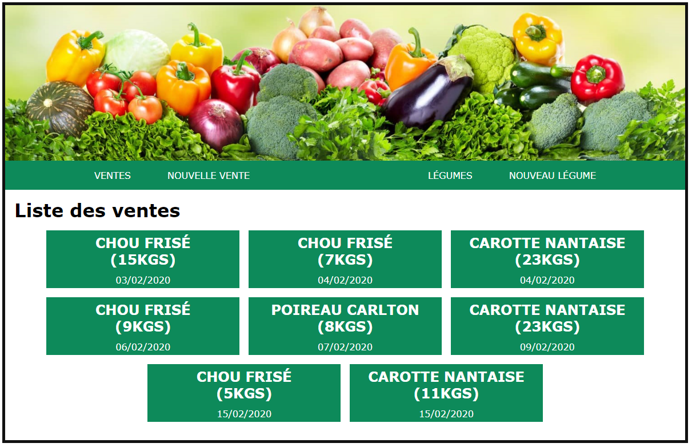
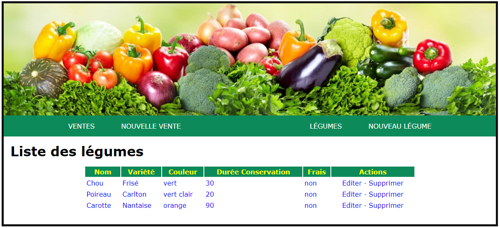

## Gérer des fruits et des légumes

Pour cet exercice, vous devez créer une application web affichant la liste des légumes en vente dans une  coopérative. Vous devrez également afficher les statistiques de ventes pour chaque légume.

Les informations proviennent d'une API fictive et sont rendues disponibles dans les fichiers JSON :

- Liste des fruits et légumes : [legumos.json](legumos.json).
- Liste des ventes : [legumos-sales.json](legumos-sales.json).

Dans un premier temps, vous devez implémenter 2 pages distinctes :

Sur la page d'accueil (index.html), les fruits et légumes doivent être listés dans un tableau avec toutes les informations de la collection. Chaque colonne peut-être triée en cliquant sur son entête.

La page des ventes (sales.html) devra, quant à elle, ressembler à la capture suivante :

Une fois ces pages implémentées, creéez 2 pages contenant chacune un formulaire pour :
- Ajouter un légume nouveau légume
- Ajouter une nouvelle vente

Ces enregistrements seront sauvegardés dans le `localStorage` du navigateur.

Au chargement d'une page : 

1. Les données sont chargées à partir des fichiers JSON
2. Les données sauvegardées dans le localStorage sont chargées

Proposez également 
- un moyen de vider les données sauvegardées dans le navigateur.
- Un moyen pour télécharger ces données sauvegardées au format JSON.

---

> Validez le fonctionnement de votre application avec votre formateur.
