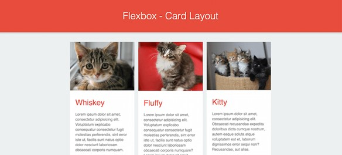
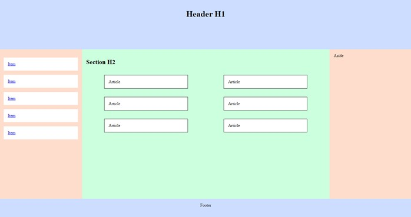
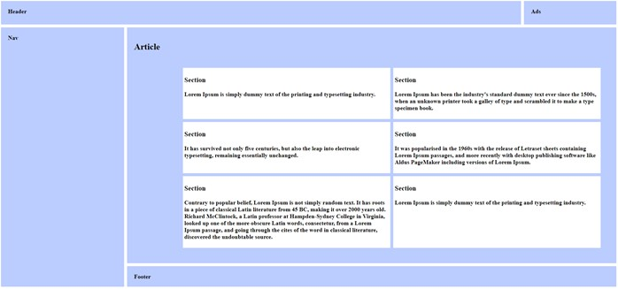
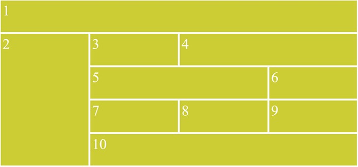

Réalisez les pages HTML correspondant aux maquettes de chaque exercice.
Utilisez GRID et FLEX pour positionner les éléments.

## CATS

Images : au choix

Couleurs : 
-	Rouge :  RGB(230, 75, 60)
-	Gris : RGB(235, 240, 240)

## FLEX 1

Couleurs : 
-	Bleu : #CCDDFF
-	Orange : #FFDDCC
-	Blanc : #FFFFFF

Bonus : Proposez une version « mobile » à 1 colonne.

## GRID 1

Couleurs : 
-	Bleu : #BBCCFF

Bonus : Proposez une version « mobile » à 1 colonne.

 
## GRID ? FLEX ?

Couleurs : 
-	Jaune/Vert : #CCCC33

Bonus : Proposez une version « mobile » à 2 colonnes (sauf les éléments 1 et 10 qui utilisent toute la largeur).
