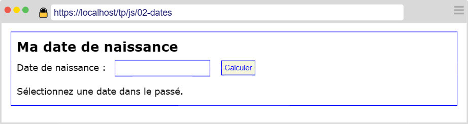
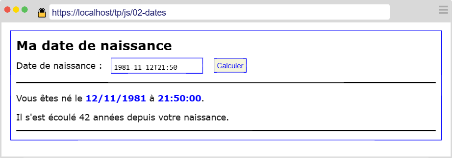
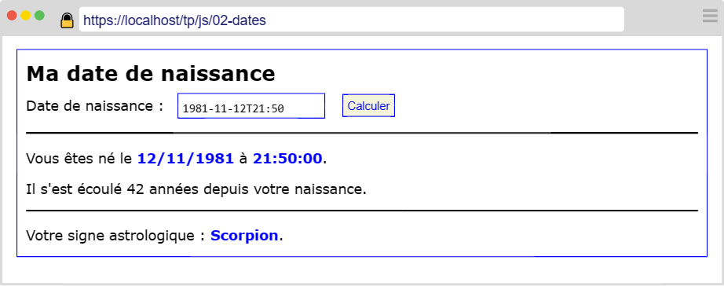

---
title: "Introduciton aux dates"
serie: "frontend"
order: 2
--- 

L'objectif de ces exercices est de vous familiariser avec la manipulation des dates en Javascript.

## Exercice 1 : Le formulaire

Reprenez la mise en page de [l'exercice précédent](./index) pour présenter un formulaire contenant : 
- Un titre de niveau 1 : `Ma date de naissance`
- un champ de type `datetime-local`
- un bouton de validation libellé `Calculer`

**Fonctionnalités à implémenter :**

- L'utilisateur sélectionne sa date et heure de naissance.
- Si la date est dans le futur, afficher un message d'erreur.
- Si la date est dans le passé, afficher : 
    - La date au format utilisé en France (par exemple : 30/08/1980).
    - Le nombre d'années écoulées depuis la date renseignée.

## Exercice 2 : Le signe astrologique

Calculez et ajouter sous le nombre d'années écoulées :
- Le signe astrologique correspondant à la date de naissance sélectionnée.

Le signe astrologique est calculé selon le jour et mois de naissance : 

