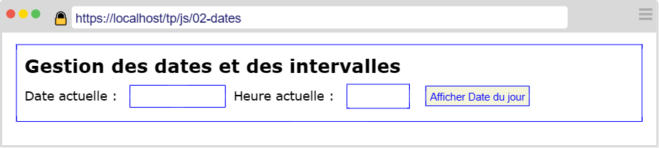

---
title: "Intervalles temporelles"
serie: "frontend"
order: 3
--- 

L'objectif de ces exercices est de manipuler des dates en Javascript.

## Exercice 1 : Un peu de HTML

Reprenez la mise en page de [l'exercice précédent](./dates-1) pour présenter un formulaire contenant : 
- un champ de type `date`
- un champ de type `time`
- un bouton de validation

Le formulaire doit correspondre à la maquette suivante :

## Exercice 2 : Aujourd'hui

Au clic sur le bouton `Afficher Date du jour`, la date et heure courante s'affichent dans les champs correspondants.

Ajoutez également une phrase sous le formulaire avec la date au format utilisé en France (jour/mois/année).

## Exercice 3 : Calcul d'intervalle

Ajouter un 2nd formulaire permettant à l'utilisateur de sélectionner une date et une heure dans un champ de type `datetime-local` et un bouton libellé `Calculer l'intervalle`.

 

Lorsque l'utilisateur a sélectionné une date (dans le passé ou dans le futur), et après un clic sur le bouton `Calculer l'intervalle`, affichez le **nombre de jours** qui sépare les 2 dates.

 

## Exercice 4 : Afiner le calcul

Améliorez votre algorithme pour afiner le calcul de l'intervalle entre les 2 dates.

Le texte affichant l'intervalle doit désormais afficher (selon le cas) : 

> Dans 91 jours, 6 heures et 9 minutes, nous serons le 28/12/2023 à 20:45.

ou

> Il y a 300 jours, 6 heures et 4 minutes, nous étions le 01/12/2022 à 10:32.

## Exercice 5 : Les mois litéraux 

Les textes affichent désormais les mois en toutes lettres et en Français.

Exemple : 
> "28/09/2023" devient "28 septembre 2023"

## Exercice 6 : L'horloge

Désormais, après le clic sur le bouton `Afficher Date du jour`, la date et l'heure du jour s'actualisent toutes les secondes. Pensez à recalculer les intervalles à chaque actualisation (dans le cas où l'utilisateur a sélectionné une date dans le 2nd formulaire).

Utilisez la fonction `setInterval()` de Javascript.
