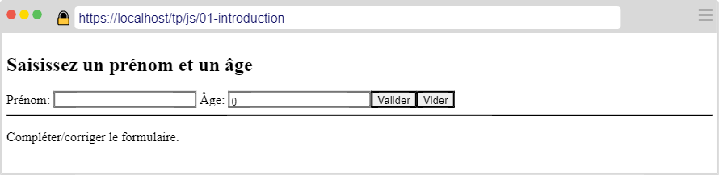
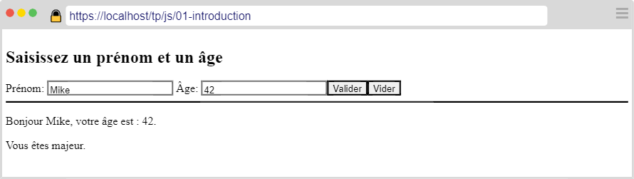
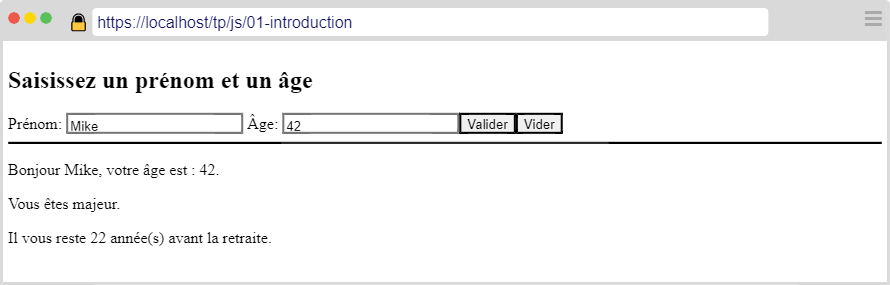
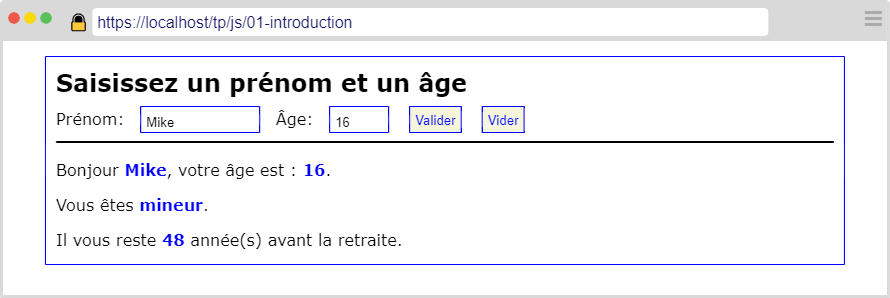
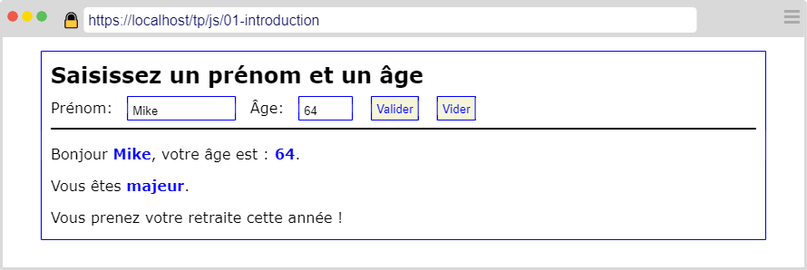
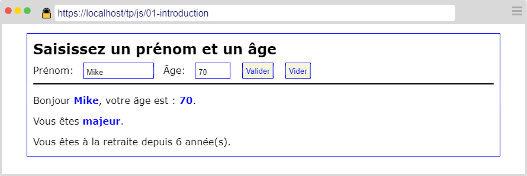

---
title: "Formulaires"
serie: "frontend"
order: 3
--- 

L'objectif de ces exercices est de vous familiariser avec JS et la manipulation du DOM.

## Exercice 1 : Bonjour

Dans un document HTML: 
1. Ajouter un titre de niveau 1.
2. Ajouter un `label` et un `input` permettant de saisir un prénom.
3. Ajouter un `label` et un `input` permettant de saisir un âge.
4. Ajouter un `button` de validation (attention, le formulaire ne doit pas être soumis !).
5. Ajouter un bouton permettant de vider le formulaire. 
6. Un bloc pour l'affichage du résultat

Votre page devrait ressembler à la capture suivante :

Au clic sur le bouton de validation :
- Si le prénom n'est pas vide et que l'âge est un entier valide supérieur à 0 :
    - Afficher le texte comme sur la capture suivante.
- Sinon 
    - Afficher "Compléter/corriger le formulaire"

## Exercice 2 : Majorité

Ajouter un message pour indiquer, selon l'âge saisi, si la personne est "mineure" ou "majeure".

## Exercice 3 : Retraite

Ajouter un message pour indiquer, toujours selon l'âge saisi, le nombre d'années avant ou après la retraite. 

Le message diffère selon le cas: 

- age < 64 : "Il vous reste X année(s) avant la retraite"
- age > 64 : "Vous êtes à la retraite depuis X année(s)"
- age = 64 : "Vous prenez votre retraite cette année !"

## Exercice 4 : Mise en forme 

Mettez en forme votre page afin qu'elle corresponde aux captures suivantes :

Le cadre bleu fait 800px de large et est centré sur la page.

La police utilisée est "Verdana".

**Moins de 64 ans** 

**64 ans**

**Plus de 64 ans**

