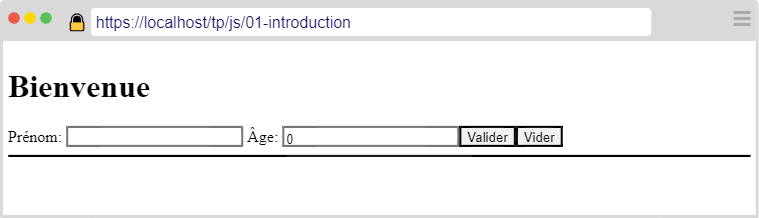
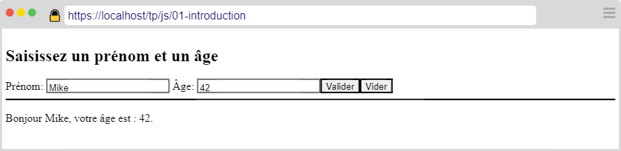

---
title: "Exercices d'introduction"
serie: "frontend"
order: 1
--- 

L'objectif de ces exercices est de vous familiariser avec JS et la manipulation du DOM.

## Exercice 1 : Bonjour

Dans un document HTML: 
1. Ajouter un titre de niveau 1.
2. Ajouter un `label` et un `input` permettant de saisir un prénom.
3. Ajouter un `label` et un `input` permettant de saisir un âge.
4. Ajouter un `button` de validation (attention, le formulaire ne doit pas être soumis !).
5. Ajouter un bouton permettant de vider le formulaire. 

Votre page devrait ressembler à la capture suivante :

Au clic sur le bouton de validation :
- Si le prénom n'est pas vide et que l'âge est un entier valide supérieur à 0 :
    - Afficher le texte comme sur la capture suivante.

