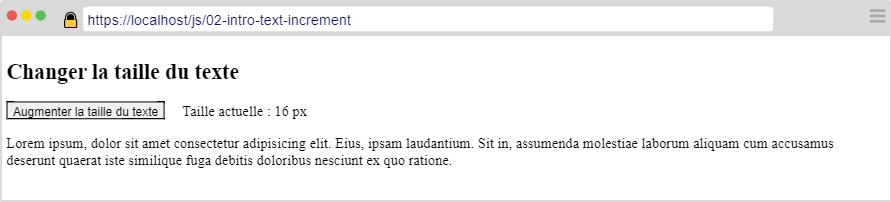
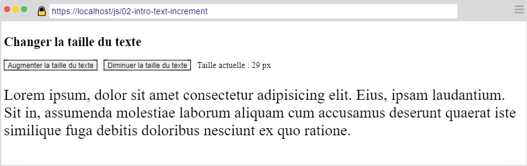
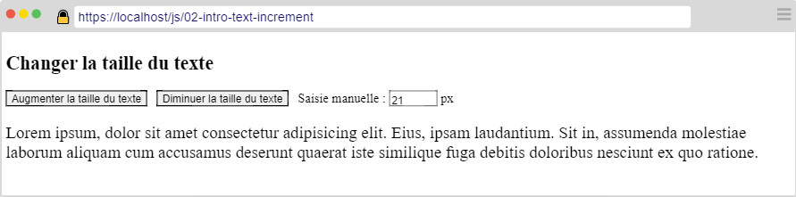

---
title: "Exercice Introduction #2"
serie: "frontend"
order: 2
--- 

L'objectif de cet exercice est de vous familiariser avec JS et la manipulation du DOM.

## Exercice 1 : Manipuler les styles

Créer un document HTML contenant : 

- 1 titre de niveau 1 
- 1 bouton suivi d'un ``
- Un paragraphe contenant au moins 200 caractères

Votre page devrait ressembler à la capture suivante : 

Dans la majorité des navigateurs, la taille du texte est  de 16px par défaut.

Au clic sur le bouton "Augmenter la taille du texte", la taille du texte dans le paragraphe augmente de 1 en prenant en compte les éléments suivants : 
- La taille maximum autorisée est de 48px
- Arrivé à 48px, un clic sur le bouton réinitialise la valeur à 16px.

Ajouter ensuite un second bouton libellé "Diminuer la taille du texte". Un clic sur ce 2nd bouton diminue la taille du texte de 1 en prenant en considération les contraintes suivantes :
- La taille minimum autorisée est de 8px
- Arrivé à 8px, un clic sur le 2nd bouton réinitialise la valeur à 16px.

Votre page devrait ressembler à la capture suivante :

 

Pour terminer, modifiez la page en y insérant un champ de type "number" permettant à l'utilisateur de définir manuellemment la taille du texte. Les règles précédentes doivent s'appliquer (taille minimum: 8, taille maximum: 48).

 
